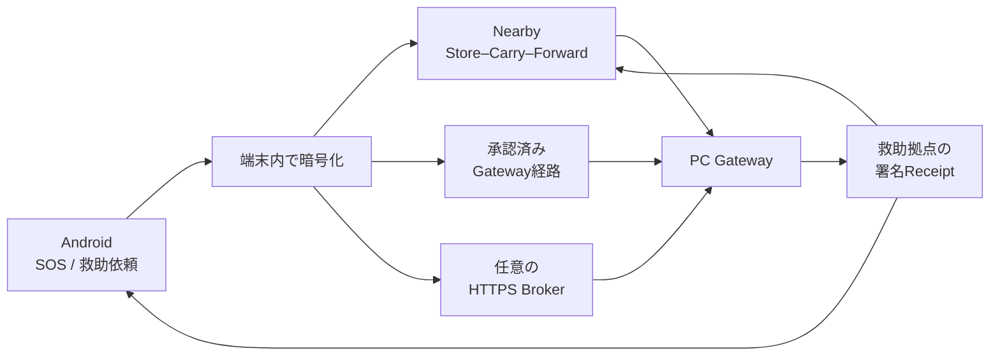

<div align="center">


# Relay

### 通信が途切れても、暗号化した救助情報を次の端末・救助拠点へ。

**Android・端末間通信・PC Gateway・任意のHTTPS Brokerを組み合わせる、災害時向けローカル優先中継システム。**

[](https://github.com/NEGI46/Relay/actions/workflows/relay-ci.yml)
[](#開発環境)
[](#開発環境)
[](#現在の状態)

[概要](#概要) ・ [仕組み](#仕組み) ・ [現在の状態](#現在の状態) ・ [開発版を試す](#開発版を試す) ・ [検証](#検証) ・ [主要ドキュメント](#主要ドキュメント) ・ [English](#english-overview)

</div>

> [!CAUTION]
> **Relayは119、消防・警察・自治体の公式な緊急連絡手段を置き換えません。**
> 現在は、限定区域の訓練・共同実証と技術検証に向けたコード基盤です。端末への保存、中継成功、Broker保管、Gateway受信、署名Receiptの取得は、救助隊の出動や人命救助の完了を保証しません。

---

## 概要

Relayは、携帯回線やインターネットが不安定な状況でも、救助要請を**暗号化したまま複数の経路で運ぶ**ことを目指しています。

- 利用者はAndroidでSOSまたは通常の救助依頼を作成します。
- 救助内容は転送前に暗号化され、端末内の暗号化DBへ保存されます。
- 近くのRelay端末、承認済みGateway経路、任意のHTTPS Brokerが独立して配送を試みます。
- PC Gatewayだけが、正しくprovisionされた救助拠点秘密鍵で内容を復号します。
- 救助拠点は署名Receiptを返し、利用者側はその署名を検証して状態を更新します。

### Relayが解決しようとしていること

| 課題 | Relayの考え方 |
|---|---|
| 携帯回線が使えない | Nearbyによる端末間Store–Carry–Forward |
| 直接避難所へ届かない | 中継端末が暗号文を保持し、利用可能な経路を再試行 |
| モバイル回線だけ使える | 任意のHTTPS Brokerへ暗号文を預け、PC Gatewayが取得 |
| 中継者に内容を見られたくない | 救助拠点公開鍵で暗号化し、中継端末とBrokerは復号しない |
| 「送信した」と「受け取られた」が混同される | 端末保存・中継・Broker保管・署名済み救助拠点受信を別状態として表示 |

---

## 仕組み



### 救助依頼の流れ

1. **作成**  
   AndroidでSOSを2秒長押しするか、人数・負傷・移動困難・必要な支援などを入力します。

2. **暗号化して保存**  
   本文、人数、状態、位置情報は、転送前に救助拠点公開鍵で暗号化されます。送信者が更新・取消を続けるための復元情報も、別のAndroid Keystore鍵で暗号化されます。

3. **複数経路で再試行**  
   Nearby、Gateway、Brokerは独立した経路です。ある経路が停止しても、保存済みEnvelopeは他の利用可能な経路で再試行されます。

4. **救助拠点で受信**  
   PC GatewayがEnvelopeを復号し、重複を除外してスタッフ画面へ表示します。

5. **署名Receiptを返送**  
   保存・受領・対応中・完了などの状態を救助拠点が署名し、Androidは署名を検証して表示します。

### 受信先鍵がまだ見つからない場合

信頼済みの救助拠点公開鍵を取得できない場合でも、SOSは失われません。

- 送信者だけが復元できるAES-GCM暗号化領域へ`PENDING_DESTINATION`として保存します。
- 平文のSOSや未検証鍵で作ったEnvelopeを周囲へ配布しません。
- 信頼済み公開鍵が後から解決された時点で、転送可能な暗号化Envelopeへ変換します。
- Envelopeが一度も外へ出ていない段階なら、利用者は端末内の保留依頼だけを削除できます。

---

## 現在の状態

**確認基準: 2026-07-23 / source HEAD `939d4ae`**

| 状態 | 意味 |
|---|---|
| ✅ | 実装済み |
| 🧪 | 自動試験・エミュレータ・シミュレータで検証あり |
| 🧩 | 基盤はあるが、運用者向け統合やprovisioningが未完了 |
| ⚠️ | 外部準備または実機検証が必要 |
| ⛔ | 正式運用を主張できない |

| 領域 | 状態 | 現在の境界 |
|---|---:|---|
| Android救助フロー | ✅ | SOS、通常依頼、更新、取消、状態表示、日英UI |
| 暗号化セッション復元 | ✅ | Room + SQLCipher、別Keystore AES-GCM鍵、version CAS、process restart後の復元 |
| 明示同意型の位置更新 | ✅ | 利用者がSwitchで同意した場合だけ、新しい位置を取得して暗号化した次versionを作成 |
| 継続バックグラウンドGPS | ⛔ | location FGS、background location permission、WorkManager周期追跡は未実装 |
| Nearby救助中継 | ✅ | 暗号化Envelopeと署名ReceiptをStore–Carry–Forward。受信端末はLAN/Broker/BLEの再配送も開始 |
| Nearby接続ポリシー | 🧩 | `OPEN` / `TRUSTED`を実装。既定はOPEN。信頼peer allow-listの運用者向けprovisioningは未完成 |
| LAN Gateway信頼登録 | 🧩 | QR・手入力token、checksum、fingerprint照合、spoof拒否のcontract/testを実装。Android runtimeへの永続登録・完全統合は未完了 |
| BLE Gateway信頼 | ⚠️ | Root → signed Directory → signed Manifest → advertised/GATT fingerprintを実装。正式な地域Root/Directoryが未提供 |
| PC Gateway | ✅ | 個人staffアカウント、役割、監査、地図、公式情報、救助状態管理、署名Receipt |
| PC Gateway SQLite競合対策 | ✅ | DB単位のwrite coordinatorとlock fileで複数connection/processのwriter競合を抑制 |
| CSV export | ✅ | messages/auditで共通encoderを使用し、表計算ソフトのformula injectionを防止 |
| HTTPS Broker | ✅ | 暗号文保存、重複排除、TTL、scoped Gateway credential、Receipt中継 |
| Broker高可用性 | ⛔ | 単一SQLite instance。HA、監視、災害復旧、RTO/RPOは未設計 |
| Androidエミュレータ | 🧪 | API 36 Gradle Managed Deviceでinstrumentation 20/20成功の記録あり |
| PCスタッフ画面 | 🧪 | 実Gateway consoleを使うPlaywright Chromium E2E 4/4成功の記録あり |
| Broker→Gateway→Receipt | 🧪 | 実HTTP・SQLite・RSA/ECDSAを使う往復E2E testを追加 |
| 負荷・一時障害 | 🧪 | 60端末相当の並行upload、pagination、pull/Receipt送信失敗とretryのtestを追加 |
| 物理端末・現地RF | ⚠️ | Nearby/BLE多段、OEM省電力、実SIM、閉域LAN、停電復旧はField acceptance未完了 |
| 正式Release | ⛔ | 組織署名、Authenticode、正式TLS、地域trust artifact、法務・運用承認が必要 |

> [!IMPORTANT]
> **IMPLEMENTED、AUTOMATED_TESTED、DEVICE_TESTED、FIELD_READYは同じ意味ではありません。**
> 自動試験が成功しても、実Android端末、Bluetooth電波環境、停電、回線混雑、避難所スタッフの運用を検証したことにはなりません。

---

## 利用者に表示する送達状態

Relayは、単なるHTTP成功やNearby転送完了を「避難所に届いた」と表示しません。

| 内部状態 | 利用者向け表示 | 意味 |
|---|---|---|
| `PENDING_DESTINATION` | この端末に保存しました | 信頼済み受信先を確認中。転送可能Envelopeはまだ無い |
| `PENDING` | 近くの端末を探しています | 受信先鍵を確認済み。中継準備中 |
| `IN_TRANSIT` | 近くの端末へ中継中です | 端末間で搬送中。救助拠点の確認はまだ無い |
| `SHELTER_STORED` | 救助拠点に保存（署名確認済み） | 署名ReceiptによりPC Gateway保存を確認。スタッフ未対応の場合がある |
| `SHELTER_ACCEPTED` | スタッフが受領しました | スタッフが依頼を受領 |
| `SHELTER_RESPONDING` | 避難所が対応中です | スタッフが対応状態へ進めた |
| `SHELTER_COMPLETED` | 対応が完了しました | 署名済み完了状態 |
| `CANCELLED` | 取り消し済みです | 救助拠点が取消を確認 |
| `SHELTER_REJECTED` | 確認が必要です | 救助拠点側で確認が必要な終了状態 |

次のイベントだけでは、救助拠点受信や救助開始を意味しません。

- Nearby payload transfer完了
- peer ACK
- GatewayへのHTTP 2xx
- Brokerの`BROKER_STORED`
- 未検証のReceipt

---

## コンポーネント

| コンポーネント | 役割 |
|---|---|
| **Android app** | 救助依頼、暗号化保存、Nearby中継、Gateway/Broker/BLE配送、署名Receipt表示 |
| **PC Gateway** | 救助内容の復号、staff認証、担当・対応管理、監査、地図、公式情報、Receipt発行 |
| **HTTPS Broker** | 暗号化Envelopeの一時保管とGatewayへのqueue提供。本文は復号しない |
| **shared** | 救助model、暗号、署名、地域trust、Gateway enrollment contract |
| **relay-protocol** | Android・Gateway間のwire contract |
| **Compose Multiplatform** | 安否・物資・地域情報の開発preview。現在はSOSと自動中継を提供しない |
| **pc-ble-bridge** | Windows側BLE GATT sidecar |
| **Meshtastic / BPv7 adapters** | 本体から分離した追加transport境界 |
| **test-lab / fuzz-jvm** | BLE simulator、host contract、decoder regression、実Jazzer target |
| **staff-console-e2e** | 実PC Gateway consoleを操作するPlaywright browser E2E |

---

## セキュリティと信頼境界

### 暗号化と保存

- 救助本文は救助拠点公開鍵で暗号化してから保存・転送します。
- AndroidのRoom DBはSQLCipherを使用します。
- 送信者の更新・取消用復元payloadは、SQLCipher passphraseとは別のAndroid Keystore AES-GCM鍵で保護します。
- sessionとEnvelopeは同じRoom transactionで更新し、version CASで競合を検出します。
- 復号に失敗した復元dataを黙って削除したり、新規依頼へ置き換えたりしません。

### 位置情報

- 依頼作成時に位置を取得します。
- 利用者が明示的に同意すると、同意状態を暗号化して永続化し、新しい位置を取得した更新versionを送れます。
- 同意前に位置hardwareへアクセスしません。
- 現在の実装は、常時・無期限・バックグラウンドのGPS追跡ではありません。

### Nearby

`OPEN`は災害時のゼロ操作形成を優先し、到達可能なpeerを受け入れる既定モードです。これはpeerの本人確認ではありません。payload側ではsize、TTL、hop、hash、version、重複、衝突を検査します。

`TRUSTED`は明示allow-listに含まれるpeerだけを許可するtransport policyです。ただし、現在のアプリにはallow-listを安全に配布・更新する完成した運用者フローがありません。

### LAN Gateway discovery

UDP discovery beaconは**発見手段であって認証ではありません**。QR・手入力用の`relay-gw:1:` enrollment token、checksum、manifest fingerprint pinning、矛盾beacon拒否の基盤はありますが、現在のAndroid runtimeへ永続的に登録して利用する一連の製品フローはまだ完成していません。

### BLE Gateway trust

```text
承認済みRegional Root
        ↓ signature
Root署名済みRegional Shelter Directory
        ↓ key / manifest binding
署名済みShelter Manifest
        ↓ advertised identity = GATT identity
BLE Gatewayへ暗号化Envelopeを提出
```

コードはfail-closedですが、正式な地域RootとRoot署名済みDirectoryはリポジトリに含まれていません。Regional Root秘密鍵をリポジトリ、APK、running Gatewayへ入れてはいけません。

### PC Gateway

既定の`production` profileは次の状態で起動します。

- bind: `127.0.0.1`
- anonymous ingress: off
- UDP discovery: off
- remote management: off
- legacy `X-Admin-Key`: rejected

staffは個人アカウントを使い、`ADMIN` / `OPERATOR` / `VIEWER`へ分離されます。passwordはPBKDF2-HMAC-SHA-256、session tokenはrandom 256-bitで、DBにはhashだけを保存します。

Gatewayの救助秘密鍵は現在、owner-only local fileです。DPAPI、HSM、KMS保護済みとは主張しません。

### Broker

- Brokerは救助本文を復号しません。
- Androidは端末固有ECDSA P-256鍵の所持を証明して登録します。
- Gateway credentialは1つの`gatewayId`と`shelterId`へscopeされます。
- raw credentialは発行時だけ表示し、DBにはSHA-256 hashを保存します。
- production/lab Brokerはloopbackへbindし、外部TLS reverse proxyの背後で運用します。
- 単一BrokerはHAではありません。

---

## 開発版を試す

> [!WARNING]
> 以下は**個人開発・動作確認専用**です。debug/localDev APK、unsigned Windows installer、Quick Tunnelを共同実証の正式配布物や緊急運用へ使わないでください。

### 開発環境

- JDK 17
- Android SDK / API 36
- Git
- WindowsでGateway installerを作る場合はWiX 3
- Broker containerまたはQuick Tunnelを試す場合はDocker Compose
- Playwright E2Eを実行する場合はNode.js

Android設定:

- min SDK: 23（Android 6.0）
- target / compile SDK: 36
- version: `1.0.0`

### Clone

```bash
git clone https://github.com/NEGI46/Relay.git
cd Relay
git switch agent/zero-operation-relay
```

### 基本build

Windows:

```powershell
.\gradlew.bat :app:assembleLocalDev :pc-gateway:installDist :broker:build
```

macOS / Linux:

```bash
./gradlew :app:assembleLocalDev :pc-gateway:installDist :broker:build
```

Android APK:

```text
app/build/outputs/apk/localDev/app-localDev.apk
```

### PC Gatewayを開発モードで起動

```powershell
.\scripts\start-pc-gateway-development.ps1
```

- 初回に管理者ユーザー名と12文字以上のpasswordを入力します。
- 開発dataは`%LOCALAPPDATA%\Relay\development`へ隔離されます。
- staff consoleは`http://127.0.0.1:8080/`で開きます。
- developmentのみ、匿名救助ingressとUDP discoveryを有効化します。

GitHubの`Publish Relay development preview` workflowは、localDev APK、unsigned Windows installer、開発launcher、SHA-256、注意書きをprereleaseとして公開します。正式Releaseとは別物です。

### 任意: HTTPS Broker

管理するdomainを使う限定テスト:

```bash
cd deployment/broker
cp .env.example .env
# RELAY_PUBLIC_DOMAINを設定
docker compose up -d --build
```

固定domainなしの短時間PoC:

```powershell
.\gradlew.bat :broker:installDist
docker compose -f compose.quick-tunnel.yml up -d --build
docker compose -f compose.quick-tunnel.yml logs -f cloudflared
```

Cloudflare Quick TunnelにはSLAがなく、production infrastructureではありません。終了時はprototype dataを削除します。

```powershell
docker compose -f compose.quick-tunnel.yml down -v
```

詳しい手順は[HTTPS Broker deployment](deployment/broker/README.md)と[Quick Tunnel Broker PoC](docs/runbooks/QUICK_TUNNEL_BROKER_POC.md)を参照してください。

---

## 検証

### Windowsの一括検証

```powershell
.\scripts\validate-windows-development.ps1
```

各checkを`PASS` / `FAIL` / `BLOCKED` / `NOT_RUN`で分類し、次のJSON reportを生成します。

```text
artifacts/windows-validation-report.json
```

Release前の厳格判定:

```powershell
.\scripts\validate-windows-development.ps1 -Strict
```

### Android instrumentation

```powershell
.\scripts\run-android-instrumentation.ps1
```

または:

```bash
./gradlew :app:mediumPhoneApi36DebugAndroidTest
```

Gradle Managed DeviceはAPI 36のheadless Medium Phoneを構築し、test後に停止します。wrapperは「BUILD SUCCESSFULだが0件実行」のfalse greenも失敗として扱います。

### JVM・desktop・fuzz regression

Windows:

```powershell
.\gradlew.bat :shared:jvmTest :app:testDebugUnitTest :pc-gateway:test :broker:test :composeApp:desktopTest :fuzz-jvm:test
```

macOS / Linux:

```bash
./gradlew :shared:jvmTest :app:testDebugUnitTest :pc-gateway:test :broker:test :composeApp:desktopTest :fuzz-jvm:test
```

`fuzz-jvm`は、出荷コードのEnvelope JSON、Gateway DTO、QR frame decoderを直接呼ぶJazzer JUnit targetを含みます。

### PCスタッフ画面のbrowser E2E

```bash
cd staff-console-e2e
npm install
npx playwright install chromium
npm test
```

実Ktor route、実static SPA、実staff session、実救助intakeを起動し、login、critical SOS確認、status更新、health/settings、filterをChromiumで操作します。

### 現在記録されている自動検証

| 検証 | 記録 |
|---|---|
| Android API 36 instrumentation | 20/20、失敗0 |
| PC Gateway staff console Playwright | Chromium 4/4 |
| Broker→Gateway→Receipt E2E | 実HTTP、SQLite、RSA-OAEP、ECDSA署名を使うtestを実装 |
| Broker/Gateway load test | 60端末相当、pull pagination、各端末へのReceipt分離を検証するtestを実装 |
| fault injection | 最初のpullとReceipt POSTを失敗させ、loss・duplicateなしでretryするtestを実装 |
| Decoder safety | deterministic regressionと実Jazzer target |
| Windows | PowerShell 5.1 / 7、CP932/ASCII、launcher、autostart、Gateway health smoke test |

このREADME更新では、最新HEADの全workflowがgreenであることを独自に再実行・確認したとは主張しません。GitHub Actions badgeと各workflow runを確認してください。

### まだ必要な実機・現地試験

- Android 2台・3台によるNearby多段中継
- 実BLE advertisement / GATT identityと公式Directoryの照合
- Android→閉域LAN→PC Gateway
- 実SIM→HTTPS Broker→Gateway→Receipt返送
- screen-off、force-stop、再起動、OEM省電力
- Gateway/Broker停止、停電、DB restore、回線復旧
- 実スタッフによる担当競合、誤操作、fake SOS、負荷訓練
- Android/Windowsの正式署名artifactを代表端末へinstall

---

## 共同実証・正式運用までの主な不足

コードだけでは次の項目を完了できません。

1. 自治体・消防・避難所による責任分界、運用時間、停止条件、連絡計画
2. 正式なRegional Root bundleとRoot署名済みShelter Directory
3. Gatewayの実recipient key・receipt-signing keyとfingerprint確認
4. Android組織署名、Windows Authenticode、cosign/TUFの管理
5. TLS、DNS、reverse proxy、firewall、WAF、hosting、monitoring
6. Broker HA、backup、alert、RTO/RPO、障害訓練
7. 個人情報の保存期間、閲覧、削除、漏えい対応
8. 法務、保険、通信制度、OSS notice、プロジェクトlicense
9. 実端末・実networkによるField acceptance test

**現在の総合判断:** `READY_FOR_DEVICE_TEST_WITH_TRUST_ARTIFACT_BLOCKER`

---

## リポジトリ構成

```text
app/                         Androidアプリ
shared/                      共通model・暗号・trust contract
relay-protocol/              Gateway wire protocol
pc-gateway/                  救助拠点PC Gateway
broker/                      HTTPS暗号文Broker
deployment/broker/           Docker Compose + Caddy構成
composeApp/                   Compose Multiplatform preview
pc-ble-bridge/               Windows BLE sidecar
fuzz-jvm/                    実Jazzer decoder target
staff-console-e2e/           Playwright browser E2E
gateway-meshtastic-adapter/  Meshtastic adapter
gateway-bp7-export/          BPv7 export boundary
test-lab/                    host・fault・simulator test
scripts/                     build・起動・検証・release tool
docs/                        architecture・audit・runbook
```

---

## 主要ドキュメント

| 目的 | ドキュメント |
|---|---|
| 現在の共同実証readiness | [Municipal pilot readiness](docs/readiness/MUNICIPAL_PILOT_READINESS.md) |
| 外部判断が必要な項目 | [Blocked by external decisions](docs/readiness/BLOCKED_BY_EXTERNAL_DECISIONS.md) |
| 救助session・BLE trust監査 | [Rescue durability and BLE trust audit](docs/audits/RESCUE_DURABILITY_INITIAL_AUDIT.md) |
| UI状態表記の根拠 | [UI copy refresh audit](docs/audits/UI_COPY_REFRESH_2026-07.md) |
| Android emulator既定値 | [Emulator validation defaults](docs/EMULATOR_VALIDATION_DEFAULTS.md) |
| PC Gateway開発setup | [PC Gateway setup](docs/PC_GATEWAY_SETUP.md) |
| PC Gateway本番配置 | [Production Gateway deployment](docs/runbooks/PRODUCTION_GATEWAY_DEPLOYMENT.md) |
| PC Gateway security | [PC Gateway security](docs/PC_GATEWAY_SECURITY.md) |
| Windows自動起動 | [PC Gateway autostart](docs/runbooks/PC_GATEWAY_AUTOSTART.md) |
| Broker設計 | [Broker architecture](docs/BROKER_ARCHITECTURE.md) |
| HTTPS Broker配置 | [HTTPS Broker deployment](deployment/broker/README.md) |
| Quick Tunnel PoC | [Quick Tunnel Broker PoC](docs/runbooks/QUICK_TUNNEL_BROKER_POC.md) |
| 現地受入試験 | [Field acceptance test](docs/runbooks/FIELD_ACCEPTANCE_TEST.md) |
| Backup | [Gateway backup](docs/runbooks/GATEWAY_BACKUP.md) |
| 正式Release検証 | [Formal release verification](docs/runbooks/VERIFY_FORMAL_RELEASE.md) |
| Security reporting | [Security policy](SECURITY.md) |

---

## 画面

| Androidホーム | 救助依頼 | 公式情報 |
|---|---|---|
|  |  |  |

---

## English overview

<details>
<summary><strong>Open the English summary</strong></summary>

Relay is a **local-first encrypted rescue-information relay** for outages and intermittent networks.

- Android creates, encrypts, persists, updates, and cancels rescue requests.
- Nearby devices carry ciphertext without receiving the shelter private key.
- An optional HTTPS Broker stores and relays ciphertext but never decrypts the rescue body.
- PC Gateway decrypts at the shelter boundary, supports named staff accounts, and returns signed receipts.
- Explicit location consent can produce a fresh encrypted location update. Continuous background GPS tracking is not implemented.
- Nearby supports OPEN and TRUSTED admission policies, but complete operator provisioning for trusted peers is unfinished.
- QR/manual LAN Gateway enrollment primitives exist, while full persistent Android runtime integration remains unfinished.
- Trusted BLE delivery still requires an authorized Regional Root and Root-signed Shelter Directory that are not included in the repository.
- Recorded automated evidence includes 20/20 Android instrumentation tests on an API 36 managed emulator and 4/4 Playwright Chromium staff-console tests. Physical RF and field validation remain required.

Relay is not an emergency-dispatch service, not a 119 replacement, and not production-ready.

</details>

---

## License / ライセンス

No project license has been selected. Do not assume permission to redistribute, modify, or commercially use the code until a license is added.

プロジェクトのライセンスは未選定です。ライセンスが追加されるまでは、再配布・改変・商用利用の許可があるものとみなさないでください。
