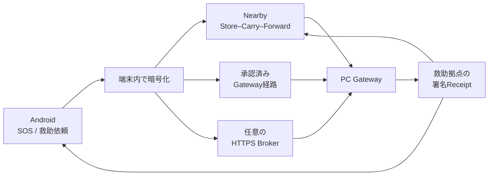

<div align="center">


# Relay

### 通信が途切れても、暗号化した救助情報を次の端末・救助拠点へ。

**Android・Nearby・PC Gateway・HTTPS Brokerを組み合わせる、災害時向けローカル優先中継システム。**

[](https://github.com/NEGI46/Relay/actions/workflows/relay-ci.yml)
[](#開発環境)
[](#ios開発基盤)
[](#開発環境)
[](#現在の状態)

[概要](#30秒でわかるrelay) ・ [仕組み](#仕組み) ・ [背景中継](#常時待機armedと災害通信) ・ [iOS](#ios開発基盤) ・ [現在の状態](#現在の状態) ・ [開発版](#開発版を試す) ・ [検証](#検証) ・ [ドキュメント](#主要ドキュメント) ・ [English](#english-overview)

</div>

> [!CAUTION]
> **Relayは119、消防・警察・自治体の公式な緊急連絡手段を置き換えません。**
> 現在は、限定区域の訓練・共同実証と技術検証に向けたコード基盤です。端末への保存、中継成功、Broker保管、Gateway受信、署名Receiptの取得は、救助隊の出動や人命救助の完了を保証しません。

---

## 30秒でわかるRelay

Relayは、携帯回線やインターネットが不安定な状況でも、救助要請を**暗号化したまま複数の経路で運ぶ**ことを目指しています。

| 対象 | 現在できること |
|---|---|
| **Android利用者** | SOS・通常依頼の作成、更新、取消、位置共有への明示同意、署名済み対応状況の確認 |
| **中継端末** | 救助本文を復号せず、暗号化Envelopeと署名ReceiptをStore–Carry–Forward |
| **PCスタッフ** | 個人アカウントでログインし、受信・担当・対応・完了を管理 |
| **HTTPS Broker** | 暗号文、公開Shelter Manifest、署名Receiptを中継。救助本文は復号しない |
| **iOS開発基盤** | SwiftUIホスト、Compose Multiplatform UI、XcodeGen、Codemagic workflow。救助暗号機能は未完成 |
| **開発者** | Android、PC Gateway、Broker、背景中継、E2E、fuzz、Windows監査、iOS simulator build基盤を検証 |

### Relayが解決しようとしていること

| 課題 | Relayの考え方 |
|---|---|
| 携帯回線が使えない | Nearbyによる端末間Store–Carry–Forward |
| 直接救助拠点へ届かない | 中継端末が暗号文を保持し、利用可能な経路を再試行 |
| モバイル回線だけ使える | HTTPS Brokerへ暗号文を預け、PC Gatewayがoutboundで取得 |
| 中継者に内容を見られたくない | 救助拠点公開鍵で暗号化し、中継端末とBrokerは復号しない |
| 「送信した」と「受け取られた」が混同される | 端末保存・中継・Broker保管・署名済み救助拠点受信を別状態として表示 |

---

## 仕組み



### 救助依頼の流れ

1. **作成**  
   AndroidでSOSを2秒長押しするか、人数・負傷・移動困難・必要な支援などを入力します。

2. **暗号化して保存**  
   本文、人数、状態、位置情報は、転送前に救助拠点公開鍵で暗号化されます。更新・取消に必要な復元情報も、別のAndroid Keystore鍵で暗号化されます。

3. **複数経路で再試行**  
   Nearby、Gateway、Brokerは独立した経路です。ある経路が停止しても、保存済みEnvelopeは他の利用可能な経路で再試行されます。

4. **救助拠点で受信**  
   PC GatewayがEnvelopeを復号し、重複を除外してスタッフ画面へ表示します。

5. **署名Receiptを返送**  
   保存・受領・対応中・完了などの状態を救助拠点が署名し、Androidは署名を検証して表示します。

### 受信先鍵がまだ見つからない場合

信頼済みの救助拠点公開鍵を取得できない場合、SOSは送信者だけが復元できるAES-GCM暗号化領域へ`PENDING_DESTINATION`として保存されます。

- 平文のSOSや未検証鍵で作ったEnvelopeを周囲へ配布しません。
- 信頼済み公開鍵が後から解決された時点で、転送可能な暗号化Envelopeへ変換します。
- Envelopeが一度も外へ出ていない段階なら、利用者は端末内の保留依頼だけを削除できます。

### モバイル通信だけで受信先鍵を取得する開発経路

`debug` / `localDev`では、PC Gatewayが**公開鍵だけを含むShelter Manifest**をBrokerへ公開し、LANへ一度も接続していないAndroidがBrokerから取得してdevelopment用に自己登録できます。

```text
PC Gateway
  └─ 公開Shelter ManifestをBrokerへpublish
          ↓ HTTPS
Android localDev
  └─ Manifestをfetch・validate・development用にpin
          ↓
救助拠点公開鍵でSOSを暗号化してBrokerへupload
```

- Gatewayの秘密鍵はBrokerへ送信しません。
- Manifest publishはGateway credentialで認証されます。
- Android側はHTTPS、size上限、shelter ID、Manifest構造と有効期間を検査します。
- **release / pilotReleaseでは自動self-pinを無効化**します。正式なRegional Root、署名Directory、承認済みprovisioningの代わりにはなりません。

---

## 常時待機（ARMED）と災害通信

Relayには、利用者が任意で有効化する背景中継の状態モデルがあります。

> [!IMPORTANT]
> **ARMEDはアプリやNearbyを常時起動するモードではありません。**
> 待機設定を永続化し、限られたOS起動経路を準備するだけです。ARMED単独では災害を自動検知できません。

| 状態 | 意味 |
|---|---|
| `DISABLED` | オプトインしていない。自動復元経路を無視 |
| `ARMED` | 待機設定のみ。process、Foreground Service、Nearby advertising/discoveryは動かさない |
| `EMERGENCY_ACTIVE` | `connectedDevice` Foreground Serviceで災害通信を実行 |
| `DEGRADED` | Bluetooth、権限、Play servicesなどの前提不足。災害通信の希望状態は保持 |
| `SUSPENDED_BY_USER` | 利用者が明示的に停止。非ユーザー経路から勝手に再開しない |

### 現在の起動経路

- アプリ内または通知からのユーザー操作
- 救助情報の作成・受信
- 未配送救助情報または実行中状態の再起動復元
- Bluetooth再有効化
- package replacement
- debug simulation

`ARMED`だけの状態は、再起動後にNearbyを自動開始しません。利用者が「すべて停止」を選んだ場合、`BOOT_RESTORE`、Bluetooth復元、救助情報などの非ユーザー経路は再開できません。

### 二重起動を防ぐ通信lease

通常通信、救助配送、災害通信は`CommunicationLeaseManager`で1つの共有runtimeを利用します。

- Nearby transport、Advertising、Discovery、Gateway syncを1組だけ起動
- 複数ownerが同時利用しても2つ目を起動しない
- 1つのownerが停止しても、他のownerが残っていれば通信を継続
- 最後のownerが解放された時だけruntimeを停止
- 明示的な「すべて停止」では全leaseを解放

### 現在できないこと

- Androidやメーカーの省電力制御、force-stop、Task Manager killを回避して永久動作すること
- FCM、気象庁XML、固定BLE beaconなどから災害を自動検知すること
- Direct Boot中に暗号化DBを読み、`LOCKED_BOOT_COMPLETED`から再開すること
- バッテリー消費量や熱状態を保証すること

FCM、気象庁情報、署名Activation Manifest、固定BLE Gatewayは設計文書のみで、実働infra・鍵・Firebase設定はありません。

---

## iOS開発基盤

iOS向けには、Compose Multiplatformを表示するSwiftUIホストと、クラウド上でbuildするための基盤が追加されています。

### 実装されている基盤

- `composeApp/iosApp`のSwiftUI entry pointとCompose view
- XcodeGenの`project.yml`と生成script
- Codemagicの`ios-simulator-smoke` workflow
- 手動実行の`ios-signed-archive` workflow
- Xcode 26.0、JDK 17、arm64 simulator向けbuild設定
- Kotlin `2.3.20`、KSP `2.3.10`、Compose Multiplatform `1.11.1`
- Kotlin/Native向け`NSRecursiveLock`によるmultiplatform同期処理
- platform依存を避けたpure Kotlin SHA-256
- storyboard compilationを不要にする`UILaunchScreen` dictionary

### 現在の制約

> [!WARNING]
> **iOS版は現時点で救助アプリとして利用できません。**

- `RescueCryptography`のiOS実装はSHA-256だけが実装済みです。
- 鍵生成、鍵import、SOS暗号化・復号、Receipt署名・検証、trust document署名・検証は`ios_not_yet_implemented`で停止します。
- iOSではMapLibre地図を表示せず、準備中のplaceholderを表示します。
- APNs、CoreBluetooth救助中継、実機通信、Privacy Manifest監査は未完了です。
- Codemagic workflowが存在することと、最新HEADのsimulator buildや署名archiveがgreenであることは同義ではありません。
- 署名archiveにはApple Developer / App Store Connectの証明書とprofileが必要です。

---

## 現在の状態

**実装確認基準: 2026-07-25 / source baseline `e566931`**  
このREADME更新コミットは文書のみを変更します。

| 状態 | 意味 |
|---|---|
| ✅ | 実装済み |
| 🧪 | 自動試験・エミュレータ・シミュレータの検証あり |
| 🧩 | 基盤はあるが、製品統合または運用provisioningが未完了 |
| ⚠️ | 外部準備または実機検証が必要 |
| ⛔ | 正式運用または当該機能の完成を主張できない |

| 領域 | 状態 | 現在の境界 |
|---|---:|---|
| Android救助フロー | ✅ | SOS、通常依頼、更新、取消、状態表示、日英UI |
| 暗号化セッション復元 | ✅ | Room + SQLCipher、別Keystore AES-GCM鍵、version CAS、process restart後の復元 |
| 明示同意型の位置更新 | ✅ | Switchで同意した場合だけ、新しい位置を取得して暗号化した次versionを作成 |
| 継続バックグラウンドGPS | ⛔ | location FGS、background location permission、WorkManager周期追跡は未実装 |
| ARMED / EMERGENCY状態モデル | 🧪 | 永続状態、明示停止、degrade/recovery、復元判断をJVM unit testで検証 |
| 単一通信lease | 🧪 | 通常通信・救助配送・災害通信の二重Foreground Service / Nearby起動を防止 |
| 自動災害検知 | ⛔ | FCM、気象庁、署名Activation Manifest、固定BLE triggerは設計のみ |
| Nearby救助中継 | ✅ | 暗号化Envelopeと署名ReceiptをStore–Carry–Forward。受信端末は再配送も開始 |
| Nearby接続ポリシー | 🧩 | `OPEN` / `TRUSTED`を実装し、明示connectを含めfail-closed。allow-list配布・更新の完成した運用者フローは未完成 |
| LAN Gateway信頼登録 | 🧪 | `relay-gw:1:` tokenを永続登録し、fail-closed load、明示rotation、GatewaySyncEngine配線、manifest pinningをunit testで検証。カメラQR取込UIと実機検証は未実施 |
| Broker Manifest enrollment | 🧪 | localDev限定。LAN未接続端末がBroker経由で公開鍵を取得し、暗号化SOSを作れるloop testあり |
| BLE Gateway信頼 | ⚠️ | Root → signed Directory → signed Manifest → advertised/GATT fingerprint。正式な地域Root/Directory未提供 |
| Android 6.0互換 | 🧪 | core library desugaringとAPI 23-safe処理を追加。実Android 6端末でのfield確認は未実施 |
| PC Gateway | ✅ | 個人staffアカウント、役割、監査、地図、公式情報、救助状態管理、署名Receipt |
| PC Gateway SQLite競合対策 | ✅ | DB単位のwrite coordinatorとlock fileでwriter競合を抑制 |
| CSV export | ✅ | messages/audit共通encoderで表計算ソフトのformula injectionを防止 |
| HTTPS Broker | ✅ | 暗号文保存、重複排除、TTL、scoped Gateway credential、Manifest・Receipt中継 |
| Broker security observability | 🧪 | 認証失敗・無効proof・rate limitなどを秘密情報なしの粗いcategoryだけで記録するseamとunit testあり |
| 固定ngrok開発preview | 🧪 | localDev APKへ固定endpointを組み込み、clone不要launcherと任意のlive E2E harnessを提供 |
| Broker高可用性 | ⛔ | 単一SQLite instance。HA、監視、災害復旧、RTO/RPOは未設計 |
| iOS host / build基盤 | 🧩 | SwiftUI、Compose、XcodeGen、Codemagic workflow、Kotlin/Native互換修正あり。最新CI greenは未確認 |
| iOS救助暗号・配送 | ⛔ | SHA-256以外のRescueCryptography、Nearby/CoreBluetooth救助配送、Receipt検証は未実装 |
| iOS MapLibre | ⛔ | 地図はplaceholder。実MapLibre統合なし |
| バッテリー・熱 | ⚠️ | ARMED / EMERGENCY_ACTIVEの実機測定は未実施。数値保証なし |
| 物理端末・現地RF | ⚠️ | Nearby/BLE多段、OEM省電力、実SIM、閉域LAN、停電復旧はField acceptance未完了 |
| 正式Release | ⛔ | 組織署名、Authenticode、Apple signing、正式TLS、地域trust artifact、法務・運用承認が必要 |

> [!IMPORTANT]
> **IMPLEMENTED、AUTOMATED_TESTED、EMULATOR_TESTED、DEVICE_TESTED、FIELD_READYは同じ意味ではありません。**
> 自動試験やクラウドbuildが成功しても、実端末、Bluetooth電波環境、停電、回線混雑、避難所スタッフの運用を検証したことにはなりません。

---

## 利用者に表示する送達状態

Relayは、単なるHTTP成功やNearby転送完了を「救助拠点に届いた」と表示しません。

| 内部状態 | 利用者向け表示 | 意味 |
|---|---|---|
| `PENDING_DESTINATION` | この端末に保存しました | 信頼済み受信先を確認中。転送可能Envelopeはまだ無い |
| `PENDING` | 近くの端末を探しています | 受信先鍵を確認済み。中継準備中 |
| `IN_TRANSIT` | 近くの端末へ中継中です | 端末間で搬送中。救助拠点の確認はまだ無い |
| `SHELTER_STORED` | 救助拠点に保存（署名確認済み） | 署名ReceiptによりPC Gateway保存を確認。スタッフ未対応の場合がある |
| `SHELTER_ACCEPTED` | スタッフが受領しました | スタッフが依頼を受領 |
| `SHELTER_RESPONDING` | 避難所が対応中です | スタッフが対応状態へ進めた |
| `SHELTER_COMPLETED` | 対応が完了しました | 署名済み完了状態 |
| `CANCELLED` | 取り消し済みです | 救助拠点が取消を確認 |
| `SHELTER_REJECTED` | 確認が必要です | 救助拠点側で確認が必要な終了状態 |

次のイベントだけでは、救助拠点受信や救助開始を意味しません。

- Nearby payload transfer完了
- peer ACK
- GatewayへのHTTP 2xx
- Brokerの`BROKER_STORED`
- 未検証のReceipt

---

## セキュリティと信頼境界

### 暗号化と保存

- 救助本文は救助拠点公開鍵で暗号化してから保存・転送します。
- AndroidのRoom DBはSQLCipherを使用します。
- 更新・取消用の復元payloadは、SQLCipher passphraseとは別のAndroid Keystore AES-GCM鍵で保護します。
- sessionとEnvelopeは同じRoom transactionで更新し、version CASで競合を検出します。
- 復号に失敗した復元dataを黙って削除したり、新規依頼へ置き換えたりしません。

### 位置情報

- 依頼作成時に位置を取得します。
- 利用者が明示的に同意すると、同意状態を暗号化して永続化し、新しい位置を取得した更新versionを送れます。
- 同意前に位置hardwareへアクセスしません。
- 常時・無期限・バックグラウンドのGPS追跡ではありません。

### Nearby

`OPEN`はゼロ操作でmeshを形成するため、到達可能なpeerを受け入れる既定モードです。これはpeerの本人確認ではありません。payload側ではsize、TTL、hop、hash、version、重複、衝突を検査します。

`TRUSTED`は明示allow-listに含まれるpeerだけを許可します。allow-listは受信・自動発起に加えて明示的な`connect()`発信経路でもfail-closedで強制されます。ただし、allow-listを安全に配布・更新する完成した運用者フローはありません。

### LAN Gateway discovery

UDP discovery beaconは**発見手段であって認証ではありません**。Androidでは次の境界を実装しています。

- QR・手入力用`relay-gw:1:` token
- checksum、field validation、fingerprint pinning
- SharedPreferencesへのcanonical payload永続化
- 破損entryのfail-closed除外と再保存
- 同一gatewayIdの異なるidentityをsilent overwriteしない明示rotation
- GatewaySyncEngineへのenrollment store配線
- 矛盾beaconの拒否
- headless import flow
- 登録tokenのshelterIdとShelter Manifestのfail-closed照合

残る主な項目は、カメラQR取込UIと実端末・現地LAN検証です。

### Broker Manifest relay

Brokerが返すShelter Manifestは公開鍵materialですが、Brokerから取得できたこと自体は正式な地域trustを証明しません。そのため自動self-pinは`debug` / `localDev`だけに限定され、release / pilotReleaseでは無効です。

### BLE Gateway trust

```text
承認済みRegional Root
        ↓ signature
Root署名済みRegional Shelter Directory
        ↓ key / manifest binding
署名済みShelter Manifest
        ↓ advertised identity = GATT identity
BLE Gatewayへ暗号化Envelopeを提出
```

コードはfail-closedですが、正式な地域RootとRoot署名済みDirectoryはリポジトリに含まれていません。Regional Root秘密鍵をリポジトリ、APK、running Gatewayへ入れてはいけません。

### PC Gateway

既定の`production` profileは次の状態で起動します。

- bind: `127.0.0.1`
- anonymous ingress: off
- UDP discovery: off
- remote management: off
- legacy `X-Admin-Key`: rejected

staffは個人アカウントを使い、`ADMIN` / `OPERATOR` / `VIEWER`へ分離されます。passwordはPBKDF2-HMAC-SHA-256、session tokenはrandom 256-bitで、DBにはhashだけを保存します。

Gatewayの救助秘密鍵は現在、owner-only local fileです。DPAPI、HSM、KMS保護済みとは主張しません。Windows監査ではDPAPI導入を、native依存とthreat modelを含むmaintainer判断が必要な項目として延期しています。

### Broker

- Brokerは救助本文を復号しません。
- Androidは端末固有ECDSA P-256鍵の所持を証明して登録します。
- Gateway credentialは1つの`gatewayId`と`shelterId`へscopeされます。
- raw credentialは発行時だけ扱い、DBにはSHA-256 hashを保存します。
- production/lab Brokerはloopbackへbindし、外部TLS reverse proxyの背後で運用します。
- 単一BrokerはHAではありません。
- security observabilityはcategoryだけを扱い、token、key、ciphertext、payloadをsinkへ渡しません。

### Background relay

- ARMEDではprocess、Nearby、Foreground Service、短周期WorkManager、無期限WakeLockを維持しません。
- `POST_NOTIFICATIONS`拒否は通信の即時停止ではなく、通知可視性のdegraded状態として扱います。
- OS exit reasonだけで「利用者が永久停止した」と判断せず、アプリ内で保存した明示停止flagを優先します。
- force-stopやメーカー独自の深い省電力を回避する仕組みではありません。

### iOS

- 現在のiOS実装はUI/build smoke用です。
- SHA-256以外の救助暗号操作はfail-fastします。
- iOS buildが通ることを、救助暗号・BLE・Broker配送が機能する証明として扱いません。

---

## 開発版を試す

> [!WARNING]
> 以下は**個人開発・動作確認専用**です。debug/localDev APK、unsigned Windows installer、未署名iOS simulator app、ngrok・Cloudflareの開発tunnelを共同実証の正式配布物や緊急運用へ使わないでください。

### 最短: 配布物だけでモバイル通信経路を試す

同じWi-Fiがなく、Androidが**モバイル通信だけ**でも、固定ngrokドメインを経由して次の流れを試せます。

```text
PC Gateway → 公開ManifestをBrokerへpublish
Android → BrokerからManifest取得 → SOSを暗号化してupload
PC Gateway → Brokerからpull・復号 → 署名Receiptを返送
```

リポジトリのclone、毎回のAPK build、事前のLAN enrollmentはdevelopment previewの通常経路では不要です。

#### 必要なもの

- Docker Desktop（起動済み）
- 無料ngrokアカウントとauthtoken
- `Publish Relay development preview`で配布されるAndroid APK
- Windows開発previewの次のファイル
  - `Relay-PC-Gateway-development-preview-unsigned.exe`
  - `Start-Relay-Broker-Tunnel-Development.cmd`
  - `Start-Relay-Broker-Tunnel-Development.ps1`
  - `relay-broker-bundle.zip`

#### 手順

1. unsigned Windows installerをインストールします。
2. Androidへ`Relay-Android-development-preview-debug.apk`をインストールします。
3. broker tunnel launcherと`relay-broker-bundle.zip`を同じfolderへ置きます。
4. `Start-Relay-Broker-Tunnel-Development.cmd`を実行し、ngrok authtokenを対話入力します。
5. localhost staff consoleへ、初回に作成した管理者accountでsign inします。
6. GatewayがBrokerへManifestをpublishすると、Android localDevはLANなしで受信先公開鍵を取得できます。

```powershell
Start-Relay-Broker-Tunnel-Development.cmd
```

現在のsource既定domain:

```text
https://buffed-unlawful-detached.ngrok-free.dev
```

別の予約済みdomainを使う場合:

```powershell
Start-Relay-Broker-Tunnel-Development.cmd -NgrokDomain your-name.ngrok-free.dev
```

停止:

```powershell
Start-Relay-Broker-Tunnel-Development.cmd -Down
```

補足:

- stateと生成鍵: `%LOCALAPPDATA%\Relay\broker-tunnel`
- credentialの既定有効期間: 2時間（1〜24時間へ変更可能）
- 2回目以降は既存管理者を使うため、通常はusername/passwordを再入力しません。
- 管理者を作り直す場合だけ`-ResetAdmin`を指定します。
- Docker engineが停止中の場合は明示的に停止します。
- `-EnableLanEnrollment`はLAN discovery経路も試す場合の開発用optionです。モバイル専用Manifest relayの必須条件ではありません。
- authtokenとBroker credentialをconsole・file・command historyへ書き込まない設計です。

> [!WARNING]
> 固定URLであっても、無料ngrok tunnelはproduction infrastructureではありません。SLA、HA、自治体承認、正式TLS運用、監視、incident responseの代わりにはなりません。

### LAN内だけでPC Gatewayを試す

開発previewに含まれる`Start-Relay-PC-Gateway-Development.cmd`を実行するか、sourceから次を実行します。

```powershell
.\scripts\start-pc-gateway-development.ps1
```

- 初回に管理者ユーザー名と12文字以上のpasswordを入力します。
- 開発dataは`%LOCALAPPDATA%\Relay\development`へ隔離されます。
- staff consoleは`http://127.0.0.1:8080/`で開きます。
- developmentだけ、匿名救助ingressとUDP discoveryを有効化します。

### Sourceからbuildする

#### 開発環境

- JDK 17
- Android SDK / API 36
- Git
- WindowsでGateway installerを作る場合はWiX 3
- Broker containerまたはtunnelを試す場合はDocker Compose
- Playwright E2Eを実行する場合はNode.js
- iOSをbuildする場合はmacOS、Xcode 26、XcodeGen

主なversion:

- Kotlin: `2.3.20`
- KSP: `2.3.10`
- Compose Multiplatform: `1.11.1`
- Android min SDK: 23（Android 6.0）
- Android target / compile SDK: 36
- Android version: `1.0.0`
- core library desugaring: enabled

Clone:

```bash
git clone https://github.com/NEGI46/Relay.git
cd Relay
git switch agent/zero-operation-relay
```

Windowsの基本build:

```powershell
.\gradlew.bat :app:assembleLocalDev :pc-gateway:installDist :broker:build
```

Android APK:

```text
app/build/outputs/apk/localDev/app-localDev.apk
```

固定Broker endpointを埋め込む場合:

```powershell
.\gradlew.bat :app:assembleLocalDev -Prelay.broker.endpoint=https://your-domain.example
```

endpointはHTTPS・host必須・embedded credential禁止です。空の場合はBroker配送を無効化します。

### iOSをmacOSでbuildする

XcodeGenを導入してprojectを生成します。

```bash
./scripts/ios/install-xcodegen.sh
./scripts/ios/generate-xcode-project.sh
```

Kotlin frameworkだけを先に確認する場合:

```bash
./gradlew :composeApp:linkDebugFrameworkIosSimulatorArm64 --no-daemon --stacktrace
```

生成後は次のprojectをXcodeで開きます。

```text
composeApp/iosApp/RelayIOS.xcodeproj
```

この手順で確認できるのはiOS host / Compose UI / build統合です。救助暗号や通信機能の完成を意味しません。

### その他のBroker開発構成

管理するdomainとCaddyを使う限定テスト:

```bash
cd deployment/broker
cp .env.example .env
# RELAY_PUBLIC_DOMAINを設定
docker compose up -d --build
```

固定domainを使わない短時間Cloudflare Quick Tunnel PoC:

```powershell
.\gradlew.bat :broker:installDist
docker compose -f compose.quick-tunnel.yml up -d --build
docker compose -f compose.quick-tunnel.yml logs -f cloudflared
```

終了時:

```powershell
docker compose -f compose.quick-tunnel.yml down -v
```

Cloudflare Quick TunnelにもSLAはありません。詳細は[HTTPS Broker deployment](deployment/broker/README.md)と[Quick Tunnel Broker PoC](docs/runbooks/QUICK_TUNNEL_BROKER_POC.md)を参照してください。

---

## 検証

### Windowsの一括検証

```powershell
.\scripts\validate-windows-development.ps1
```

各checkを`PASS` / `FAIL` / `BLOCKED` / `NOT_RUN`で分類し、次のJSON reportを生成します。

```text
artifacts/windows-validation-report.json
```

Release前の厳格判定:

```powershell
.\scripts\validate-windows-development.ps1 -Strict
```

2026-07-24のWindows監査では、監査対象HEADに対して次を記録しています。

- **20 PASS / 1 BLOCKED / 0 FAIL**
- JVM主要suite: **444 tests / 0 failures / 0 errors / 1 infrastructure-gated skip**
- BLOCKED: `gateway-backup-restore`。Windows向けlitestream binaryがなく、`age` / `age-keygen`も未導入

これは監査時点の証拠です。その後のiOS/toolchain変更を含む最新HEAD全体の再実行結果ではありません。

### Android instrumentation

```powershell
.\scripts\run-android-instrumentation.ps1
```

または:

```bash
./gradlew :app:mediumPhoneApi36DebugAndroidTest
```

Gradle Managed DeviceはAPI 36のheadless Medium Phoneを構築し、test後に停止します。wrapperは「BUILD SUCCESSFULだが0件実行」のfalse greenも失敗として扱います。

### JVM・desktop・fuzz regression

Windows:

```powershell
.\gradlew.bat :shared:jvmTest :app:testDebugUnitTest :pc-gateway:test :broker:test :composeApp:desktopTest :fuzz-jvm:test
```

macOS / Linux:

```bash
./gradlew :shared:jvmTest :app:testDebugUnitTest :pc-gateway:test :broker:test :composeApp:desktopTest :fuzz-jvm:test
```

`fuzz-jvm`は、出荷コードのEnvelope JSON、Gateway DTO、QR frame decoderを直接呼ぶJazzer JUnit targetを含みます。

### PCスタッフ画面のbrowser E2E

```bash
cd staff-console-e2e
npm install
npx playwright install chromium
npm test
```

実Ktor route、実static SPA、実staff session、実救助intakeを起動し、login、critical SOS確認、status更新、health/settings、filterをChromiumで操作します。

### iOS Codemagic

`codemagic.yaml`には次のmanual workflowがあります。

| Workflow | 内容 | 現在の扱い |
|---|---|---|
| `ios-simulator-smoke` | Swift tests、shared JVM tests、XcodeGen、Kotlin iOS framework、unsigned arm64 simulator app | source / workflow基盤あり。最新greenはこのREADME更新で未確認 |
| `ios-signed-archive` | signing file取得、Release archive、IPA生成 | Apple signing設定が必要。成功を未確認 |

simulator workflowはcompiler errorを見失わないよう、Kotlin frameworkをXcode build前に直接compileし、Gradle・xcodebuild logをartifact化します。

### 現在記録されている自動検証

| 検証 | 記録 |
|---|---|
| Android API 36 instrumentation | 20/20、失敗0の過去記録あり |
| Background relay unit suite | 状態遷移、明示停止、復元判断、start backoff、lease、exit interpretation |
| LAN Gateway enrollment | persistence、破損load、衝突、rotation、trust decision、manifest shelter pinning |
| Nearby TRUSTED policy | inbound、auto-initiate、明示connectのallow-list enforcement |
| Broker observability | AUTH_FAILED、INVALID_REGISTRATION_PROOF、RATE_LIMITED、no-op default |
| PC Gateway staff console Playwright | Chromium 4/4の過去記録あり |
| Mobile provisioning loop | LAN未接続phoneがBroker Manifestだけで暗号化し、Gateway秘密鍵で復号できるin-process test |
| Broker→Gateway→Receipt E2E | 実HTTP、SQLite、RSA-OAEP、ECDSA署名を使うtest |
| Broker/Gateway load test | 60端末相当、pull pagination、各端末へのReceipt分離 |
| fault injection | 最初のpullとReceipt POSTを失敗させ、loss・duplicateなしでretry |
| Decoder safety | deterministic regressionと実Jazzer target |
| Windows監査 | 20 PASS / 1 BLOCKED / 0 FAILの監査記録 |
| iOS | workflow・host・toolchain sourceあり。実機・暗号機能・最新CI greenは未確認 |

### 任意のlive ngrok E2E

`RemoteBrokerTunnelE2ETest`は、環境変数でremote Broker URLとcredentialを渡した場合だけ、実ngrok HTTPS経路で次を試します。

```text
device register → signed upload → Gateway pull/decrypt
→ signed Receipt upload → device poll/verify
```

これはmanual / ops用であり、通常CIではskipされます。test harnessが存在することと、すべての環境でlive tunnel試験がPASSしたことは同義ではありません。

### まだ必要な実機・現地試験

- Android 2台・3台によるNearby多段中継
- ARMED → EMERGENCY_ACTIVEの実background start
- 実reboot、package replacement、Bluetooth OFF/ONからの復元
- Task Manager、force-stop、OEM省電力、Doze、App Standby
- ARMED idleとEMERGENCY_ACTIVE 1時間・6時間のbattery / thermal測定
- 実BLE advertisement / GATT identityと公式Directoryの照合
- Android 6.0実端末でのNearby・session・Manifest fetch
- QR camera scanと永続Gateway enrollmentの実端末確認
- Android→閉域LAN→PC Gateway
- 実SIM→HTTPS Broker→Gateway→Receipt返送
- Gateway/Broker停止、停電、DB restore、回線復旧
- iOS simulator buildの最新Codemagic green確認
- iOS実機build、signing、救助暗号、CoreBluetooth、Broker経路
- 実スタッフによる担当競合、誤操作、fake SOS、負荷訓練
- Android / Windows / iOSの正式署名artifactを代表端末へinstall

このREADME更新では、最新HEADの全GitHub ActionsやCodemagic workflowがgreenであることを独自に再実行・確認したとは主張しません。

---

## 共同実証・正式運用までの主な不足

コードだけでは次の項目を完了できません。

1. 自治体・消防・避難所による責任分界、運用時間、停止条件、連絡計画
2. 正式なRegional Root bundleとRoot署名済みShelter Directory
3. Gatewayの実recipient key・receipt-signing keyとfingerprint確認
4. Android組織署名、Windows Authenticode、Apple signing、cosign/TUFの管理
5. TLS、DNS、reverse proxy、firewall、WAF、hosting、monitoring
6. Broker HA、backup、alert、RTO/RPO、障害訓練
7. 個人情報の保存期間、閲覧、削除、漏えい対応
8. 法務、保険、通信制度、OSS notice、プロジェクトlicense
9. 自動災害triggerの署名authority、配信server、運用鍵
10. iOS救助暗号、通信transport、Privacy Manifest、App Store要件
11. 実端末・実networkによるField acceptance test

**現在の総合判断:** `READY_FOR_DEVICE_TEST_WITH_TRUST_ARTIFACT_BLOCKER`

---

## リポジトリ構成

```text
app/                         Androidアプリ
  src/main/.../background/   ARMED / EMERGENCY状態・lease・exit処理
shared/                      共通model・暗号・trust contract
  src/iosMain/               iOS actual実装（救助暗号はSHA-256以外未完成）
relay-protocol/              Gateway wire protocol
pc-gateway/                  救助拠点PC Gateway
broker/                      HTTPS暗号文・Manifest・Receipt Broker
composeApp/                  Compose Multiplatform preview
  iosApp/                    SwiftUI / XcodeGen iOS host
deployment/broker/           Docker Compose + Caddy構成
pc-ble-bridge/               Windows BLE sidecar
fuzz-jvm/                    実Jazzer decoder target
staff-console-e2e/           Playwright browser E2E
gateway-meshtastic-adapter/  Meshtastic adapter
gateway-bp7-export/          BPv7 export boundary
test-lab/                    host・fault・simulator test
scripts/                     build・起動・検証・release tool
  ios/                       XcodeGen install・project生成・設定検証
docs/                        architecture・audit・runbook
codemagic.yaml               iOS simulator / signed archive workflow
```

---

## 主要ドキュメント

| 目的 | ドキュメント |
|---|---|
| iOS buildの状態 | [iOS build status](docs/IOS_BUILD_STATUS.md) |
| Codemagic設定 | [iOS Codemagic setup](docs/IOS_CODEMAGIC_SETUP.md) |
| 最新の総合debug監査 | [Full debug audit](docs/audits/FULL_DEBUG_AUDIT_2026-07-24.md) |
| Windowsで次に行う作業の監査 | [Windows next-work audit](docs/audits/WINDOWS_NEXT_WORK_AUDIT_2026-07.md) |
| 常時待機（ARMED）と災害通信 | [Background relay mode](docs/BACKGROUND_RELAY_MODE.md) |
| 背景中継のテスト計画 | [Background relay test plan](docs/BACKGROUND_RELAY_TEST_PLAN.md) |
| 自動災害trigger設計 | [Disaster activation triggers](docs/DISASTER_ACTIVATION_TRIGGERS.md) |
| バッテリー検証 | [Battery validation](docs/BATTERY_VALIDATION.md) |
| Nearby実装 | [Nearby implementation](docs/NEARBY_IMPLEMENTATION.md) |
| 現在の共同実証readiness | [Municipal pilot readiness](docs/readiness/MUNICIPAL_PILOT_READINESS.md) |
| 外部判断が必要な項目 | [Blocked by external decisions](docs/readiness/BLOCKED_BY_EXTERNAL_DECISIONS.md) |
| 救助session・BLE trust監査 | [Rescue durability and BLE trust audit](docs/audits/RESCUE_DURABILITY_INITIAL_AUDIT.md) |
| UI状態表記の根拠 | [UI copy refresh audit](docs/audits/UI_COPY_REFRESH_2026-07.md) |
| Android emulator既定値 | [Emulator validation defaults](docs/EMULATOR_VALIDATION_DEFAULTS.md) |
| PC Gateway開発setup | [PC Gateway setup](docs/PC_GATEWAY_SETUP.md) |
| PC Gateway本番配置 | [Production Gateway deployment](docs/runbooks/PRODUCTION_GATEWAY_DEPLOYMENT.md) |
| PC Gateway security | [PC Gateway security](docs/PC_GATEWAY_SECURITY.md) |
| Windows自動起動 | [PC Gateway autostart](docs/runbooks/PC_GATEWAY_AUTOSTART.md) |
| Broker設計 | [Broker architecture](docs/BROKER_ARCHITECTURE.md) |
| HTTPS Broker配置 | [HTTPS Broker deployment](deployment/broker/README.md) |
| Quick Tunnel PoC | [Quick Tunnel Broker PoC](docs/runbooks/QUICK_TUNNEL_BROKER_POC.md) |
| 現地受入試験 | [Field acceptance test](docs/runbooks/FIELD_ACCEPTANCE_TEST.md) |
| Backup | [Gateway backup](docs/runbooks/GATEWAY_BACKUP.md) |
| 正式Release検証 | [Formal release verification](docs/runbooks/VERIFY_FORMAL_RELEASE.md) |
| Security reporting | [Security policy](SECURITY.md) |

> [!NOTE]
> 一部の監査・状態文書は作成時点のtoolchainやHEADを記録しています。現在のversionは`gradle/libs.versions.toml`と最新commitを優先してください。

---

## 画面

| Androidホーム | 救助依頼 | 公式情報 |
|---|---|---|
|  |  |  |

---

## English overview

<details>
<summary><strong>Open the English summary</strong></summary>

Relay is a **local-first encrypted rescue-information relay** for outages and intermittent networks.

- Android creates, encrypts, persists, updates, and cancels rescue requests.
- Nearby devices carry ciphertext without receiving the shelter private key.
- An optional HTTPS Broker stores ciphertext, public shelter manifests, and signed receipts; it never decrypts the rescue body.
- PC Gateway decrypts at the shelter boundary, supports named staff accounts, publishes its public manifest, and returns signed receipts.
- LAN Gateway enrollment is now durably wired into Android with fail-closed loading, explicit rotation, beacon rejection, and shelter-manifest pinning. Camera QR capture and physical-device validation remain unfinished.
- A localDev phone with no prior LAN visit can fetch the Gateway's public manifest from the Broker and encrypt an SOS with that key. This self-pinning shortcut is development-only and disabled in release/pilot builds.
- The opt-in ARMED state persists readiness but does not keep the process, Nearby, or a foreground service running. EMERGENCY_ACTIVE uses a connected-device foreground service.
- A shared owner/lease prevents duplicate communication runtimes when user communication, rescue delivery, and emergency mode overlap.
- Explicit user stop blocks non-user restart routes. Android/OEM force-stop behavior cannot be bypassed.
- Automatic FCM/JMA/signed-manifest/BLE disaster activation is design-only and not implemented.
- Broker security observability records coarse rejection categories without tokens, keys, ciphertext, or payload bodies.
- The repository now includes a SwiftUI/Compose iOS host, XcodeGen project generation, and Codemagic simulator/archive workflows.
- The iOS rescue implementation is not complete: only SHA-256 is implemented; key generation, encryption, decryption, receipt verification, BLE transport, and MapLibre rendering are unavailable.
- Recorded automated evidence does not replace physical RF, reboot, battery, thermal, OEM power-policy, iOS-device, or field validation.

Relay is not an emergency-dispatch service, not a 119 replacement, and not production-ready.

</details>

---

## License / ライセンス

No project license has been selected. Do not assume permission to redistribute, modify, or commercially use the code until a license is added.

プロジェクトのライセンスは未選定です。ライセンスが追加されるまでは、再配布・改変・商用利用の許可があるものとみなさないでください。