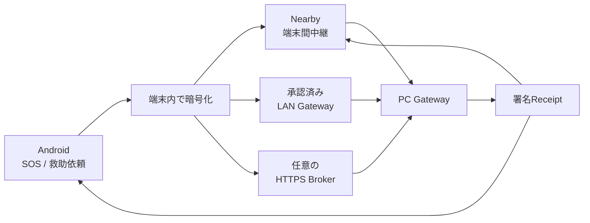
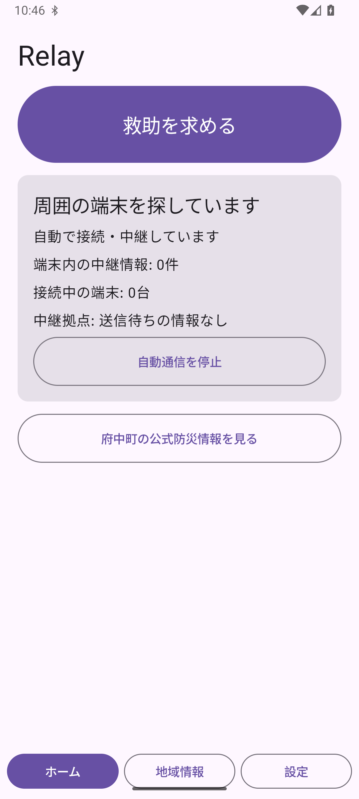
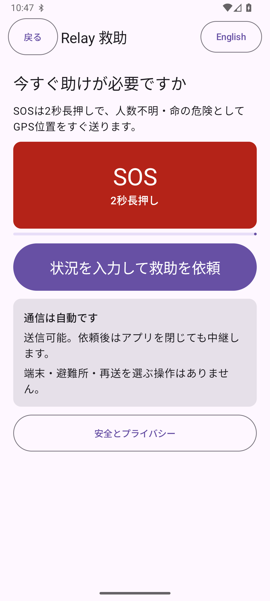
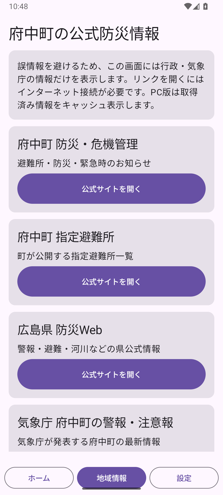

<div align="center">


# Relay

### 通信が途切れても、暗号化した救助情報を次の端末・救助拠点へ。

**Android・Nearby・PC Gateway・HTTPS Brokerを組み合わせた、災害時向けローカル優先中継システムです。**

[](https://github.com/NEGI46/Relay/actions/workflows/relay-ci.yml)
[](#開発環境)
[](#開発環境)
[](#現在の状態)

[概要](#relayとは) ・ [現在の状態](#現在の状態) ・ [仕組み](#仕組み) ・ [開発版](#開発版を試す) ・ [検証](#検証) ・ [未完了](#共同実証正式運用までの主な不足) ・ [ドキュメント](#主要ドキュメント)

</div>

> [!CAUTION]
> **Relayは119、消防・警察・自治体の公式な緊急連絡手段を置き換えません。**
> 現在は、限定区域での訓練・共同実証・技術検証に向けたコード基盤です。端末保存、中継、Broker保管、Gateway受信、署名Receiptは、救助隊の出動や人命救助の完了を保証しません。

---

## Relayとは

Relayは、携帯回線やインターネットが不安定な状況でも、救助情報を**暗号化したまま複数経路で運ぶ**ことを目指しています。

| 対象 | 役割 |
|---|---|
| **Android利用者** | SOS・通常依頼の作成、更新、取消、位置共有への明示同意、対応状況の確認 |
| **中継端末** | 本文を復号せず、暗号化Envelopeと署名ReceiptをStore–Carry–Forward |
| **PCスタッフ** | 個人アカウントでログインし、受信・担当・対応・完了を管理 |
| **HTTPS Broker** | 暗号文、公開Shelter Manifest、署名Receiptを一時中継。救助本文は復号しない |

### 想定する通信経路



- **オフライン:** Nearbyで周囲の端末へ暗号文を中継
- **同一LAN:** 承認済みPC Gatewayへ直接配送
- **モバイル回線:** HTTPS Brokerへ預け、PC Gatewayがoutboundで取得
- **確認:** 救助拠点が署名したReceiptだけを、受信済み・対応中・完了の根拠に使用

---

## 現在の状態

**実装確認基準: 2026-07-25 / source baseline `9e7119c`**  
このREADME更新コミットは文書のみを変更します。

| 記号 | 意味 |
|---|---|
| ✅ | 実装済み |
| 🧪 | 自動試験・シミュレータなどの検証あり |
| 🧩 | 基盤はあるが、製品統合または実機検証が未完了 |
| ⚠️ | 外部準備・正式鍵・現地検証が必要 |
| ⛔ | 未実装、または正式運用を主張できない |

### Android・救助フロー

| 領域 | 状態 | 現在の境界 |
|---|---:|---|
| SOS・救助依頼 | ✅ | SOS、通常依頼、更新、取消、日英UI、状態表示 |
| 暗号化保存 | ✅ | Room + SQLCipher、別Keystore AES-GCM鍵、version CAS、process restart後の復元 |
| 位置更新 | ✅ | 利用者が明示同意した場合だけ、新しい位置を取得して暗号化更新 |
| 継続GPS追跡 | ⛔ | background location、location FGS、周期追跡は未実装 |
| ARMED / EMERGENCY | 🧪 | 永続状態、明示停止、degrade/recovery、復元判断、共有通信leaseをunit testで検証 |
| 自動災害検知 | ⛔ | FCM、気象情報、署名Activation Manifest、固定BLE triggerは設計のみ |

### 通信・信頼登録

| 領域 | 状態 | 現在の境界 |
|---|---:|---|
| Nearby救助中継 | ✅ | 暗号化Envelopeと署名ReceiptをStore–Carry–Forward。受信端末も再配送を開始 |
| Nearby接続ポリシー | 🧩 | `OPEN` / `TRUSTED`を実装。明示connectを含めallow-listをfail-closedで強制。安全な配布・更新運用は未完成 |
| LAN Gateway登録 | 🧪 | `relay-gw:1:` tokenの検証・永続化・明示rotation・矛盾beacon拒否・manifest pinningを実装 |
| 登録確認フロー | 🧪 | scanまたは貼付内容を即登録せず、fingerprint確認後に保存。競合時は明示rotationが必要 |
| 登録画面 | 🧩 | controllerとsecurity testは実装済み。カメラscanを含む完成したCompose画面は未実装 |
| Broker Manifest登録 | 🧪 | `debug` / `localDev`限定。LAN未接続端末がBrokerから公開鍵を取得するloop testあり |
| BLE Gateway信頼 | ⚠️ | Root → signed Directory → signed Manifest → advertised/GATT fingerprint。正式な地域Root/Directoryは未提供 |

### PC Gateway・Broker

| 領域 | 状態 | 現在の境界 |
|---|---:|---|
| PC Gateway | ✅ | 個人staffアカウント、役割、監査、地図、公式情報、救助状態管理、署名Receipt |
| SQLite競合対策 | ✅ | DB単位のwrite coordinatorとlock fileでwriter競合を抑制 |
| CSV export | ✅ | messages/audit共通encoderでformula injectionを防止 |
| HTTPS Broker | ✅ | 暗号文保存、重複排除、TTL、scoped credential、Manifest・Receipt中継 |
| Broker observability | 🧪 | 認証失敗・無効proof・rate limitなどを秘密情報なしの粗いcategoryだけで記録 |
| Packaged Broker–Gateway E2E | 🧪 | 実BrokerとGatewayをloopbackで起動するblack-box testを追加 |
| Broker高可用性 | ⛔ | 単一SQLite instance。HA、監視、災害復旧、RTO/RPOは未設計 |

### 検証・配布

| 領域 | 状態 | 現在の境界 |
|---|---:|---|
| Android 6.0互換基盤 | 🧩 | minSdk 23、core library desugaring、API 23 Managed Device laneあり。実行環境と実端末確認は未完了 |
| Windows一括検証 | 🧪 | protocol、unit test、lint、instrumentation、PlaywrightなどをPASS / FAIL / BLOCKED / NOT_RUNで分類 |
| 実機テスト基盤 | 🧩 | ADB/Mobly用script、reboot、Bluetooth、Doze、permission、battery収集を追加。実端末では未実行 |
| Coverage | 🧪 | Kover reportを追加。現時点では可視化のみで閾値強制なし |
| Build再現性 | 🧩 | `SOURCE_DATE_EPOCH`対応とAPK比較scriptあり。全artifactの再現可能性は未証明 |
| 正式Release | ⛔ | 組織署名、Authenticode、正式TLS、地域trust artifact、法務・運用承認が必要 |

> [!IMPORTANT]
> **IMPLEMENTED、AUTOMATED_TESTED、DEVICE_TESTED、FIELD_READYは同じ意味ではありません。**
> 自動試験の成功は、実端末、電波環境、停電、回線混雑、避難所運用の検証を意味しません。

---

## 仕組み

### 救助依頼の流れ

1. **作成**  
   AndroidでSOSを2秒長押しするか、人数・負傷・移動困難・必要な支援などを入力します。

2. **暗号化して保存**  
   本文、人数、状態、位置情報を救助拠点公開鍵で暗号化します。更新・取消用の復元情報は別のAndroid Keystore鍵で保護します。

3. **利用可能な経路で再試行**  
   Nearby、LAN Gateway、Brokerは独立した経路です。失敗したEnvelopeは端末に保持し、利用可能な経路で再試行します。

4. **PC Gatewayで受信**  
   救助拠点境界で復号し、重複を除外してスタッフ画面へ表示します。

5. **署名Receiptを返送**  
   保存・受領・対応中・完了などの状態を救助拠点が署名し、Androidが署名を検証します。

### 受信先鍵が見つからない場合

信頼済みの救助拠点公開鍵を取得できないSOSは、`PENDING_DESTINATION`として送信者端末内へ暗号化保存します。

- 平文や未検証鍵で作ったEnvelopeを周囲へ配布しません。
- 信頼済み公開鍵が解決された時点で、転送可能なEnvelopeへ変換します。
- 一度も外部へ送信していない保留依頼は、端末内から削除できます。

### モバイル回線だけの開発経路

`debug` / `localDev`では、PC Gatewayが公開Shelter ManifestをBrokerへpublishし、LANへ接続していないAndroidが取得できます。

```text
PC Gateway → 公開ManifestをBrokerへpublish
Android    → Manifestを取得・検証・development用にpin
Android    → 公開鍵でSOSを暗号化してBrokerへupload
PC Gateway → Brokerからpull・復号・署名Receiptを返送
```

このself-pinは開発preview専用です。`release` / `pilotRelease`では無効で、正式なRegional Rootや署名Directoryの代わりにはなりません。

### 背景中継

> [!IMPORTANT]
> **ARMEDはアプリやNearbyを常時動かすモードではありません。**

| 状態 | 意味 |
|---|---|
| `DISABLED` | オプトインしていない |
| `ARMED` | 待機設定のみ。process、Foreground Service、Nearbyは起動しない |
| `EMERGENCY_ACTIVE` | foreground serviceで災害通信を実行 |
| `DEGRADED` | Bluetooth、権限、Play servicesなどの前提不足 |
| `SUSPENDED_BY_USER` | 利用者が明示停止。非ユーザー経路から再開しない |

通常通信、救助配送、災害通信は`CommunicationLeaseManager`で1つのruntimeを共有し、NearbyやGateway syncの二重起動を防ぎます。

### 利用者へ表示する送達状態

| 内部状態 | 表示 | 意味 |
|---|---|---|
| `PENDING_DESTINATION` | この端末に保存しました | 信頼済み受信先を確認中 |
| `PENDING` | 近くの端末を探しています | 受信先鍵を確認済み |
| `IN_TRANSIT` | 近くの端末へ中継中です | 搬送中。救助拠点の確認なし |
| `SHELTER_STORED` | 救助拠点に保存 | 署名ReceiptによりGateway保存を確認 |
| `SHELTER_ACCEPTED` | スタッフが受領しました | スタッフが受領 |
| `SHELTER_RESPONDING` | 避難所が対応中です | 対応中 |
| `SHELTER_COMPLETED` | 対応が完了しました | 署名済み完了状態 |
| `CANCELLED` | 取り消し済みです | 取消を確認 |
| `SHELTER_REJECTED` | 確認が必要です | 救助拠点側で確認が必要 |

Nearby転送完了、peer ACK、HTTP 2xx、`BROKER_STORED`だけでは、救助拠点の受信や救助開始を意味しません。

---

## セキュリティと信頼境界

<details>
<summary><strong>暗号化と保存</strong></summary>

- 救助本文は救助拠点公開鍵で暗号化してから保存・転送します。
- AndroidのRoom DBはSQLCipherを使用します。
- 更新・取消用payloadは、SQLCipher passphraseとは別のAndroid Keystore AES-GCM鍵で保護します。
- sessionとEnvelopeは同じRoom transactionで更新し、version CASで競合を検出します。
- 復号失敗時にdataを黙って削除したり、新規依頼へ置換したりしません。

</details>

<details>
<summary><strong>NearbyとLAN Gateway</strong></summary>

- `OPEN`は到達可能なpeerを受け入れる既定モードであり、本人確認ではありません。
- `TRUSTED`はallow-list外のpeerを受信・自動発起・明示connectのすべてで拒否します。
- UDP discovery beaconは発見手段であり、認証手段ではありません。
- Gateway登録はchecksum、fingerprint、shelter ID、conflict、rotationをfail-closedで扱います。
- QRまたは貼付内容を読み取っただけでは登録せず、fingerprintの明示確認を要求します。

</details>

<details>
<summary><strong>PC GatewayとBroker</strong></summary>

PC Gatewayのproduction profileは、既定でloopback bind、anonymous ingress無効、UDP discovery無効、remote management無効、legacy admin key拒否です。

- staff accountは`ADMIN` / `OPERATOR` / `VIEWER`へ分離
- passwordはPBKDF2-HMAC-SHA-256
- session tokenはrandom 256-bitで、DBにはhashのみ保存
- Gateway秘密鍵はowner-only local file。DPAPI、HSM、KMS保護済みとは主張しない
- Brokerは救助本文を復号しない
- credentialはgateway IDとshelter IDへscopeし、DBにはhashのみ保存
- security eventはtoken、鍵、暗号文、本文を記録しない

</details>

---

## 開発版を試す

> [!WARNING]
> 以下は**個人開発・動作確認専用**です。debug/localDev APK、unsigned Windows installer、無料tunnelを共同実証の正式配布物や緊急運用へ使わないでください。

### 最短: モバイル通信経路

必要なもの:

- Docker Desktop（起動済み）
- 無料ngrokアカウントとauthtoken
- development previewのAndroid APK
- Windows previewのinstaller、Broker tunnel launcher、`relay-broker-bundle.zip`

手順:

1. Windows previewをインストールします。
2. Androidへdevelopment preview APKをインストールします。
3. launcherと`relay-broker-bundle.zip`を同じfolderへ置きます。
4. `Start-Relay-Broker-Tunnel-Development.cmd`を実行します。
5. localhost staff consoleへログインします。
6. GatewayがManifestをpublishすると、AndroidはLANなしで受信先公開鍵を取得できます。

```powershell
Start-Relay-Broker-Tunnel-Development.cmd
```

停止:

```powershell
Start-Relay-Broker-Tunnel-Development.cmd -Down
```

- stateと生成鍵: `%LOCALAPPDATA%\Relay\broker-tunnel`
- credentialの既定有効期間: 2時間
- 管理者を作り直す場合: `-ResetAdmin`
- LAN discoveryも試す場合: `-EnableLanEnrollment`

無料tunnelはproduction infrastructureではなく、SLA、HA、正式監視、incident responseを提供しません。

### LAN内だけでPC Gatewayを試す

```powershell
.\scripts\start-pc-gateway-development.ps1
```

- 初回に管理者ユーザー名と12文字以上のpasswordを入力
- dataは`%LOCALAPPDATA%\Relay\development`へ隔離
- staff console: `http://127.0.0.1:8080/`

### Sourceからbuildする

#### 開発環境

- JDK 17
- Android SDK / API 36
- Git
- Windows installerを作る場合はWiX 3
- Broker containerを使う場合はDocker Compose
- browser E2Eを実行する場合はNode.js

主な設定:

- Kotlin: `2.3.20`
- Android min SDK: 23
- Android target / compile SDK: 36
- core library desugaring: enabled

```bash
git clone https://github.com/NEGI46/Relay.git
cd Relay
git switch agent/zero-operation-relay
```

```powershell
.\gradlew.bat :app:assembleLocalDev :pc-gateway:installDist :broker:build
```

APK:

```text
app/build/outputs/apk/localDev/app-localDev.apk
```

Broker endpointを埋め込む場合:

```powershell
.\gradlew.bat :app:assembleLocalDev -Prelay.broker.endpoint=https://your-domain.example
```

endpointはHTTPS・host必須・embedded credential禁止です。空の場合はBroker配送を無効化します。

---

## 検証

### Windows一括検証

```powershell
.\scripts\validate-windows-development.ps1
```

各checkを`PASS` / `FAIL` / `BLOCKED` / `NOT_RUN`に分類し、次のreportを生成します。

```text
artifacts/windows-validation-report.json
```

厳格判定:

```powershell
.\scripts\validate-windows-development.ps1 -Strict
```

個別実行:

```powershell
.\scripts\validate-windows-development.ps1 -Only relay-protocol-test,pc-gateway-test,broker-test
```

### 2026-07-25の実装監査記録

| Check | 記録 |
|---|---|
| shared JVM test | PASS |
| relay protocol test | PASS |
| Android unit test | PASS |
| PC Gateway test | PASS |
| Broker test | PASS |
| Packaged Broker–Gateway E2E | PASS |
| Kover report | PASS、閾値強制なし |
| Android lint | BLOCKED、実行環境不足 |
| API 23 / API 36 instrumentation | BLOCKED、system image未導入 |
| Playwright | BLOCKED、Chromium未導入 |
| 実Android端末 | `BLOCKED_NO_DEVICE` |

これは監査時点の記録です。このREADME更新では、最新HEADの全workflowを再実行してgreenを確認したとは主張しません。

### 主な手動コマンド

Android unit / protocol / Gateway / Broker:

```powershell
.\gradlew.bat :shared:jvmTest :relay-protocol:test :app:testDebugUnitTest :pc-gateway:test :broker:test
```

API 23 / API 36 Managed Device:

```powershell
.\gradlew.bat :app:mediumPhoneApi23DebugAndroidTest
.\gradlew.bat :app:mediumPhoneApi36DebugAndroidTest
```

Staff console E2E:

```bash
cd staff-console-e2e
npm ci
npx playwright install chromium
npm test
```

APK再現性確認:

```powershell
.\scripts\verify-build-reproducibility.ps1
```

### 実機テスト用script

`scripts/device-test/`には、次の検証基盤があります。

- install・launch・no-crash smoke test
- reboot後のARMED状態確認
- Bluetooth OFF / ON recovery
- permission denial時のdegraded動作
- Doze mode
- package replacement
- Nearby multi-hop
- battery / thermal evidence収集
- Mobly orchestrator

scriptが存在することは、実端末でPASSしたことを意味しません。

---

## 共同実証・正式運用までの主な不足

1. Android 2台・3台によるNearby多段中継の実機確認
2. reboot、Bluetooth復元、Doze、OEM省電力、force-stopの代表端末検証
3. ARMED / EMERGENCY_ACTIVEのbattery・thermal測定
4. カメラscanを含むGateway登録画面と実LAN検証
5. 正式なRegional Root bundleとRoot署名済みShelter Directory
6. Gatewayの正式recipient key・receipt-signing keyとfingerprint確認
7. Android組織署名、Windows Authenticode、artifact provenance
8. TLS、DNS、reverse proxy、firewall、WAF、hosting、monitoring
9. Broker HA、backup、alert、RTO/RPO、障害訓練
10. 個人情報の保存期間、閲覧、削除、漏えい対応
11. 自治体・消防・避難所による責任分界、運用時間、停止条件、連絡計画
12. 法務、保険、通信制度、OSS notice、プロジェクトlicense
13. 実スタッフと実networkによるField acceptance test

**現在の総合判断:** `READY_FOR_DEVICE_TEST_WITH_TRUST_ARTIFACT_BLOCKER`

---

## リポジトリ構成

```text
app/                         Androidアプリ
shared/                      共通model・暗号・trust contract
relay-protocol/              Gateway wire protocol
pc-gateway/                  救助拠点PC Gateway
broker/                      HTTPS暗号文・Manifest・Receipt Broker
deployment/broker/           Docker Compose + Caddy構成
composeApp/                  Compose Multiplatform preview
pc-ble-bridge/               Windows BLE sidecar
fuzz-jvm/                    Jazzer decoder target
staff-console-e2e/           Playwright browser E2E
gateway-meshtastic-adapter/  Meshtastic adapter
gateway-bp7-export/          BPv7 export boundary
test-lab/                    host・fault・simulator test
scripts/device-test/         ADB・Mobly実機検証script
scripts/                     build・起動・検証・release tool
docs/                        architecture・audit・runbook
```

---

## 主要ドキュメント

| 目的 | ドキュメント |
|---|---|
| 最新のWindows実装監査 | [Windows implementation audit](docs/audits/WINDOWS_IMPLEMENTATION_AUDIT_2026-07.md) |
| Windowsで次に行う作業 | [Windows next-work audit](docs/audits/WINDOWS_NEXT_WORK_AUDIT_2026-07.md) |
| リポジトリ容量監査 | [Repository size audit](docs/audits/REPOSITORY_SIZE_AUDIT_2026-07.md) |
| 総合debug監査 | [Full debug audit](docs/audits/FULL_DEBUG_AUDIT_2026-07-24.md) |
| 背景中継 | [Background relay mode](docs/BACKGROUND_RELAY_MODE.md) |
| 背景中継テスト計画 | [Background relay test plan](docs/BACKGROUND_RELAY_TEST_PLAN.md) |
| 自動災害trigger設計 | [Disaster activation triggers](docs/DISASTER_ACTIVATION_TRIGGERS.md) |
| バッテリー検証 | [Battery validation](docs/BATTERY_VALIDATION.md) |
| Nearby実装 | [Nearby implementation](docs/NEARBY_IMPLEMENTATION.md) |
| 共同実証readiness | [Municipal pilot readiness](docs/readiness/MUNICIPAL_PILOT_READINESS.md) |
| 外部判断が必要な項目 | [Blocked by external decisions](docs/readiness/BLOCKED_BY_EXTERNAL_DECISIONS.md) |
| Android emulator既定値 | [Emulator validation defaults](docs/EMULATOR_VALIDATION_DEFAULTS.md) |
| PC Gateway開発setup | [PC Gateway setup](docs/PC_GATEWAY_SETUP.md) |
| PC Gateway本番配置 | [Production Gateway deployment](docs/runbooks/PRODUCTION_GATEWAY_DEPLOYMENT.md) |
| PC Gateway security | [PC Gateway security](docs/PC_GATEWAY_SECURITY.md) |
| Windows自動起動 | [PC Gateway autostart](docs/runbooks/PC_GATEWAY_AUTOSTART.md) |
| Broker設計 | [Broker architecture](docs/BROKER_ARCHITECTURE.md) |
| Broker配置 | [HTTPS Broker deployment](deployment/broker/README.md) |
| 現地受入試験 | [Field acceptance test](docs/runbooks/FIELD_ACCEPTANCE_TEST.md) |
| Backup | [Gateway backup](docs/runbooks/GATEWAY_BACKUP.md) |
| 正式Release検証 | [Formal release verification](docs/runbooks/VERIFY_FORMAL_RELEASE.md) |
| Security reporting | [Security policy](SECURITY.md) |

---

## 画面

| Androidホーム | 救助依頼 | 公式情報 |
|---|---|---|
|  |  |  |

---

## English overview

<details>
<summary><strong>Open the English summary</strong></summary>

Relay is a local-first encrypted rescue-information relay for outages and intermittent networks.

- Android creates, encrypts, persists, updates, and cancels rescue requests.
- Nearby devices carry ciphertext without receiving the shelter private key.
- PC Gateway decrypts at the shelter boundary and returns signed receipts.
- An optional HTTPS Broker stores ciphertext, public manifests, and signed receipts without decrypting the rescue body.
- Gateway enrollment uses fail-closed validation, persistent pinning, fingerprint confirmation, and explicit rotation.
- ARMED persists readiness but does not keep the process, Nearby, or a foreground service running.
- Automated tests, device-test scripts, and CI jobs do not replace physical RF, battery, reboot, power-policy, or field validation.

Relay is not an emergency-dispatch service, not a 119 replacement, and not production-ready.

</details>

---

## License / ライセンス

No project license has been selected. Do not assume permission to redistribute, modify, or commercially use the code until a license is added.

プロジェクトのライセンスは未選定です。ライセンスが追加されるまでは、再配布・改変・商用利用の許可があるものとみなさないでください。
