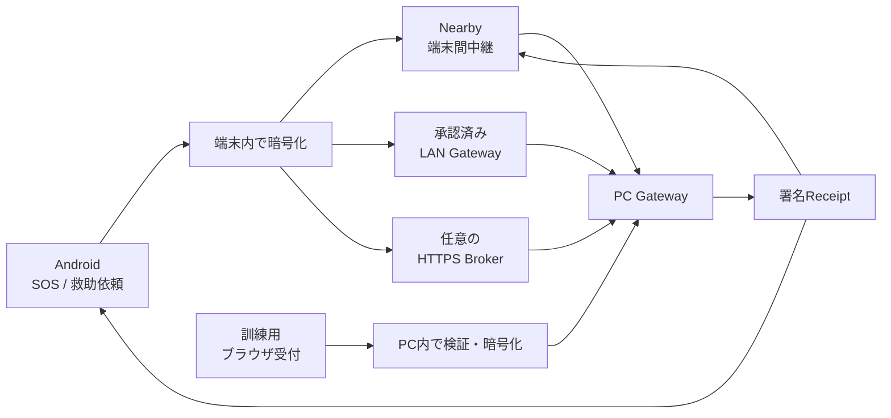

<div align="center">


# Relay

### 通信が途切れても、暗号化した救助情報を次の端末・救助拠点へ。

**Android・Nearby・PC Gateway・HTTPS Brokerを組み合わせた、災害時向けローカル優先中継システムです。**

[](https://github.com/NEGI46/Relay/actions/workflows/relay-ci.yml)
[](#開発環境)
[](#開発環境)
[](#現在の状態)

[概要](#relayとは) ・ [現在の状態](#現在の状態) ・ [仕組み](#仕組み) ・ [ローカル実証](#ローカル実証機能) ・ [開発版](#開発版を試す) ・ [検証](#検証) ・ [未完了](#共同実証正式運用までの主な不足) ・ [ドキュメント](#主要ドキュメント)

</div>

> [!CAUTION]
> **Relayは119、消防・警察・自治体の公式な緊急連絡手段を置き換えません。**
> 現在は、個人開発、避難訓練、限定区域での共同実証、技術検証に向けたコード基盤です。端末保存、中継、Broker保管、Gateway受信、署名Receipt、ブラウザ受付は、救助隊の出動や人命救助の完了を保証しません。

---

## Relayとは

Relayは、携帯回線やインターネットが不安定な状況でも、救助情報を**暗号化したまま複数経路で運ぶ**ことを目指しています。

| 対象 | 役割 |
|---|---|
| **Android利用者** | SOS・通常依頼の作成、更新、取消、位置共有への明示同意、対応状況の確認 |
| **中継端末** | 本文を復号せず、暗号化Envelopeと署名ReceiptをStore–Carry–Forward |
| **PCスタッフ** | 個人アカウントでログインし、受信・担当・対応・完了を管理 |
| **HTTPS Broker** | 暗号文、公開Shelter Manifest、署名Receiptを一時中継。救助本文は復号しない |
| **訓練参加者** | Relayアプリ未導入でも、明示的に有効化されたローカル実証ページから依頼を登録 |

### 想定する通信経路



- **オフライン:** Nearbyで周囲の端末へ暗号文を中継
- **同一LAN:** 承認済みPC Gatewayへ直接配送
- **モバイル回線:** HTTPS Brokerへ預け、PC Gatewayがoutboundで取得
- **ローカル実証:** ブラウザ入力を既存の救助Envelopeへ変換し、PC Gateway内の通常取込経路へ投入
- **確認:** 救助拠点が署名したReceiptだけを、受信済み・対応中・完了の根拠に使用

---

## 現在の状態

機械可読な唯一の正は [`docs/readiness/status.yml`](docs/readiness/status.yml) です。以下の生成ブロックと
[READINESS_TABLE](docs/readiness/READINESS_TABLE.md) はそこから自動生成され、CIが乖離を検出します。

<!-- BEGIN GENERATED: readiness-summary (tools/readiness/readiness_tool.py; edit docs/readiness/status.yml instead) -->
> [!NOTE]
> この節は `docs/readiness/status.yml`（唯一の正）から自動生成されます。手で編集しないでください。
>
> **status基準: 2026-07-29 / commit `23bd1da` / branch `agent/zero-operation-relay`**
>
> 管理対象 50機能: 実装済み 46 / 未実装 3 / 自動試験済み 43 / emulator検証済み 1 / **実機検証済み 0 / 現地検証済み 0** / 外部判断待ちを含む 7
>
> IMPLEMENTEDやAUTOMATED_TESTEDはDEVICE_TESTED・FIELD_TESTEDを意味しません。全機能の軸別状態は [READINESS_TABLE](docs/readiness/READINESS_TABLE.md)、未完了項目は [OPEN_ITEMS](docs/readiness/OPEN_ITEMS.md)、自治体向け要約は [MUNICIPAL_SUMMARY](docs/readiness/MUNICIPAL_SUMMARY.md) を参照してください。
<!-- END GENERATED: readiness-summary -->

| 記号 | 意味 |
|---|---|
| ✅ | 実装済み |
| 🧪 | 自動試験・シミュレータなどの検証あり |
| 🧩 | 基盤はあるが、最新実行確認または実機検証が未完了 |
| ⚠️ | 外部準備・正式鍵・現地検証が必要 |
| ⛔ | 未実装、または正式運用を主張できない |

### Android・救助フロー

| 領域 | 状態 | 現在の境界 |
|---|---:|---|
| SOS・救助依頼 | ✅ | SOS、通常依頼、更新、取消、日英UI、状態表示 |
| 暗号化保存 | ✅ | Room + SQLCipher、別Keystore AES-GCM鍵、version CAS、process restart後の復元 |
| 位置更新 | ✅ | 利用者が明示同意した場合だけ、新しい位置を取得して暗号化更新 |
| 継続GPS追跡 | ⛔ | background location、location FGS、周期追跡は未実装 |
| ARMED / EMERGENCY | 🧪 | 永続状態、明示停止、degrade/recovery、復元判断、共有通信leaseをunit testで検証 |
| 自動災害検知 | ⛔ | FCM、気象情報、署名Activation Manifest、固定BLE triggerは設計のみ |

### 通信・信頼登録

| 領域 | 状態 | 現在の境界 |
|---|---:|---|
| Nearby救助中継 | ✅ | 暗号化Envelopeと署名ReceiptをStore–Carry–Forward。受信端末も再配送を開始 |
| Nearby接続ポリシー | 🧩 | `OPEN` / `TRUSTED`を実装。明示connectを含めallow-listをfail-closedで強制。安全な配布・更新運用は未完成 |
| LAN Gateway登録 | 🧪 | `relay-gw:1:` tokenの検証・永続化・明示rotation・矛盾beacon拒否・manifest pinningを実装 |
| Gateway登録画面 | 🧪 | Compose画面、CameraX QR scan、貼付入力、fingerprint確認、競合時の二段階rotation、削除確認を実装 |
| カメラ権限拒否 | 🧪 | QRを強制せず、貼付入力へ安全にfallback。読み取り内容を即登録しない |
| Broker Manifest登録 | 🧪 | `debug` / `localDev`限定。LAN未接続端末がBrokerから公開鍵を取得するloop testあり |
| BLE Gateway信頼 | ⚠️ | Root → signed Directory → signed Manifest → advertised/GATT fingerprint。正式な地域Root/Directoryは未提供 |

### ローカル実証

| 領域 | 状態 | 現在の境界 |
|---|---:|---|
| ブラウザ受付（PUERTA） | 🧪 | 訓練用ページから入力し、既存の`RescueDeliveryIngress` / `RescueIntakeService`を通して暗号化保存 |
| 受付出所 | 🧪 | `LOCAL_WEB`、assurance、時刻など最小metadataだけを暗号本文外へ保存。名前・住所・IP・本文は保存しない |
| Observation / CSV（PONTE） | 🧪 | 職員Observation、訓練用CSV preview・一括import、opaque subject tokenを実装 |
| 要確認キュー（ÉCART） | 🧪 | 未確認・情報不足・確認優先度をルール化。行方不明、負傷、死亡、出動を自動判定しない |
| 支援profile（ANTICIPO Lite） | 🧪 | 移動・電源など限定flagだけを扱い、診断、薬、住所、公的番号などを除外 |
| 経路履歴（MOSAIK） | 🧪 | Local Web、LAN、Nearby/BLE、Broker、Receiptの各段階を区別。暗号文と個人情報は履歴へ出さない |
| 本番profile | ✅ | ローカル実証ページとAPIは常に404。環境変数だけでは有効化できない |
| LAN公開 | ⚠️ | 既定はloopback。`-AllowLan`による明示操作と、訓練LAN・Firewallの手動制限が必要 |

### PC Gateway・Broker

| 領域 | 状態 | 現在の境界 |
|---|---:|---|
| PC Gateway | ✅ | 個人staffアカウント、役割、監査、地図、公式情報、救助状態管理、署名Receipt |
| SQLite競合・migration | ✅ | journal設定をmigration前に行い、DB write coordinatorとlock fileを使用。migration失敗時は起動停止し、DBを作り直さない |
| CSV export | ✅ | messages/audit共通encoderでformula injectionを防止 |
| HTTPS Broker | ✅ | 暗号文保存、重複排除、TTL、scoped credential、Manifest・Receipt中継 |
| Broker observability | 🧪 | 認証失敗・無効proof・rate limitなどを秘密情報なしの粗いcategoryだけで記録 |
| Broker高可用性 | ⛔ | 単一SQLite instance。HA、監視、災害復旧、RTO/RPOは未設計 |

### 検証・配布

| 領域 | 状態 | 現在の境界 |
|---|---:|---|
| Windows一括検証 | 🧪 | JUnit XMLの時刻・件数・failureを検査し、0件・古い結果・BLOCKEDをPASSへ誤分類しない |
| Android 6.0検証 | 🧩 | minSdk 23、desugaring、classic API 23 AVD scriptあり。system imageと実端末確認は未完了 |
| API 36検証 | 🧩 | Gradle Managed Device laneあり。最新HEADでの実行確認は未実施 |
| 実機テスト基盤 | 🧩 | ADB端末を動的検出し、reboot、Bluetooth、Doze、permission、package replacement、battery、multi-hopを検証可能。実端末PASSは未確認 |
| Packaged E2E | 🧩 | BrokerとGatewayを別OS process・random port・一時DBで起動するblack-box harnessあり。最新PASSは未確認 |
| Heavy CI | 🧩 | Packaged E2EとAPK再現性を月・木および手動で実行するworkflowあり。最新runは未確認 |
| Coverage | 🧪 | Kover reportあり。現時点では可視化のみで閾値強制なし |
| Build再現性 | 🧩 | stale APK除外、Gradle exit code、ZIP entry SHA-256、metadata差異を検査。全artifactの再現可能性は未証明 |
| Repository hygiene | ✅ | 生成APK、EXE、MSIX、distribution、`bin` / `obj`など560件超を追跡対象から削除し、CIまたはlocal buildで再生成 |
| 正式Release | ⛔ | 組織署名、Authenticode、正式TLS、地域trust artifact、法務・運用承認が必要 |

> [!IMPORTANT]
> **IMPLEMENTED、AUTOMATED_TESTED、EMULATOR_TESTED、DEVICE_TESTED、FIELD_READYは同じ意味ではありません。**
> 自動試験や検証scriptの存在は、実端末、電波環境、停電、回線混雑、避難所運用の検証を意味しません。

---

## 仕組み

### 救助依頼の流れ

1. **作成**  
   AndroidでSOSを2秒長押しするか、人数・負傷・移動困難・必要な支援などを入力します。

2. **暗号化して保存**  
   本文、人数、状態、位置情報を救助拠点公開鍵で暗号化します。更新・取消用の復元情報は別のAndroid Keystore鍵で保護します。

3. **利用可能な経路で再試行**  
   Nearby、LAN Gateway、Brokerは独立した経路です。失敗したEnvelopeは端末に保持し、利用可能な経路で再試行します。

4. **PC Gatewayで受信**  
   救助拠点境界で復号し、重複を除外してスタッフ画面へ表示します。

5. **署名Receiptを返送**  
   保存・受領・対応中・完了などの状態を救助拠点が署名し、Androidが署名を検証します。

### 受信先鍵が見つからない場合

信頼済みの救助拠点公開鍵を取得できないSOSは、`PENDING_DESTINATION`として送信者端末内へ暗号化保存します。

- 平文や未検証鍵で作ったEnvelopeを周囲へ配布しません。
- 信頼済み公開鍵が解決された時点で、転送可能なEnvelopeへ変換します。
- 一度も外部へ送信していない保留依頼は、端末内から削除できます。

### モバイル回線だけの開発経路

`debug` / `localDev`では、PC Gatewayが公開Shelter ManifestをBrokerへpublishし、LANへ接続していないAndroidが取得できます。

```text
PC Gateway → 公開ManifestをBrokerへpublish
Android    → Manifestを取得・検証・development用にpin
Android    → 公開鍵でSOSを暗号化してBrokerへupload
PC Gateway → Brokerからpull・復号・署名Receiptを返送
```

このself-pinは開発preview専用です。`release` / `pilotRelease`では無効で、正式なRegional Rootや署名Directoryの代わりにはなりません。

### 背景中継

> [!IMPORTANT]
> **ARMEDはアプリやNearbyを常時動かすモードではありません。**

| 状態 | 意味 |
|---|---|
| `DISABLED` | オプトインしていない |
| `ARMED` | 待機設定のみ。process、Foreground Service、Nearbyは起動しない |
| `EMERGENCY_ACTIVE` | foreground serviceで災害通信を実行 |
| `DEGRADED` | Bluetooth、権限、Play servicesなどの前提不足 |
| `SUSPENDED_BY_USER` | 利用者が明示停止。非ユーザー経路から再開しない |

通常通信、救助配送、災害通信は`CommunicationLeaseManager`で1つのruntimeを共有し、NearbyやGateway syncの二重起動を防ぎます。

### 利用者へ表示する送達状態

| 内部状態 | 表示 | 意味 |
|---|---|---|
| `PENDING_DESTINATION` | この端末に保存しました | 信頼済み受信先を確認中 |
| `PENDING` | 近くの端末を探しています | 受信先鍵を確認済み |
| `IN_TRANSIT` | 近くの端末へ中継中です | 搬送中。救助拠点の確認なし |
| `SHELTER_STORED` | 救助拠点に保存 | 署名ReceiptによりGateway保存を確認 |
| `SHELTER_ACCEPTED` | スタッフが受領しました | スタッフが受領 |
| `SHELTER_RESPONDING` | 避難所が対応中です | 対応中 |
| `SHELTER_COMPLETED` | 対応が完了しました | 署名済み完了状態 |
| `CANCELLED` | 取り消し済みです | 取消を確認 |
| `SHELTER_REJECTED` | 確認が必要です | 救助拠点側で確認が必要 |

Nearby転送完了、peer ACK、HTTP 2xx、`BROKER_STORED`、ブラウザ受付完了だけでは、救助拠点の受領や救助開始を意味しません。

---

## ローカル実証機能

ローカル実証機能は、Relayアプリ未導入者を含む避難訓練で、受付・観察・確認作業を検証するための機能群です。

### PUERTA Local — ブラウザ受付

- staff consoleとは別の一般参加者向けページです。
- 入力を既存の`RescuePayload`へ変換し、救助拠点公開鍵で暗号化します。
- 救助recordをSQLiteへ直接INSERTせず、既存のTTL・重複排除・durable-before-receipt境界を再利用します。
- 成功画面が示すのは「このPCへ保存した」ことだけです。staff受領、出動、救助開始は意味しません。
- production profileではページとAPIを常に404にします。

### PONTE — Observationと訓練CSV

- `OPERATOR`がObservationを登録し、`VIEWER`は最小metadataだけを参照できます。
- subject tokenには名前ではなく、不透明な識別子を使用します。
- UTF-8 / BOM付きUTF-8、最大256 KiB、最大5,000行のCSVをpreviewしてからimportします。
- 1行でも不正な場合は全件を変更しません。
- CSVが高いassuranceを主張しても、import結果は`CSV_IMPORT / UNVERIFIED`として保存します。

### ÉCART / ANTICIPO Lite — 要確認と支援flag

- ÉCARTは「未確認」「情報不足」「要確認候補」「確認優先度」を表示します。
- 人が行方不明、負傷、死亡したとは判定せず、出動判断も行いません。
- ANTICIPO Liteは移動支援、電源支援、子どもの同伴など限定的なflagだけを扱います。
- 診断、薬、住所、国民識別番号、保険、家族詳細は保存対象外です。
- 期限切れ・取消済みprofileを現在の事実として表示しません。

### MOSAIK — 経路履歴

接続、API受付、payload転送、peer ACK、Broker保管、Gateway保存、署名Receiptを別の段階として記録します。transport成功とGateway受領を混同せず、暗号文や個人情報をUI/API履歴へ出しません。

---

## セキュリティと信頼境界

<details>
<summary><strong>暗号化と保存</strong></summary>

- 救助本文は救助拠点公開鍵で暗号化してから保存・転送します。
- AndroidのRoom DBはSQLCipherを使用します。
- 更新・取消用payloadは、SQLCipher passphraseとは別のAndroid Keystore AES-GCM鍵で保護します。
- sessionとEnvelopeは同じRoom transactionで更新し、version CASで競合を検出します。
- 復号失敗時にdataを黙って削除したり、新規依頼へ置換したりしません。

</details>

<details>
<summary><strong>NearbyとLAN Gateway</strong></summary>

- `OPEN`は到達可能なpeerを受け入れる既定モードであり、本人確認ではありません。
- `TRUSTED`はallow-list外のpeerを受信・自動発起・明示connectのすべてで拒否します。
- UDP discovery beaconは発見手段であり、認証手段ではありません。
- Gateway登録はchecksum、fingerprint、shelter ID、conflict、rotationをfail-closedで扱います。
- QRまたは貼付内容を読み取っただけでは登録せず、fingerprintの明示確認を要求します。

</details>

<details>
<summary><strong>ローカル実証</strong></summary>

- productionでは常に無効です。
- browserが`Origin`を送る場合はsame-Originを要求します。
- JSON、body size、enum、payload、有効期限を検査し、既存のanonymous rate limiterを使用します。
- `LOCAL_WEB` metadataにはrequest ID、source、assurance、時刻だけを保存します。
- 名前、住所、GPS、本文、暗号文、browser identity、token、IP addressをprovenance tableへ保存しません。
- migration失敗時は起動を停止し、既存DBの削除や破壊的再作成を行いません。

</details>

<details>
<summary><strong>PC GatewayとBroker</strong></summary>

PC Gatewayはすべてのprofileでloopback bindを既定とし、LAN公開は明示操作に限定します。

- staff accountは`ADMIN` / `OPERATOR` / `VIEWER`へ分離
- passwordはPBKDF2-HMAC-SHA-256
- session tokenはrandom 256-bitで、DBにはhashのみ保存
- Gateway秘密鍵はowner-only local file。DPAPI、HSM、KMS保護済みとは主張しない
- Brokerは救助本文を復号しない
- credentialはgateway IDとshelter IDへscopeし、DBにはhashのみ保存
- security eventはtoken、鍵、暗号文、本文を記録しない

</details>

---

## 開発版を試す

> [!WARNING]
> 以下は**個人開発・避難訓練・動作確認専用**です。debug/localDev APK、unsigned Windows installer、無料tunnel、ローカル実証ページを正式配布物や緊急運用へ使わないでください。

### ローカル実証を起動する

```powershell
.\scripts\Start-Relay-Local-Pilot.ps1
```

起動後に次を開きます。

```text
http://127.0.0.1:8080/local-pilot
```

staff console:

```text
http://127.0.0.1:8080/
```

契約確認:

```powershell
.\scripts\Test-Relay-Local-Pilot.ps1
```

停止:

```powershell
.\scripts\Stop-Relay-Local-Pilot.ps1
```

LAN内の訓練端末から接続する場合だけ、明示的に次を使用します。

```powershell
.\scripts\Start-Relay-Local-Pilot.ps1 -AllowLan
```

RelayはWindows Firewallを自動変更しません。訓練LANを限定し、終了後は必ず停止してください。

### モバイル通信経路を試す

必要なもの:

- Docker Desktop（起動済み）
- 無料ngrokアカウントとauthtoken
- development previewのAndroid APK
- Windows previewのinstaller、Broker tunnel launcher、`relay-broker-bundle.zip`

```powershell
Start-Relay-Broker-Tunnel-Development.cmd
```

停止:

```powershell
Start-Relay-Broker-Tunnel-Development.cmd -Down
```

- stateと生成鍵: `%LOCALAPPDATA%\Relay\broker-tunnel`
- credentialの既定有効期間: 2時間
- 管理者を作り直す場合: `-ResetAdmin`
- LAN discoveryも試す場合: `-EnableLanEnrollment`

無料tunnelはproduction infrastructureではなく、SLA、HA、正式監視、incident responseを提供しません。

### LAN内だけでPC Gatewayを試す

```powershell
.\scripts\start-pc-gateway-development.ps1
```

- 初回に管理者ユーザー名と12文字以上のpasswordを入力
- dataは`%LOCALAPPDATA%\Relay\development`へ隔離
- staff console: `http://127.0.0.1:8080/`
- 既定bindはloopback。LAN公開は明示設定が必要

### Sourceからbuildする

#### 開発環境

- JDK 17
- Android SDK / API 36
- Git
- Windows installerを作る場合はWiX 3
- Broker containerを使う場合はDocker Compose
- browser E2Eを実行する場合はNode.js

主な設定:

- Kotlin: `2.3.20`
- Android min SDK: 23
- Android target / compile SDK: 36
- core library desugaring: enabled

```bash
git clone https://github.com/NEGI46/Relay.git
cd Relay
git switch agent/zero-operation-relay
```

```powershell
.\gradlew.bat :app:assembleLocalDev :pc-gateway:installDist :broker:build
```

APK:

```text
app/build/outputs/apk/localDev/app-localDev.apk
```

Broker endpointを埋め込む場合:

```powershell
.\gradlew.bat :app:assembleLocalDev -Prelay.broker.endpoint=https://your-domain.example
```

endpointはHTTPS・host必須・embedded credential禁止です。空の場合はBroker配送を無効化します。

生成APK、EXE、MSIX、distribution packageはリポジトリへcommitせず、CIまたはlocal buildで作成します。

---

## 検証

### Windows一括検証

```powershell
.\scripts\validate-windows-development.ps1
```

各checkを`PASS` / `FAIL` / `BLOCKED` / `NOT_RUN`に分類し、次のreportを生成します。

```text
artifacts/windows-validation-report.json
```

厳格判定:

```powershell
.\scripts\validate-windows-development.ps1 -Strict
```

個別実行:

```powershell
.\scripts\validate-windows-development.ps1 -Only relay-protocol-test,pc-gateway-test,broker-test
```

validationは次を防止します。

- Gradle成功だがtestが0件
- 古いJUnit XMLの再利用
- failure / errorの見落とし
- stale APKの再利用
- `BLOCKED`やmock-only結果のPASS扱い
- processが生存しただけのreboot / Doze成功扱い

### 記録済みの検証境界

2026-07-25のfalse-green監査では、次を記録しています。

| Check | 記録 |
|---|---|
| shared JVM | 88 tests / PASS |
| relay protocol | 45 tests / PASS |
| Android unit | 194+ tests / PASS |
| API 23 AVD | BLOCKED、system image未導入 |
| API 36 Managed Device | NOT_RUN |
| Playwright | NOT_RUN |
| Packaged E2E | NOT_RUN |
| APK再現性 | NOT_RUN |
| 実Android端末 | BLOCKED |

ローカル実証向けには、PowerShell構文確認と`PuertaPilotTest`をWindowsで実行するworkflowが追加されています。このREADME更新では、最新HEADの全workflowがgreenであることを独自に再実行・確認したとは主張しません。

### 主な手動コマンド

JVM / Android unit / Gateway / Broker:

```powershell
.\gradlew.bat :shared:jvmTest :relay-protocol:test :app:testDebugUnitTest :pc-gateway:test :broker:test
```

API 23 classic AVD:

```powershell
.\scripts\android-test\run-api23-smoke.ps1
```

API 23はGradle Managed Devicesの対応範囲外であるため、`sdkmanager`、`avdmanager`、`emulator`を使います。成功してもAndroid 6実機検証とはみなしません。

API 36 Managed Device:

```powershell
.\gradlew.bat :app:mediumPhoneApi36DebugAndroidTest
```

Staff console E2E:

```bash
cd staff-console-e2e
npm ci
npx playwright install chromium
npm test
```

APK再現性確認:

```powershell
.\scripts\verify-build-reproducibility.ps1
```

### 実機テスト用script

`scripts/device-test/`には、次の検証基盤があります。

- install・launch・no-crash smoke test
- reboot後の保存状態確認
- Bluetooth OFF / ONと`DEGRADED`・lease重複確認
- permission denial時のdegraded動作
- Doze中の状態保持とNearby非起動確認
- package replacement
- Nearby multi-hop
- battery / thermal evidence収集
- ADB端末を動的検出するMobly orchestrator

端末数に応じて1台、2台、3台のroleを割り当て、mock-onlyとreal-device結果を区別します。scriptが存在することは、実端末でPASSしたことを意味しません。

---

## 共同実証・正式運用までの主な不足

1. Android 2台・3台によるNearby多段中継の実機確認
2. reboot、Bluetooth復元、Doze、OEM省電力、force-stopの代表端末検証
3. ARMED / EMERGENCY_ACTIVEのbattery・thermal測定
4. API 23 AVDとAndroid 6実端末での互換性確認
5. Gateway登録QR cameraと実LANの端末検証
6. ローカル実証の参加者導線、誤入力、同意、訓練LAN、Firewall、staff運用の現地確認
7. ローカル実証dataの保存期間、削除、privacy、鍵管理、責任分界の承認
8. 正式なRegional Root bundleとRoot署名済みShelter Directory
9. Gatewayの正式recipient key・receipt-signing keyとfingerprint確認
10. Android組織署名、Windows Authenticode、artifact provenance
11. TLS、DNS、reverse proxy、firewall、WAF、hosting、monitoring
12. Broker HA、backup、alert、RTO/RPO、障害訓練
13. 自治体・消防・避難所による運用時間、停止条件、連絡計画
14. 法務、保険、通信制度、OSS notice、プロジェクトlicense
15. 実スタッフと実networkによるField acceptance test

**現在の総合判断:** 自動試験とローカル実証基盤は進んでいますが、`DEVICE_TESTED`、`FIELD_READY`、`PILOT_READY`、`PRODUCTION_READY`ではありません。

---

## リポジトリ構成

```text
app/                         Androidアプリ
shared/                      共通model・暗号・trust contract
relay-protocol/              Gateway wire protocol
pc-gateway/                  救助拠点PC Gateway・ローカル実証機能
broker/                      HTTPS暗号文・Manifest・Receipt Broker
deployment/broker/           Docker Compose + Caddy構成
composeApp/                  Compose Multiplatform preview
pc-ble-bridge/               Windows BLE sidecar
fuzz-jvm/                    Jazzer decoder target
staff-console-e2e/           Playwright browser E2E
gateway-meshtastic-adapter/  Meshtastic adapter
gateway-bp7-export/          BPv7 export boundary
test-lab/                    host・fault・simulator test
scripts/android-test/        API 23 classic AVD検証
scripts/device-test/         ADB・Mobly実機検証
scripts/                     build・起動・検証・release tool
docs/                        architecture・audit・runbook
examples/                    訓練用CSV sample
```

---

## 主要ドキュメント

### ローカル実証

- [Local pilot ingress / PUERTA Core](docs/LOCAL_PILOT_INGRESS.md)
- [PUERTA Local browser page](docs/PUERTA_LOCAL.md)
- [PONTE observations and CSV](docs/PONTE_OBSERVATIONS.md)
- [ÉCART review queue](docs/ECART_REVIEW_QUEUE.md)
- [ANTICIPO Lite](docs/ANTICIPO_LITE.md)
- [MOSAIK route history](docs/MOSAIK_ROUTE_HISTORY.md)

### 検証・監査

- [Windows false-green and productization audit](docs/audits/WINDOWS_FALSE_GREEN_AND_PRODUCTIZATION_AUDIT_2026-07.md)
- [Windows implementation audit](docs/audits/WINDOWS_IMPLEMENTATION_AUDIT_2026-07.md)
- [Windows next-work audit](docs/audits/WINDOWS_NEXT_WORK_AUDIT_2026-07.md)
- [Repository size audit](docs/audits/REPOSITORY_SIZE_AUDIT_2026-07.md)
- [Full debug audit](docs/audits/FULL_DEBUG_AUDIT_2026-07-24.md)

### 通信・運用

- [Background relay mode](docs/BACKGROUND_RELAY_MODE.md)
- [Background relay test plan](docs/BACKGROUND_RELAY_TEST_PLAN.md)
- [Disaster activation triggers](docs/DISASTER_ACTIVATION_TRIGGERS.md)
- [Battery validation](docs/BATTERY_VALIDATION.md)
- [Nearby implementation](docs/NEARBY_IMPLEMENTATION.md)
- [Municipal pilot readiness](docs/readiness/MUNICIPAL_PILOT_READINESS.md)
- [Blocked by external decisions](docs/readiness/BLOCKED_BY_EXTERNAL_DECISIONS.md)
- [PC Gateway setup](docs/PC_GATEWAY_SETUP.md)
- [Production Gateway deployment](docs/runbooks/PRODUCTION_GATEWAY_DEPLOYMENT.md)
- [PC Gateway security](docs/PC_GATEWAY_SECURITY.md)
- [HTTPS Broker deployment](deployment/broker/README.md)
- [Field acceptance test](docs/runbooks/FIELD_ACCEPTANCE_TEST.md)
- [Security policy](SECURITY.md)

---

## 画面

| Androidホーム | 救助依頼 | 公式情報 |
|---|---|---|
|  |  |  |

---

## English overview

<details>
<summary><strong>Open the English summary</strong></summary>

Relay is a local-first encrypted rescue-information relay for outages and intermittent networks.

- Android creates, encrypts, persists, updates, and cancels rescue requests.
- Nearby devices carry ciphertext without receiving the shelter private key.
- PC Gateway decrypts at the shelter boundary and returns signed receipts.
- An optional HTTPS Broker stores ciphertext, public manifests, and signed receipts without decrypting the rescue body.
- Gateway enrollment includes a CameraX QR screen, paste fallback, fingerprint confirmation, persistent pinning, and explicit rotation.
- A development/lab-only local pilot page can accept browser submissions through the existing encrypted ingress path; production always returns 404.
- Pilot observations, CSV imports, review candidates, limited support flags, and route history are training tools, not identity verification or dispatch decisions.
- Windows validation rejects stale results, zero-test runs, blocked prerequisites, and mock-only evidence instead of reporting false success.
- Automated tests and device-test scripts do not replace physical RF, battery, reboot, power-policy, privacy, operational, or field validation.

Relay is not an emergency-dispatch service, not a 119 replacement, and not production-ready.

</details>

---

## License / ライセンス

Relay is licensed under the [Apache License 2.0](LICENSE). You may use, modify, and redistribute the project under its terms. The license includes an express patent grant. It does not grant trademark rights, except for reasonable and customary use in describing the origin of the work or reproducing the NOTICE file.

Relayは [Apache License 2.0](LICENSE) の下で提供されます。ライセンス条件の範囲で、利用・改変・再配布できます。明示的な特許ライセンスを含みます。商標の使用権は含みませんが、作品の出所を説明するため、またはNOTICEファイルを複製するための合理的かつ慣習的な使用は除きます。