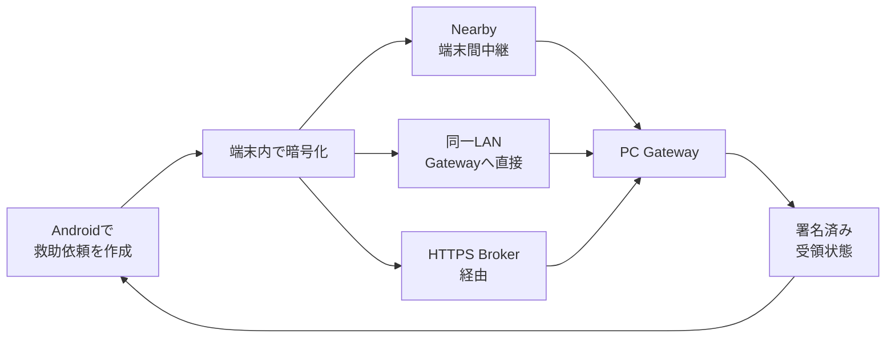

<div align="center">


# Relay

### 通信が途切れても、暗号化した救助情報を次の端末・救助拠点へ。

**Android・Nearby・PC Gateway・HTTPS Brokerを組み合わせた、災害時向けローカル優先の情報中継システムです。**

[](https://github.com/NEGI46/Relay/actions/workflows/relay-ci.yml)
[](#開発環境)
[](#開発環境)
[](LICENSE)
[](#現在の状態)

[30秒で理解](#30秒でわかるrelay) ・ [現在の状態](#現在の状態) ・ [主な機能](#主な機能) ・ [試す](#開発版を試す) ・ [検証](#検証) ・ [未完了](#実運用までに必要なこと) ・ [資料](#主要ドキュメント)

</div>

> [!CAUTION]
> **Relayは119、消防・警察・自治体の公式な緊急連絡手段を置き換えません。**
> 現在は、個人開発・避難訓練・限定的な共同実証・技術検証に向けたコード基盤です。画面に「保存」「中継」「受信」と表示されても、救助隊の出動や人命救助を保証するものではありません。

---

## 30秒でわかるRelay

Relayは、救助情報を**端末内で暗号化してから**、その時に使える経路でPC Gatewayへ届けます。

1. Androidで救助依頼を作る
2. Nearby、同一LAN、またはHTTPS Brokerで暗号文を運ぶ
3. PC Gatewayが救助拠点側で復号し、署名済みの受領状態を返す



### それぞれの役割

| 構成 | 役割 |
|---|---|
| **Androidアプリ** | 救助依頼の作成・暗号化・保存・更新・取消・送達状態の表示 |
| **中継端末** | 内容を復号せず、暗号化データと署名済みReceiptを運ぶ |
| **PC Gateway** | 救助拠点で復号し、スタッフの受領・対応・完了を管理 |
| **HTTPS Broker** | インターネット経由で暗号文とReceiptを一時中継。本文は復号しない |
| **ローカル実証ページ** | アプリ未導入者が、避難訓練用のブラウザ画面から依頼を登録 |

---

## 現在の状態

**機能確認の基準:** 2026-08-01 / source commit `0ebc62d`  
このREADME更新は文書のみを変更します。

> [!IMPORTANT]
> **実装済み・自動試験済み・実機検証済み・現地検証済みは、すべて別の状態です。**
> 現在、実機検証済みと現地検証済みの機能はどちらも0件です。

| 領域 | 現在地 |
|---|---|
| Androidの救助フロー | 実装・自動試験あり。実Android端末での総合確認は未完了 |
| Nearby・LAN・Broker配送 | 実装・自動試験あり。実際の電波環境、複数端末、実回線での確認が必要 |
| PC Gateway | スタッフ画面、監査、署名Receipt、訓練機能、保存期間管理を実装。現地運用は未検証 |
| Gateway登録 | CameraX QR読取、貼付入力、fingerprint確認、明示的な鍵rotationを実装。実端末・実LAN確認が必要 |
| セキュリティ・品質 | CodeQL、秘密情報scan、依存関係検証、fuzz、API契約、負荷・障害試験などのCI基盤あり |
| 正式運用 | **未到達**。正式鍵、実機試験、運用責任者、インフラ、法務・privacy承認が必要 |

現在のreadiness管理では、50機能中46機能が実装済み、43機能が自動試験済みです。未実装として管理している主な機能は、**継続GPS追跡、自動災害検知、Broker高可用性**です。

機械可読な唯一の正は [`docs/readiness/status.yml`](docs/readiness/status.yml) です。詳細表や未完了項目は、このファイルから自動生成されます。

<details>
<summary><strong>自動生成されたreadiness集計を表示</strong></summary>

<!-- BEGIN GENERATED: readiness-summary (tools/readiness/readiness_tool.py; edit docs/readiness/status.yml instead) -->
> [!NOTE]
> この節は `docs/readiness/status.yml`（唯一の正）から自動生成されます。手で編集しないでください。
>
> **status基準: 2026-07-29 / commit `23bd1da` / branch `agent/zero-operation-relay`**
>
> 管理対象 50機能: 実装済み 46 / 未実装 3 / 自動試験済み 43 / emulator検証済み 1 / **実機検証済み 0 / 現地検証済み 0** / 外部判断待ちを含む 7
>
> IMPLEMENTEDやAUTOMATED_TESTEDはDEVICE_TESTED・FIELD_TESTEDを意味しません。全機能の軸別状態は [READINESS_TABLE](docs/readiness/READINESS_TABLE.md)、未完了項目は [OPEN_ITEMS](docs/readiness/OPEN_ITEMS.md)、自治体向け要約は [MUNICIPAL_SUMMARY](docs/readiness/MUNICIPAL_SUMMARY.md) を参照してください。
<!-- END GENERATED: readiness-summary -->

</details>

---

## 「送れた」と「届いた」を分ける

Relayは、通信処理が成功しただけで「救助拠点に届いた」とは表示しません。

| 表示 | 意味 |
|---|---|
| **この端末に保存しました** | 受信先の確認中。まだ外部へ送っていない場合がある |
| **近くの端末へ中継中です** | 端末間で搬送中。救助拠点の確認はまだない |
| **救助拠点に保存** | PC Gatewayが署名したReceiptを確認済み |
| **スタッフが受領／対応中／完了** | 救助拠点側が署名した対応状態を確認済み |

Nearby転送完了、peer ACK、HTTP 2xx、Broker保存、ブラウザ受付完了だけでは、スタッフ受領や救助開始を意味しません。

---

## 主な機能

### Androidアプリ

- SOSと通常の救助依頼を作成
- 依頼の更新・取消と状態確認
- 明示同意した場合だけ位置情報を更新
- Room + SQLCipherとAndroid Keystoreによる暗号化保存
- NearbyによるStore-Carry-Forward中継
- 新規Envelopeは送信端末の署名で版更新を認可し、署名済み依頼の無署名降格を拒否
- QRまたは貼付入力によるPC Gateway登録
- `ARMED` / `EMERGENCY_ACTIVE` / `DEGRADED`などの背景中継状態管理

> [!NOTE]
> `ARMED`は「アプリやNearbyを常時動かす状態」ではありません。待機設定を保存する状態であり、単独では災害を自動検知しません。

### PC GatewayとBroker

- 個人staffアカウントと`ADMIN` / `OPERATOR` / `VIEWER`の権限分離
- 救助依頼の受信、担当、対応中、完了、監査記録
- 救助拠点が署名するReceipt
- 位置情報を取得できない場合も依頼を端末内へ保存し、後から同意済み更新で補完
- 到着順序に依存しないReceipt再送と、案件更新時の担当状態引継ぎ
- 公式情報の出典・取得経路・検証状態の表示
- HTTPS Brokerによる暗号文、公開Manifest、Receiptの中継
- SQLiteの競合対策、重複排除、TTL、CSV formula injection対策
- 保存期間に基づく個人・救助情報のretention管理

### ローカル実証機能

ローカル実証機能は、アプリ未導入者を含む避難訓練で、受付と確認作業を試すための機能です。

| 機能 | できること | 重要な制約 |
|---|---|---|
| **PUERTA** | ブラウザから訓練用の依頼を登録 | 成功は「このPCへ保存した」ことだけを示す |
| **PONTE** | 職員Observationと訓練CSVを登録 | CSV由来の情報は常に未確認として扱う |
| **ÉCART** | 未確認・情報不足・確認優先度を整理 | 行方不明、負傷、死亡、出動を自動判定しない |
| **ANTICIPO Lite** | 移動・電源など限定的な支援flagを管理 | 診断、薬、住所、公的番号などは保存しない |
| **MOSAIK** | Local Web、LAN、Nearby、Broker、Receiptの経路を区別 | 暗号文や個人情報を履歴へ表示しない |

本番profileでは、ローカル実証ページとAPIは常に404を返します。GatewayとBrokerの訓練データは本番データから分離されますが、Android側の専用訓練表示・保存分離は今後の作業です。

---

## セキュリティの考え方

| 境界 | 方針 |
|---|---|
| 救助本文 | Androidで暗号化してから保存・転送。中継端末とBrokerは復号しない |
| Gateway登録 | QRを読み取っただけでは登録せず、fingerprintの確認を要求 |
| PC Gateway | 既定はloopback接続。LAN公開は明示操作のみ |
| Windows秘密鍵 | 任意で同一Windowsユーザー・同一PCに結び付くDPAPI保護を使用可能 |
| 訓練受付 | productionでは無効。same-Origin、サイズ、形式、rate limitを検査 |
| 公式情報 | 出典と検証状態を表示し、trust anchorがない情報を「真正」と断定しない |

Windows DPAPIは**任意機能**です。既定はowner-onlyのローカルファイルであり、HSM・TPM・KMSによる保護を意味しません。

<details>
<summary><strong>セキュリティ・品質ゲートの詳細</strong></summary>

- CodeQLによるJava/Kotlin、JavaScript/TypeScript、GitHub Actions解析
- gitleaksによる秘密情報scan
- actionlintとzizmorによるworkflow検査
- GitHub Actionsのcommit SHA固定確認
- Gradle依存関係のSHA-256検証とwrapper downloadのhash確認
- Dependency Review、Dependabot、OSSF Scorecard
- Jazzer / ClusterFuzzLiteによるdecoder fuzz
- property-based test、mutation test、ArchUnit
- OpenAPI 3.1 + SchemathesisによるBroker API契約検査
- Toxiproxyと並行負荷試験によるBroker耐障害性検査

これらの検査基盤が存在することと、最新commitの全workflowが成功していることは同義ではありません。

</details>

---

## 開発版を試す

> [!WARNING]
> 以下は**個人開発・避難訓練・動作確認専用**です。debug APK、unsigned installer、無料tunnel、ローカル実証ページを正式運用へ使わないでください。

### ローカル実証を起動する

```powershell
.\scripts\Start-Relay-Local-Pilot.ps1
```

起動後:

- 参加者向け受付: `http://127.0.0.1:8080/local-pilot`
- staff console: `http://127.0.0.1:8080/`

確認と停止:

```powershell
.\scripts\Test-Relay-Local-Pilot.ps1
.\scripts\Stop-Relay-Local-Pilot.ps1
```

LAN内の訓練端末から接続する場合だけ、明示的に`-AllowLan`を使います。

```powershell
.\scripts\Start-Relay-Local-Pilot.ps1 -AllowLan
```

RelayはWindows Firewallを自動変更しません。訓練LANを限定し、終了後は必ず停止してください。

<details>
<summary><strong>Sourceからbuildする</strong></summary>

### 開発環境

- JDK 17
- Android SDK / API 36
- Git
- Windows installerを作る場合はWiX 3
- Broker containerを使う場合はDocker Compose
- browser E2Eを実行する場合はNode.js

主なversion:

- Kotlin `2.3.21`
- Android Gradle Plugin `9.3.0`
- Gradle `9.5.0`
- Android min SDK `23`
- Android target / compile SDK `36`

```bash
git clone https://github.com/NEGI46/Relay.git
cd Relay
git switch agent/zero-operation-relay
```

```powershell
.\gradlew.bat :app:assembleLocalDev :pc-gateway:installDist :broker:build
```

APK:

```text
app/build/outputs/apk/localDev/app-localDev.apk
```

Broker endpointを組み込む場合:

```powershell
.\gradlew.bat :app:assembleLocalDev -Prelay.broker.endpoint=https://your-domain.example
```

endpointはHTTPSとhostが必須です。credentialをURLへ埋め込んではいけません。

</details>

モバイル通信だけでBroker経路を試す手順は、[HTTPS Broker deployment](deployment/broker/README.md)を参照してください。

---

## 検証

### Windows一括検証

```powershell
.\scripts\validate-windows-development.ps1
```

結果は`PASS` / `FAIL` / `BLOCKED` / `NOT_RUN`へ分類され、次へ保存されます。

```text
artifacts/windows-validation-report.json
```

Release前の厳格判定:

```powershell
.\scripts\validate-windows-development.ps1 -Strict
```

### readiness文書の整合性

```powershell
python tools/readiness/readiness_tool.py validate
python tools/readiness/readiness_tool.py generate
python tools/readiness/readiness_tool.py check
```

### 個別の検証

<details>
<summary><strong>主なコマンドを表示</strong></summary>

JVM・Android unit・Gateway・Broker:

```powershell
.\gradlew.bat :shared:jvmTest :relay-protocol:test :app:testDebugUnitTest :pc-gateway:test :broker:test
```

Android 6.0相当のAPI 23 classic AVD:

```powershell
.\scripts\android-test\run-api23-smoke.ps1
```

API 36 Managed Device:

```powershell
.\gradlew.bat :app:mediumPhoneApi36DebugAndroidTest
```

Staff console E2E:

```bash
cd staff-console-e2e
npm ci
npx playwright install chromium
npm test
```

APK再現性:

```powershell
.\scripts\verify-build-reproducibility.ps1
```

</details>

> [!NOTE]
> このREADME更新では、最新HEADの全GitHub Actionsを再実行して成功を確認したとは主張しません。

---

## 実運用までに必要なこと

READMEを短く保つため、未完了項目は次の5分類にまとめています。

1. **実機・電波試験** — Android複数台、Nearby多段、BLE、reboot、Doze、省電力、battery・thermal
2. **正式な信頼情報** — Regional Root、署名済みShelter Directory、Gateway鍵とfingerprint確認
3. **本番インフラ** — TLS、DNS、監視、backup、Broker HA、RTO/RPO、障害訓練
4. **運用とprivacy** — 保存期間、削除、同意、責任分界、スタッフ訓練、法務・保険・通信制度
5. **正式配布** — Android組織署名、Windows Authenticode、release承認、代表端末へのinstall確認

完全な一覧は[OPEN_ITEMS](docs/readiness/OPEN_ITEMS.md)と[BLOCKED_BY_EXTERNAL_DECISIONS](docs/readiness/BLOCKED_BY_EXTERNAL_DECISIONS.md)を参照してください。

**現在の総合判断:** `DEVICE_TESTED`、`FIELD_READY`、`PILOT_READY`、`PRODUCTION_READY`ではありません。

---

## 主要ドキュメント

### 最初に読む資料

- [自治体向け現状サマリ](docs/readiness/MUNICIPAL_SUMMARY.md)
- [全50機能のreadiness表](docs/readiness/READINESS_TABLE.md)
- [未完了・外部判断が必要な項目](docs/readiness/OPEN_ITEMS.md)
- [正式Releaseの証拠一覧](docs/readiness/RELEASE_EVIDENCE.md)

### 機能と運用

- [背景中継モード](docs/BACKGROUND_RELAY_MODE.md)
- [Nearby実装](docs/NEARBY_IMPLEMENTATION.md)
- [PC Gateway setup](docs/PC_GATEWAY_SETUP.md)
- [PC Gateway security](docs/PC_GATEWAY_SECURITY.md)
- [ローカル実証受付](docs/LOCAL_PILOT_INGRESS.md)
- [HTTPS Broker deployment](deployment/broker/README.md)
- [現地受入試験](docs/runbooks/FIELD_ACCEPTANCE_TEST.md)

### セキュリティ

- [Security policy](SECURITY.md)
- [依存関係検証](docs/security/DEPENDENCY_VERIFICATION.md)
- [Branch protection設定](docs/security/BRANCH_PROTECTION.md)
- [Broker OpenAPI 3.1](docs/api/broker-openapi.yaml)

<details>
<summary><strong>リポジトリ構成</strong></summary>

```text
app/                  Androidアプリ
shared/               共通model・暗号・trust contract
relay-protocol/       Gateway wire protocol
pc-gateway/           PC Gateway・staff console・ローカル実証
broker/               HTTPS Broker
deployment/broker/    Broker配置構成
pc-ble-bridge/        Windows BLE sidecar
fuzz-jvm/             decoder fuzz target
staff-console-e2e/    browser E2E
scripts/              build・起動・検証・release tool
tools/readiness/      readinessの検証・生成tool
docs/                 設計・監査・runbook
```

</details>

---

## 画面

| Androidホーム | 救助依頼 | 公式情報 |
|---|---|---|
|  |  |  |

---

## English overview

<details>
<summary><strong>Open the English summary</strong></summary>

Relay is a local-first encrypted rescue-information relay for outages and intermittent networks.

- Android creates and encrypts rescue requests before storage or transfer.
- Nearby, an approved LAN Gateway, or an optional HTTPS Broker can carry the ciphertext.
- PC Gateway decrypts at the shelter boundary and returns signed receipts.
- Relay separates local storage, transit, Gateway storage, staff acceptance, response, and completion states.
- Gateway enrollment requires fingerprint confirmation and explicit key rotation.
- Development-only browser intake and staff review tools support evacuation drills; they are disabled in production.
- Windows can optionally protect Gateway private keys with per-user DPAPI.
- Security automation covers static analysis, secret scanning, dependency verification, fuzzing, API contracts, and resilience tests.
- Automated evidence does not replace physical-device, RF, privacy, operational, or field validation.

Relay is not an emergency-dispatch service, not a 119 replacement, and not production-ready.

</details>

---

## License / ライセンス

Relay is available under the [Apache License 2.0](LICENSE).

Relayは [Apache License 2.0](LICENSE) の下で提供されます。ライセンス条件の範囲で、利用・改変・再配布できます。
