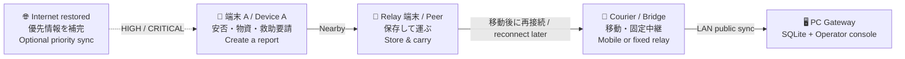

<div align="center">

# Relay

**災害時の「届かない」を、端末同士のリレーで減らす。**  
**A local-first message relay for disasters and network outages.**

[](#開発状況)
[](#クイックスタート)
[](#technology--技術構成)
[](#how-it-works--仕組み)
[](#privacy-and-trust--プライバシーと信頼)

[日本語](#日本語) · [English](#english) · [Architecture](docs/architecture.md) · [Operation model](docs/OPERATION_MODEL.md) · [PC Gateway setup](docs/PC_GATEWAY_SETUP.md)

</div>

> [!WARNING]
> **Relay is under active development.** The repository contains working software paths and automated tests, but physical-device and real-world disaster operation still require validation.  
> **Relay は開発途中です。** ソフトウェア上の主要経路と自動テストはありますが、実機・電波環境・災害運用での検証は継続中です。

---

## How it works / 仕組み



Relay uses **Store–Carry–Forward**: a device stores information locally, carries it while the user moves, and forwards it when another Relay device becomes reachable. It is designed to keep useful information moving even when continuous internet connectivity is unavailable.

Relay は **Store–Carry–Forward（保存・運搬・再転送）** 方式です。端末が情報をローカルに保存し、利用者の移動によって運び、別の Relay 端末と接続できた時に再転送します。

---

# 日本語

## 30秒でわかる Relay

Relay は、災害や大規模通信障害でインターネットが使えない状況を想定した、ローカル優先の情報中継プロジェクトです。

- Android 端末同士が Nearby Connections で自動接続し、情報を差分同期
- 安否、避難状況、物資不足、救助要請を端末内へ保存
- 受信した端末が移動し、別の端末へ情報を再転送
- 固定地点では Android Bridge から同一 LAN の PC Gateway へ保存
- 重複排除、TTL、hop 上限、サイズ制限、ACK を使って多段中継を制御
- 電話番号・メールアドレス・永続的なハードウェア ID を必須にしない
- AI 機能に依存しない

### Relay が目指すもの

「常に通信できる」ことではなく、**一時的にしか端末同士が出会えない環境でも、重要な情報が少しずつ前へ進むこと**を目指します。

### Relay ではないもの

- リアルタイムチャットではありません
- 配送成功や最終到達を保証するサービスではありません
- 受信情報を公式情報・本人確認済み情報として扱う仕組みではありません
- 消防・警察・自治体の緊急連絡手段を置き換えるものではありません
- 現時点では本番用 PKI、完全な内容署名、Play Store 配布を完成条件にしていません

## 主な機能

| 機能 | 概要 |
|---|---|
| 安否・避難状況 | 無事、負傷、避難中、避難所到着などを定型フォームで保存 |
| 物資不足 | 水、食料、薬、毛布、電源、衛生用品などの不足を登録 |
| 救助・情報リレー | 救助要請の作成、端末による運搬、避難所への提出を支援 |
| 地域情報 | 端末内に保存された有効な情報を一覧表示 |
| Nearby 中継 | Android 端末を自動発見し、差分だけを交換 |
| PC Gateway | LAN 上で REPORT を受信し、SQLite と管理画面へ保存 |
| 復旧後同期 | インターネット復旧時に HIGH / CRITICAL 情報を補完 |
| 防御的処理 | 不正 JSON、未知 version、過大 payload、期限切れ、hop 超過を拒否 |

## 開発状況

この表は「完成宣言」ではなく、現在のソースを理解するためのスナップショットです。変更時は、この表と [`artifacts/relay_status.json`](artifacts/relay_status.json) を更新してください。

| コンポーネント | 実装 | 自動検証 | 実機・運用検証 |
|---|---:|---:|---:|
| Android UI / Room / ドメイン | ✅ | ✅ 記録あり | 🚧 端末別確認を継続 |
| Nearby Store–Carry–Forward | ✅ | ✅ Fake 多段同期 | 🚧 2台以上の RF 検証 |
| Foreground Service / 自動開始 | ✅ | ✅ 単体検証 | 🚧 省電力・メーカー差 |
| PC Gateway / 管理画面 | ✅ | ✅ Health・公開同期 smoke | 🚧 Phone → PC 実機 E2E |
| 救助要請 / Courier 経路 | ✅ 実装あり | 🚧 継続整備 | 🚧 避難所を含む運用検証 |
| iPhone / macOS 基盤 | 🧪 ソース・ビルド基盤 | 🧪 手順あり | ❌ IPA・実機検証未完 |
| 本番署名 / PKI | ➖ 現 MVP の非ゴール | — | — |

**最新の記録済み状態:** 自動 build/test と PC Gateway smoke は成功。物理 Android 端末を使う Nearby、Phone → PC、切断・再接続などは環境依存の残作業です。

## 信頼表示の意味

Relay は「保存された」と「内容が正しい」を分けて扱います。

| 表示・状態 | 意味 | 意味しないこと |
|---|---|---|
| `PEER_RECEIVED` | 別の Relay 端末が保存した | 本人確認、内容検証、最終到達 |
| `GATEWAY_RECEIVED_UNVERIFIED` | 匿名 LAN 経路で PC Gateway が保存した | 公式 Gateway、内容の真正性、最終配信 |
| `GATEWAY_RECEIVED` | 認証済み Bridge 経路で PC Gateway が保存した | REPORT 本文の真正性、本人確認、最終配信 |

## クイックスタート

### Android アプリ

必要環境:

- JDK 17
- Android Studio
- Android SDK 36 / Build Tools 36.0.0
- 初回の依存関係取得用インターネット接続

Windows:

```powershell
.\gradlew.bat testDebugUnitTest :relay-protocol:test :pc-gateway:test
.\gradlew.bat assembleDebug
```

macOS / Linux:

```bash
./gradlew testDebugUnitTest :relay-protocol:test :pc-gateway:test
./gradlew assembleDebug
```

Debug APK:

```text
app/build/outputs/apk/debug/app-debug.apk
```

> [!NOTE]
> APK がビルドできても、Nearby、権限、Foreground Service、画面消灯時の動作は実機で別途確認してください。

### PC Gateway

Windows ではリポジトリ直下の `Start-PC-Gateway.cmd` をダブルクリックします。

```powershell
.\Start-PC-Gateway.cmd
```

macOS / Linux:

```bash
chmod +x scripts/run-pc-gateway.sh
./scripts/run-pc-gateway.sh
```

起動後:

- 管理画面: `http://127.0.0.1:8080/`
- Health: `http://127.0.0.1:8080/api/health`
- 公開同期: `POST /api/public/sync/messages`
- LAN 発見: UDP `42888`

固定地点向けの詳細は [`docs/PC_GATEWAY_SETUP.md`](docs/PC_GATEWAY_SETUP.md) を参照してください。

## プライバシーと信頼

- 電話番号、メールアドレス、永続的なハードウェア ID は必須ではありません
- 端末 ID はアプリ専用領域へ保存するランダム ID です
- GPS はフォームの場所が空の場合だけ、許可されていればワンショットで補完します
- 常時位置追跡は行いません
- ログへメッセージ本文、場所、自由記述を出さない設計です
- 受信データは信頼せず、JSON 解析前に byte 数を確認します
- 現 MVP の NoOp 署名では、悪意ある端末による偽情報や改ざんを防げません
- LAN HTTP は TLS なしのため、PC Gateway を信頼できない Wi-Fi へ公開しないでください

## リポジトリ構成

```text
Relay/
├─ app/                 Android アプリ（Compose / Room / Nearby）
├─ relay-protocol/      Android と Gateway で共有する DTO・HTTP 契約
├─ pc-gateway/          Kotlin/JVM Gateway（Ktor / SQLite / 管理画面）
├─ shared/              Kotlin Multiplatform の共有ロジック
├─ composeApp/          Compose Multiplatform / iOS framework ターゲット
├─ apple/RelayAppleKit/ Swift 配送・信頼検証基盤
├─ docs/                設計、運用、セキュリティ、runbook
├─ scripts/             Gateway 起動・セットアップ・パッケージ作成
└─ artifacts/           状態記録、検証結果、ローカル成果物
```

## まず読む資料

1. [`docs/OPERATION_MODEL.md`](docs/OPERATION_MODEL.md) — 災害時の利用者・固定中継地点の運用
2. [`docs/architecture.md`](docs/architecture.md) — Android と同期プロトコルの設計
3. [`docs/REACHABILITY_AND_ALTERNATIVE_TRANSPORTS.md`](docs/REACHABILITY_AND_ALTERNATIVE_TRANSPORTS.md) — 到達性と端末ロール
4. [`docs/PC_GATEWAY_SETUP.md`](docs/PC_GATEWAY_SETUP.md) — PC Gateway の起動と固定地点設定
5. [`docs/PC_GATEWAY_ARCHITECTURE.md`](docs/PC_GATEWAY_ARCHITECTURE.md) — Gateway の責務と API
6. [`docs/PC_GATEWAY_SECURITY.md`](docs/PC_GATEWAY_SECURITY.md) — Gateway の脅威と防御
7. [`docs/APPLE_TARGETS.md`](docs/APPLE_TARGETS.md) — iPhone / macOS 基盤の現在地
8. [`docs/runbooks/PHONE_TO_PC_PUBLIC_SYNC_E2E.md`](docs/runbooks/PHONE_TO_PC_PUBLIC_SYNC_E2E.md) — Phone → PC 実機検証

## README を更新する時

開発途中でも README が古くなりにくいよう、変更時は次の順で確認してください。

1. 「主な機能」に利用者から見える変更があるか
2. 「開発状況」の実装・自動検証・実機検証を分けて更新したか
3. Receipt の意味を過大に表現していないか
4. ビルドコマンドと成果物パスが現在も正しいか
5. 日本語と English の内容が矛盾していないか
6. 詳細仕様は README に詰め込みすぎず、`docs/` の正本へリンクしたか

---

# English

## Relay in 30 seconds

Relay is a local-first information relay project for disasters and large-scale network outages.

- Android devices discover each other with Nearby Connections and exchange only missing data
- Safety reports, evacuation status, supply needs, and rescue requests are stored locally
- A receiving device can physically carry information and forward it later
- At fixed locations, an Android bridge can submit reports to a PC Gateway on the same LAN
- Deduplication, TTL, hop limits, payload limits, and peer-specific acknowledgements control forwarding
- Phone numbers, email addresses, and persistent hardware identifiers are not required
- The core system does not depend on AI

### What Relay is trying to achieve

Relay does not assume continuous connectivity. Its goal is to let important information **make gradual progress through brief, intermittent encounters between devices**.

### What Relay is not

- It is not a real-time chat application
- It does not guarantee delivery or final destination arrival
- It does not make received content official or identity-verified
- It is not a replacement for emergency services or government alert systems
- Production PKI, complete content signing, and Play Store distribution are not current MVP completion criteria

## Main features

| Feature | Description |
|---|---|
| Safety and evacuation reports | Structured forms for safe, injured, evacuating, and at-shelter states |
| Supply needs | Water, food, medicine, blankets, power, hygiene items, and other needs |
| Rescue relay | Create a rescue request, carry it between devices, and submit it toward a shelter |
| Regional information | View valid information stored on the device |
| Nearby relay | Automatically discover Android peers and exchange only missing messages |
| PC Gateway | Receive REPORT messages over LAN and store them in SQLite with an operator console |
| Recovery sync | Supplement HIGH / CRITICAL information after internet connectivity returns |
| Defensive processing | Reject malformed JSON, unknown versions, oversized payloads, expired data, and excessive hops |

## Development status

This is a source-oriented snapshot, not a production-readiness declaration. Update this table together with [`artifacts/relay_status.json`](artifacts/relay_status.json) when the project changes.

| Component | Implementation | Automated verification | Device / operational verification |
|---|---:|---:|---:|
| Android UI / Room / domain | ✅ | ✅ Recorded | 🚧 Continue device-specific checks |
| Nearby Store–Carry–Forward | ✅ | ✅ Fake multi-hop sync | 🚧 Two-or-more-device RF testing |
| Foreground Service / auto-start | ✅ | ✅ Unit-level coverage | 🚧 Battery and vendor behavior |
| PC Gateway / operator console | ✅ | ✅ Health and public-ingress smoke | 🚧 Phone-to-PC device E2E |
| Rescue request / courier path | ✅ Present | 🚧 Evolving | 🚧 Shelter-involved operation tests |
| iPhone / macOS foundation | 🧪 Source and build foundation | 🧪 Documented commands | ❌ IPA and device validation pending |
| Production signing / PKI | ➖ Not an MVP goal | — | — |

**Latest recorded snapshot:** automated build/test and PC Gateway smoke checks passed. Physical Android Nearby, Phone-to-PC, disconnect/retry, and device-specific behavior remain environment-dependent validation work.

## Trust semantics

Relay separates “stored successfully” from “content is trustworthy.”

| State | Means | Does not mean |
|---|---|---|
| `PEER_RECEIVED` | Another Relay device stored the message | Identity verified, content verified, final delivery |
| `GATEWAY_RECEIVED_UNVERIFIED` | A PC Gateway stored it through anonymous LAN ingress | Official gateway, authentic content, final delivery |
| `GATEWAY_RECEIVED` | A PC Gateway stored it through an authenticated bridge route | Authentic report body, verified sender, final delivery |

## Quick start

### Android application

Requirements:

- JDK 17
- Android Studio
- Android SDK 36 / Build Tools 36.0.0
- Internet access for the initial dependency download

Windows:

```powershell
.\gradlew.bat testDebugUnitTest :relay-protocol:test :pc-gateway:test
.\gradlew.bat assembleDebug
```

macOS / Linux:

```bash
./gradlew testDebugUnitTest :relay-protocol:test :pc-gateway:test
./gradlew assembleDebug
```

Debug APK:

```text
app/build/outputs/apk/debug/app-debug.apk
```

> [!NOTE]
> A successful APK build does not validate Nearby radio behavior, runtime permissions, Foreground Service behavior, or screen-off operation on physical devices.

### PC Gateway

On Windows, double-click `Start-PC-Gateway.cmd` in the repository root.

```powershell
.\Start-PC-Gateway.cmd
```

macOS / Linux:

```bash
chmod +x scripts/run-pc-gateway.sh
./scripts/run-pc-gateway.sh
```

After startup:

- Operator console: `http://127.0.0.1:8080/`
- Health: `http://127.0.0.1:8080/api/health`
- Public ingress: `POST /api/public/sync/messages`
- LAN discovery: UDP `42888`

See [`docs/PC_GATEWAY_SETUP.md`](docs/PC_GATEWAY_SETUP.md) for fixed-site deployment and security requirements.

## Privacy and trust

- Phone numbers, email addresses, and persistent hardware identifiers are not required
- The device ID is a random application-scoped identifier
- GPS is used only as an optional one-shot form fill when the location field is empty
- Relay does not continuously track location
- Logs are designed not to include message bodies, locations, or free-form notes
- Incoming data is treated as untrusted and byte limits are checked before JSON parsing
- The current NoOp signing model cannot prevent malicious devices from creating or modifying false information
- PC Gateway LAN HTTP does not use TLS; never expose it to untrusted Wi-Fi

## Repository map

```text
Relay/
├─ app/                 Primary Android app (Compose / Room / Nearby)
├─ relay-protocol/      Shared DTOs and HTTP contracts
├─ pc-gateway/          Kotlin/JVM Gateway (Ktor / SQLite / operator console)
├─ shared/              Kotlin Multiplatform shared logic
├─ composeApp/          Compose Multiplatform / iOS framework target
├─ apple/RelayAppleKit/ Swift transport and trust-verification foundation
├─ docs/                Architecture, operation, security, and runbooks
├─ scripts/             Gateway startup, setup, and packaging
└─ artifacts/           Status snapshots, verification notes, and local outputs
```

## Recommended reading order

1. [`docs/OPERATION_MODEL.md`](docs/OPERATION_MODEL.md) — user and fixed-site operation
2. [`docs/architecture.md`](docs/architecture.md) — Android and synchronization architecture
3. [`docs/REACHABILITY_AND_ALTERNATIVE_TRANSPORTS.md`](docs/REACHABILITY_AND_ALTERNATIVE_TRANSPORTS.md) — reachability and device roles
4. [`docs/PC_GATEWAY_SETUP.md`](docs/PC_GATEWAY_SETUP.md) — startup and fixed-site setup
5. [`docs/PC_GATEWAY_ARCHITECTURE.md`](docs/PC_GATEWAY_ARCHITECTURE.md) — Gateway responsibilities and APIs
6. [`docs/PC_GATEWAY_SECURITY.md`](docs/PC_GATEWAY_SECURITY.md) — threats and controls
7. [`docs/APPLE_TARGETS.md`](docs/APPLE_TARGETS.md) — current iPhone / macOS foundation
8. [`docs/runbooks/PHONE_TO_PC_PUBLIC_SYNC_E2E.md`](docs/runbooks/PHONE_TO_PC_PUBLIC_SYNC_E2E.md) — physical Phone-to-PC validation

## Maintaining this README

When the project changes:

1. Update user-visible capabilities under “Main features”
2. Keep implementation, automated verification, and physical verification separate
3. Never overstate what a Receipt proves
4. Recheck build commands and artifact paths
5. Keep the Japanese and English sections consistent
6. Put detailed specifications in `docs/` and link to the canonical document

---

## Technology / 技術構成

- Kotlin / JVM 17
- Jetpack Compose / Material 3
- Kotlin Coroutines / Flow / StateFlow
- Room
- kotlinx.serialization
- Google Nearby Connections
- Ktor / Netty
- SQLite JDBC
- Kotlin Multiplatform / Compose Multiplatform
- Swift Package (`apple/RelayAppleKit`)

## Contributing / コントリビューション

This repository is currently private and under active design. Before making a large change, read the operation model and architecture documents, keep trust semantics conservative, and add or update tests for protocol and forwarding behavior.

このリポジトリは現在プライベートで、設計も更新中です。大きな変更の前に運用モデルとアーキテクチャを読み、信頼表示を過大にせず、プロトコル・中継動作のテストを追加または更新してください。

## License / ライセンス

No license has been selected yet. Until a license is added, do not assume permission to redistribute this code.

ライセンスは未選定です。ライセンスが追加されるまでは、再配布の許可があるものとみなさないでください。

## Safety note / 安全上の注意

Relay is an experimental resilience tool. In an emergency, use official alerts and contact emergency services whenever available.

Relay は実証・開発中の耐障害ツールです。緊急時は、利用可能であれば必ず公式情報と消防・警察・自治体などの連絡手段を優先してください。
