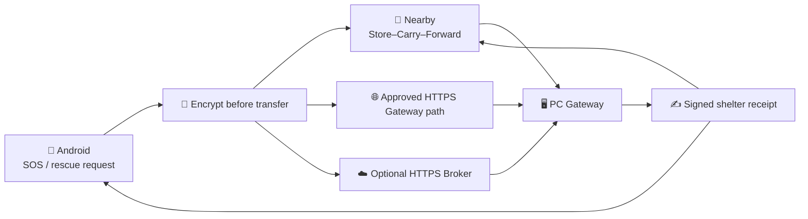

<div align="center">


# Relay

### 災害時の「届かない」を、端末・人・避難所PC・安全なオンライン経路でつなぐ。
### Keep critical rescue information moving across offline and approved online paths.

[](docs/readiness/MUNICIPAL_PILOT_READINESS.md)
[](#androidでの流れ)
[](#pc-gateway)
[](#https-broker)
[](#ble-gateway信頼)
[](#配布とrelease)

**[🇯🇵 日本語](#日本語)**　｜　**[🇬🇧 English](#english)**　｜　**[開発プレビュー](#開発プレビューを試す)**　｜　**[共同実証 readiness](docs/readiness/MUNICIPAL_PILOT_READINESS.md)**

</div>

> [!CAUTION]
> **Relayは119、消防・警察・自治体の緊急連絡、公式警報、認証済み人命安全システムを置き換えません。** 現在は限定区域の訓練・共同実証に向けたコード基盤です。送信、保存、Broker保管、Receiptは、救助実施や最終到達の保証ではありません。

## 30秒でわかるRelay

Relayは、Androidで作った救助要請を**端末内で暗号化**し、Nearby、承認済みPC Gateway、任意のHTTPS Brokerを使って避難所へ送達しようとする、ローカル優先の中継システムです。



| 対象 | 現在できること |
|---|---|
| **Android利用者** | 赤いSOSを2秒長押し、通常依頼、更新、取消、署名済み対応状況の確認 |
| **中継端末** | 本文を復号せず暗号化Envelopeを運び、自分のLAN/Broker経路で onward deliveryを継続 |
| **PCスタッフ** | 個人アカウントでログインし、担当・確認・準備・対応・完了を管理 |
| **Broker** | 暗号文を復号せず一時保存し、PC Gatewayとの配送とReceipt返送を補助 |
| **開発者** | Windows開発ランチャー、development prerelease、Docker/Caddy Broker、Quick Tunnel PoCを利用可能 |

## 現在の状態

**基準日: 2026-07-22 / HEAD: `408bee4`**

| 区分 | 状態 | 内容 |
|---|---:|---|
| 救助UI・暗号化Envelope | ✅ 実装済み | 2秒SOS、通常依頼、version付き更新・取消、署名Receipt表示 |
| 受信先未解決時のSOS | ✅ 実装済み | 送信元だけが復元できるAES-GCM保留状態へ保存し、信頼済み受信鍵の解決後にEnvelope化 |
| 送信者セッション復元 | ✅ 実装済み | Room + SQLCipherと別Keystore鍵で復元情報を保持し、通常のprocess restart後も更新・取消を再開 |
| Nearby courier配送 | ✅ 修正済み | 受信端末がEnvelopeを永続保存すると、自身のLAN/Broker配送ownerを直ちに起動 |
| PC Gateway DB書込み | ✅ 修正済み | 複数SQLite接続のwriteを共有coordinatorとlock fileで直列化し、`SQLITE_BUSY`を抑制 |
| PC Gatewayアクセス制御 | ✅ 実装済み | 個人アカウント、`ADMIN` / `OPERATOR` / `VIEWER`、監査、secure session |
| HTTPS Broker配置 | ✅ 限定テスト用構成あり | Docker Compose + Caddy、またはCloudflare Quick Tunnel PoC |
| BLE Gateway信頼チェーン | ⚠️ コード実装・実運用BLOCKED | Root → signed Directory → signed Manifest → BLE fingerprint。正式な府中町Root/Directoryは未提供 |
| 継続バックグラウンドGPS | ❌ 未実装 | Android 14+ location FGSと明示同意を含む別設計が必要 |
| 物理RF・現地運用 | ◻ NOT RUN | Nearby/BLE多段、Phone→PC、モバイル回線→Broker、OEM省電力、停電復旧など未完了 |
| 正式Release | ⛔ 外部鍵・証明書待ち | Android組織署名、Authenticode、cosign/TUF、正式scanner evidenceが必要 |

> [!IMPORTANT]
> **IMPLEMENTED ≠ AUTOMATED_TESTED ≠ DEVICE_TESTED ≠ DEPLOYMENT-READY** です。最後に文書化された監査ではshared JVM 20/20、Android JVM 201/201、PC Gateway 57/57、Broker 28/28がPASSしましたが、その後も機能修正が入っています。最新HEADについて物理端末・現地試験済みとは主張しません。

## 画面イメージ

| Androidホーム | 救助ホーム | 公式情報 |
|---|---|---|
|  |  |  |

## 開発プレビューを試す

> [!WARNING]
> 次の手順は**個人開発・動作確認専用**です。unsigned Windows installerとdebug/localDev APKを、共同実証・訓練・緊急運用へ使用しないでください。

### Windows PC Gateway

GitHub Actionsの **Publish Relay development preview** は、次をprereleaseとして分離公開できます。

- `Relay-Android-development-preview-debug.apk`
- `Relay-PC-Gateway-development-preview-unsigned.exe`
- `Start-Relay-PC-Gateway-Development.cmd`
- SHA-256とdevelopment-only notice

インストール後、`Start-Relay-PC-Gateway-Development.cmd`をダブルクリックします。初回は管理者の**ユーザー名と12文字以上のパスワード**だけを入力します。

- 開発DB・生成鍵: `%LOCALAPPDATA%\Relay\development`
- Operator UI: `http://127.0.0.1:8080/`
- profile: `development`
- 開発時のみanonymous rescue ingressとUDP discoveryを有効化
- 同じポートのGatewayが既に動作中なら二重起動せず既存画面を開く

ソースから起動する場合:

```powershell
.\scripts\start-pc-gateway-development.ps1
```

### Android localDev

```powershell
.\gradlew.bat :app:assembleLocalDev
```

生成先:

```text
app/build/outputs/apk/localDev/app-localDev.apk
```

`debug` / `localDev`だけは、同一Private LANで見つけた`development` Gatewayの公開manifestをdevelopment専用として登録できます。これは正式なRegional Rootや署名済みDirectoryの代わりではなく、`release` / `pilotRelease`では無効です。

---

# 日本語

## Androidでの流れ

1. 位置情報と近距離通信の権限を許可する。
2. 命の危険がある場合は、赤いSOSを2秒長押しする。
3. 通常依頼では人数と「命の危険・けが/体調不良・移動困難・支援が必要」を入力する。
4. GPS位置、取得時刻、精度を含む本文を暗号化し、SQLCipher DBへ保存する。
5. Nearby、承認済みGateway、設定済みBrokerを独立して再試行する。
6. 暗号化復元情報から依頼の更新・取消を継続する。
7. 避難所が署名したReceiptだけを「確認・対応中・完了」として表示する。
8. 終了結果は利用者が確認するまで保持し、その後に暗号化session recovery rowを削除する。

### オフラインで受信先鍵がまだ無い場合

SOS作成と端末内保存にWi-Fiやモバイル通信は不要です。受信先公開鍵がまだ解決できない場合は、本文を送信元だけが復元できるAES-GCM recovery payloadへ保存し、状態を`PENDING_DESTINATION`として保持します。

- plaintextのSOS本文を中継端末へ渡しません。
- 信頼済み受信先鍵が後から解決されると、同じrequest versionのまま転送可能な暗号化Envelopeへmaterializeします。
- 未materializeの保留SOSは、利用者が安全にローカル取消できます。
- Gateway HTTP成功やBrokerの`BROKER_STORED`を避難所受領として表示しません。

## Nearby Store–Carry–Forward

- 端末同士が接続すると、routing metadataだけのinventoryを交換します。
- 不足している有効な暗号化Envelopeと、より新しい署名Receiptだけを要求します。
- TTL、hop、size、hash、version、deduplication、collisionを検査します。
- 同一versionで異なるhashはupdateとして扱わず、collision/tamper候補として再要求しません。
- ACKは同一`envelopeId`・hash・exported hopが一致した場合だけlocal hopを進めます。
- 中継端末が新しいEnvelopeを永続保存すると、接続済みの別peerへ再広告し、LAN/Broker配送serviceも起動します。
- Receiptは検証済み避難所署名だけを適用し、接続済みpeerへ再広告します。

## BLE Gateway信頼

BLE Gateway配送は次の検証がすべて成功した場合だけ有効です。

```text
承認済みRegional Root
        ↓ signature
Root署名済みRegional Shelter Directory
        ↓ manifest / recipient key / receipt key binding
署名済みShelter Manifest
        ↓ advertised identity = GATT identity
BLE Gatewayへ暗号化Envelopeを提出
```

- Androidはbuild variantごとの**公開Root bundleだけ**を読み込みます。
- DirectoryはRoot署名、region、generation、有効期限、各Manifestと公開鍵bindingを検証します。
- 古いgeneration、same-generation equivocation、期限切れ、fingerprint不一致を拒否します。
- 保存済みDirectoryは起動時に再検証し、完了するまでBLE resolverを空にします。
- `release` / `pilotRelease`はunsigned manifestと自動Enrollmentを拒否します。
- 正式Root/Directoryがない現在はBLEがfail-closedになります。
- Regional Root秘密鍵をrepository、APK、running Gatewayへ渡してはいけません。

オフライン運用者CLI:

```powershell
.\gradlew.bat :pc-gateway:regionalTrustProvisioning --args="generate-regional-root ..."
```

対応コマンド:

```text
generate-regional-root
export-regional-root-bundle
sign-regional-directory
verify-regional-directory
print-public-fingerprints
```

このCLIは私有Root materialのGit worktree内出力、既存file上書き、秘密鍵の標準出力を拒否します。生成したRootが自治体の正式Rootになるわけではありません。

## PC Gateway

### 安全なprofile

| Profile | 既定bind | Anonymous ingress | UDP discovery | Remote management | Legacy `X-Admin-Key` |
|---|---|---:|---:|---:|---:|
| `production`（既定） | `127.0.0.1` | off | off | off | rejected |
| `lab` | `127.0.0.1` | off | off | off | rejected |
| `development` | `0.0.0.0` | on | on | compatibility | compatibility only |

LANやremote staff consoleを使う場合は、責任者が次のどちらかを明示します。

- `closed-network`: 承認済み閉域網とPrivate-only firewall
- `tls-reverse-proxy`: Gatewayはloopbackのまま、外部TLS proxyがHTTPS、certificate、ACLを担当

Androidの`release` / `pilotRelease`はcleartext Gateway URLを拒否します。HTTPは`debug` / `localDev`だけです。

### Staff認証・監査

- 初回ADMINは一回限りの`bootstrap-admin`で作成し、既定passwordはありません。
- `ADMIN` / `OPERATOR` / `VIEWER`の個人アカウントを使用します。
- password: PBKDF2-HMAC-SHA-256、random salt、210,000 iterations
- session token: random 256-bit、DBにはSHA-256 hashだけを保存
- browser cookie: `HttpOnly`、`SameSite=Strict`、TLS proxy時は`Secure`
- 無効化したaccountのsessionは失効し、最後の有効ADMINは無効化・降格できません。
- auditにはoperator、action、result、最小限のtarget/source metadataだけを保存します。
- rescue本文、GPS、ciphertext、password、token、credential、private key、exception textはauditへ保存しません。

状態遷移:

```text
未確認 → 確認済み → 準備中 → 対応中 → 完了
```

### SQLite書込み競合対策

`GatewayStore`、`GatewayAccessStore`、救助persistenceは同じSQLite fileへ別JDBC connectionを持ちます。WALはreaderとwriterの並行性を改善しますが、writerは同時に1つだけです。

最新版では、DB pathごとの`GatewaySqliteWriteCoordinator`が次を行います。

- fair `ReentrantLock`でprocess内writeを直列化
- sibling `.relay-writer.lock` fileで同じ開発DBを誤って開いた複数Gateway processも調整
- nested transactionを安全に扱うreentrancy guard
- sessionの`last_seen_at`は認証requestごとではなく、既定60秒間隔で条件付き更新

これにより、地図APIなどの認証済みGETと救助・監査writeが競合して発生していた`SQLITE_BUSY: database is locked`を抑えます。

### 救助秘密鍵

Gatewayの救助秘密鍵は現在もowner-only local fileです。DPAPI、HSM、KMS保護済みとは主張しません。`production` / `lab`では未provisioned、期限切れ、安全でないpermission/ACLをfail-closedにします。rotation、revocation、escrow、hardware-backed storageは外部方針が必要です。

- [PC Gatewayセットアップ](docs/PC_GATEWAY_SETUP.md)
- [Production Gateway deployment](docs/runbooks/PRODUCTION_GATEWAY_DEPLOYMENT.md)
- [PC Gateway security](docs/PC_GATEWAY_SECURITY.md)

## HTTPS Broker

Brokerは救助本文を復号しません。暗号化Envelopeの一時保存、deduplication、collision isolation、TTL purge、shelter queue、signed Receipt返送だけを担当します。

### Security boundary

- Android登録時に端末固有ECDSA P-256秘密鍵の所持を証明
- upload署名を登録済み公開鍵で検証
- device Receipt取得は推測困難なBearer capability token
- Gateway credentialは256-bitで、1つの`gatewayId`と`shelterId`へscope
- DBにはcredentialのSHA-256 hashだけを保存
- expired、revoked、wrong-Gateway、wrong-shelterを拒否
- Broker URLはAndroid・GatewayともHTTPS限定
- `production` / `lab` Brokerはloopback bind必須
- Caddy/nginx、DNS、certificate、firewall/WAF、backup、monitoringは外部運用責任
- 単一BrokerはHAではありません

Android APKへBroker URLをbuild-timeで埋め込みます。URLはHTTPS、host必須、embedded credential禁止です。空ならBroker配送を無効化します。

```powershell
.\gradlew.bat :app:assembleLocalDev -Prelay.broker.endpoint=https://relay.example.org
```

### Docker + Caddyによる限定テスト配置

`deployment/broker/`には、Linux host、Docker Compose、Caddy、永続SQLite volumeを使う構成があります。

前提:

- 自分で管理するdomainとA/AAAA record
- 公開TCP 80/443
- Broker内部portをinternetへ直接公開しないfirewall
- named owner、backup policy、終了条件

```bash
cd deployment/broker
cp .env.example .env
# RELAY_PUBLIC_DOMAINを設定
docker compose up -d --build
docker compose logs -f caddy broker
```

Health:

```text
https://<domain>/v1/health
```

詳細: [deployment/broker/README.md](deployment/broker/README.md)

### Cloudflare Quick Tunnel PoC

`compose.quick-tunnel.yml`は、固定domainなしでモバイル回線→Broker→Gatewayを短時間確認するPoCです。Cloudflare Quick TunnelにはSLAがなく、production用途ではありません。

```powershell
.\gradlew.bat :broker:installDist
docker compose -f compose.quick-tunnel.yml up -d --build
docker compose -f compose.quick-tunnel.yml logs -f cloudflared
```

表示されたrandom `https://*.trycloudflare.com` URLを使い、Gatewayを接続します。

```powershell
.\scripts\start-poc-broker-gateway.ps1 -EnableLanEnrollment
.\scripts\initialize-poc-gateway-admin.ps1
.\gradlew.bat :app:assembleDebug -Prelay.broker.endpoint=https://<random>.trycloudflare.com
```

テスト終了後はprototype dataを削除します。

```powershell
docker compose -f compose.quick-tunnel.yml down -v
```

詳細: [Quick Tunnel Broker PoC](docs/runbooks/QUICK_TUNNEL_BROKER_POC.md)

## 救助セッションの耐久性

`active_rescue_sessions`（Room schema v8）は、request/version/status/timestampと暗号化recovery payloadだけを保持します。

- rescue本文、人数、状態、自由記述、sender ID、位置をplaintext session columnへ保存しません。
- SQLCipher DBとは別のAndroid Keystore alias `relay_rescue_session_recovery_v1`を使用します。
- AES-GCM、provider-generated nonce、authenticated decryptionを使用します。
- sessionとEnvelopeを同じRoom transactionでcommitします。
- durable version CASで競合を検出します。
- 復号失敗時はrowを残し、新規requestへ黙って置き換えません。
- verified Receipt適用はEnvelope状態とsender session状態を同じtransactionで更新します。
- active/cancellation-in-flight Envelopeはcourier capacity pruningから保護されます。

通常のprocess deathや利用者による再起動から復元しますが、OS force-stop、OEM background制限、device rebootを保証するものではありません。

### 位置情報について

継続バックグラウンドGPS追跡、location foreground service、background location permissionは未実装です。以前のViewModel周期loopは削除されました。Android 14+制約、利用者の明示同意、foreground start、停止条件を含む別設計が必要です。

## 公式情報と地図

- Androidは府中町、広島県、気象庁の公式情報への導線だけを表示します。
- PC Gatewayは府中町周辺の国土地理院標準地図をズーム13–15でcacheできます。
- 気象庁の広島県警報JSONから府中町コード`3430200`を抽出し、失敗時は最後のcacheを表示します。
- 地図利用時は [国土地理院コンテンツ利用規約](https://maps.gsi.go.jp/help/termsofuse.html) に従ってください。

## 配布とRelease

### Development preview

`Publish Relay development preview`は、debug/localDev APKとunsigned Windows installerを**GitHub prerelease**として公開します。正式版名のartifactが混入した場合は公開を拒否します。

用途:

- 個人開発
- 同一LANでの開発Gateway接続
- UI・配送PoC

禁止:

- 自治体共同実証
- 訓練での正式配布
- 緊急運用
- 署名済み正式版としての案内

### Formal release

`Publish Relay formal release`は、次が揃わない限り公開前にfail-closedします。

- 組織管理Android signing materialと`apksigner`
- Windows Authenticode certificate、timestamp、`signtool`
- immutable source commit
- pinned Syft / OSV-Scanner / Grype
- SBOMとHigh/Critical blocking policy
- cosign signature/bundle verification
- TUF trusted root / targets metadata
- SHA-256とsource-commit manifest

通常CIのsecurity evidenceは`report-only`です。正式Releaseは`block-high-critical`です。

- [GitHub Releases](https://github.com/NEGI46/Relay/releases)
- [Formal release verification](docs/runbooks/VERIFY_FORMAL_RELEASE.md)
- [External blockers](docs/readiness/BLOCKED_BY_EXTERNAL_DECISIONS.md)

## Build / test

必要環境:

- JDK 17
- Android SDK / API 36
- Git
- Windows installer作成時はWiX 3とsigning toolchain
- Broker container試験時はDocker Compose

Android: min SDK 23、target/compile SDK 36、version `1.0.0`。

Windows PowerShell:

```powershell
.\gradlew.bat :shared:jvmTest :app:testDebugUnitTest :app:compileDebugAndroidTestKotlin :pc-gateway:test :broker:test
.\gradlew.bat :app:assembleDebug :app:assembleLocalDev :pc-gateway:build :broker:build
.\gradlew.bat :app:verifyNoTestTrustArtifactsInReleaseApks
```

macOS / Linux:

```bash
./gradlew :shared:jvmTest :app:testDebugUnitTest :app:compileDebugAndroidTestKotlin :pc-gateway:test :broker:test
./gradlew :app:assembleDebug :app:assembleLocalDev :pc-gateway:build :broker:build
./gradlew :app:verifyNoTestTrustArtifactsInReleaseApks
```

`compileDebugAndroidTestKotlin`はinstrumentation source compilationであり、emulator・物理端末上の実行ではありません。

## Repository map

| 場所 | 役割 |
|---|---|
| `app/` | Android UI、SQLCipher、session復元、Nearby/Gateway/Broker/BLE、PoC diagnostics |
| `shared/` | rescue model、cryptography、signed Receipt、regional trust contract |
| `pc-gateway/` | rescue復号、staff/auth/audit、SQLite coordination、地図、公式情報、Broker Pull/Outbox |
| `broker/` | scoped encrypted-envelope relay、device registration、Gateway credential、Receipt relay |
| `deployment/broker/` | Docker Compose + CaddyによるHTTPS Broker限定テスト配置 |
| `compose.quick-tunnel.yml` | Cloudflare Quick Tunnel PoC |
| `scripts/` | Gateway launcher、PoC起動、packaging、scanner、verification |
| `relay-protocol/` | Gateway wire contract |
| `pc-ble-bridge/` | Windows BLE GATT sidecar |
| `composeApp/`, `apple/` | desktop/iOS frameworkとApple contract |
| `gateway-meshtastic-adapter/` | 分離されたMeshtastic adapter |
| `gateway-bp7-export/` | BPv7 export-only boundary |
| `test-lab/`, `tools/ble-sim/` | host、fault、decoder、virtual BLE test |
| `docs/` | architecture、security、readiness、audit、runbook |

## 共同実証前に必要なこと

- 自治体・消防・避難所の責任者、運用範囲、停止条件、連絡計画の承認
- 正式なpublic Regional Root bundleとRoot署名済みDirectory
- 実Gatewayのrecipient public key・receipt-signing public keyとfingerprint確認
- TLS/DNS/reverse proxy/WAF/hostingと承認済みnetwork boundary
- Android/Windows/cosign/TUFの組織署名・検証material
- privacy、retention、法務、保険、license、OSS noticeの判断
- 実Android端末、Windows配備先、現地スタッフによる [Field acceptance test](docs/runbooks/FIELD_ACCEPTANCE_TEST.md)

**現在の総合状態:** `READY_FOR_DEVICE_TEST_WITH_TRUST_ARTIFACT_BLOCKER`

## 主要ドキュメント

- [Municipal pilot readiness](docs/readiness/MUNICIPAL_PILOT_READINESS.md)
- [Rescue durability and BLE trust audit](docs/audits/RESCUE_DURABILITY_INITIAL_AUDIT.md)
- [PC Gateway setup](docs/PC_GATEWAY_SETUP.md)
- [PC Gateway security](docs/PC_GATEWAY_SECURITY.md)
- [Production Gateway deployment](docs/runbooks/PRODUCTION_GATEWAY_DEPLOYMENT.md)
- [Broker architecture](docs/BROKER_ARCHITECTURE.md)
- [HTTPS Broker deployment](deployment/broker/README.md)
- [Quick Tunnel Broker PoC](docs/runbooks/QUICK_TUNNEL_BROKER_POC.md)
- [Field acceptance test](docs/runbooks/FIELD_ACCEPTANCE_TEST.md)
- [Gateway backup](docs/runbooks/GATEWAY_BACKUP.md)
- [Formal release verification](docs/runbooks/VERIFY_FORMAL_RELEASE.md)
- [Security policy](SECURITY.md)

---

# English

<details open>
<summary><strong>Current English overview</strong></summary>

Relay is a **local-first encrypted rescue-information relay** for outages and intermittent networks. Android requests can move through Nearby Store–Carry–Forward, an approved HTTPS Gateway path, and an optional HTTPS Broker. Courier devices and the Broker never receive the shelter private key.

### Latest changes

- An SOS can be stored locally as an AES-GCM sealed `PENDING_DESTINATION` session when no trusted recipient key is available. It is materialized into a transferable envelope only after a recipient is resolved.
- A courier that durably stores a Nearby rescue envelope immediately starts its own onward LAN/Broker delivery instead of leaving the envelope stranded.
- Nearby inventory, ACK, collision, update/cancellation, and signed-receipt handling were tightened.
- PC Gateway SQLite writes across the message, access, and rescue stores are serialized by a per-database coordinator and sibling lock file. Session `last_seen_at` writes are throttled to a 60-second interval by default.
- A Windows development launcher now asks only for a username and a 12+ character password, isolates state under LocalAppData, and opens the local console.
- A separate development-prerelease workflow publishes a localDev APK and unsigned Windows installer without confusing them with formal release artifacts.
- Controlled HTTPS Broker deployment is available with Docker Compose and Caddy.
- A Cloudflare Quick Tunnel configuration is available strictly for a time-limited mobile-network PoC; it has no SLA and is not production infrastructure.

### Trust and deployment boundary

Trusted BLE Gateway delivery still requires an approved Regional Root and a current Root-signed Regional Shelter Directory. These official Fuchu artifacts are not in this repository, so BLE fails closed. The Regional Root private key must never enter the repository, APK, or running Gateway.

The default Gateway `production` profile is loopback-only with anonymous ingress, UDP discovery, remote management, and legacy admin-key access disabled. Remote access requires an approved closed-network or TLS reverse-proxy topology.

The Broker never decrypts. Gateway credentials are high-entropy, hashed at rest, and scoped to one Gateway and shelter. Production/lab Broker processes bind to loopback behind an externally operated TLS proxy.

### Validation boundary

The latest documented audit baseline recorded shared JVM 20/20, Android JVM 201/201, PC Gateway 57/57, and Broker 28/28 passing tests. Later fixes added more tests and tooling, but physical Nearby/BLE, multi-hop, Phone-to-PC, mobile-to-Broker-to-Gateway, OEM background behavior, power-loss recovery, and field operation remain unvalidated.

Continuous background GPS tracking is not implemented. Formal distribution remains blocked until organization Android signing, Windows Authenticode, SBOM/vulnerability evidence, cosign/TUF verification, and production infrastructure are available.

**Overall status:** `READY_FOR_DEVICE_TEST_WITH_TRUST_ARTIFACT_BLOCKER`

</details>

## License / ライセンス

No project license has been selected. Do not assume permission to redistribute, modify, or commercially use the code until a license is added.

プロジェクトのライセンスは未選定です。ライセンスが追加されるまでは、再配布・改変・商用利用の許可があるものとみなさないでください。
