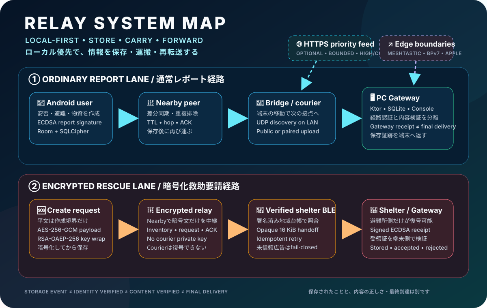

<div align="center">


### 災害時の「届かない」を、端末と人の移動でつなぐ。
### Keep critical information moving when networks cannot.

[](#current-status--現在の状況)
[](#quick-start--クイックスタート)
[](#technology--技術構成)
[](#what-relay-is--relayとは)

## 🌐 [🇯🇵 日本語](#日本語)　｜　[🇬🇧 English](#english)

</div>

## Download / ダウンロード

Published builds are available from the latest GitHub Release. Use these buttons rather than the repository's `artifacts/` directory, which is retained only as development evidence.

[](https://github.com/NEGI46/Relay/releases/latest/download/Relay-Android-debug.apk)
[](https://github.com/NEGI46/Relay/releases/latest/download/Relay-PC-Gateway-setup.exe)

Windows installer integrity: [SHA-256 checksum](https://github.com/NEGI46/Relay/releases/latest/download/Relay-PC-Gateway-setup.exe.sha256) · [All releases](https://github.com/NEGI46/Relay/releases)

初回の公開リリース以降、最新版の APK と Windows PC Gateway インストーラーは上のボタンから取得できます。`artifacts/` は開発検証の記録であり、利用者向け配布場所ではありません。

## v1 Fuchu Pilot / 府中町パイロット

現在のv1は **広島県安芸郡府中町** を初期地域にした救助優先版です。Androidの2秒長押しSOS・必須GPS・避難所選択なしの暗号化中継と、PCの救助地図・担当確定・対応状態・公式情報を一つの運用にまとめています。

- [v1の操作、実装範囲、既知の境界](docs/V1_FUCHU_PILOT.md)
- Android: `versionName 1.0.0`
- PC共通PIN: `%USERPROFILE%\.relay\admin.key`
- PC画面: `http://127.0.0.1:8080/`

The v1 pilot initially targets Fuchu Town, Aki District, Hiroshima. It combines a two-second Android SOS, mandatory GPS, encrypted destination-free relay, and a staff-only PC rescue map and response workflow. See [the v1 scope and known boundaries](docs/V1_FUCHU_PILOT.md).



## Relay in 20 seconds / 20秒でわかるRelay

|  | 日本語 | English |
|---|---|---|
| **WHY** | インターネットが止まっても、端末と人の移動で情報を少しずつ前へ進める | Keep information moving even when internet access disappears |
| **HOW** | `作成 → 保存 → 運搬 → 再転送` のStore–Carry–Forward | `Create → Store → Carry → Forward` |
| **DATA** | 通常REPORTと暗号化救助要請を別経路で扱う | Separate lanes for ordinary REPORTs and encrypted rescue requests |
| **NOW** | 実装とhost検証基盤は充実。物理RF・実運用・本番署名は未完了 | Strong implementation and host checks; physical RF, operations, and production signing remain |

```text
📱 CREATE ──► 💾 STORE ──► 🚶 CARRY ──► 📡 FORWARD ──► 🖥 GATEWAY / 🏥 SHELTER
```
> [!CAUTION]
> **Relayは消防・警察・自治体の緊急連絡、公式警報、認証済み人命安全システムを置き換えるものではありません。**
>
> **Relay is not a replacement for emergency services, official alerts, or certified life-safety systems.**

## Current status / 現在の状況

| 領域 / Area | 状態 / Status | 現在わかっていること / What it means |
|---|---:|---|
| 府中町v1救助フロー | ✅ Implemented | 2秒SOS、GPS、更新・取消、PC担当・状態・地図・公式情報 |
| Android・Gateway・暗号化経路 | ✅ Implemented | UI、Nearby、SQLCipher、PC Gateway、救助Envelope、署名Receiptのコードあり |
| Host・決定的contract試験 | ✅ Available | implementation/accessibility/host/BPv7/Meshtastic/TUF等の検証経路あり |
| Android DB暗号化ビルド | ✅ Build PASS | Debug APK、Android test APK、Android test compilationは現監査状態でPASS |
| Android instrumentation | ⛔ BLOCKED | AVDのBluetooth/system障害で現HEADの新DB試験は完走できていない |
| 複数実機Nearby・Phone→PC | ◻ NOT RUN | 物理RF、OEM差、画面消灯、再接続、実機E2Eは未証明 |
| SBOM・OSV・Grype・MobSF | ⛔ BLOCKED | 未導入ツールや未設定secretをPASS扱いせず、BLOCKED証拠として保存 |
| 配布署名・cosign bundle | ⛔ BLOCKED | 本番鍵・署名済み配布物・検証環境がまだ無い |
| Jazzer fuzzing | ◻ NOT RUN | deterministic decoder regressionはあるが、JVM Jazzer targetは未実装 |

> [!IMPORTANT]
> `PASS`は「その検証が完了した」ことだけを意味します。Host、仮想BLE、emulatorのPASSは、物理無線・災害現場・最終配送のPASSではありません。

## Trust in one line / 信頼を一行で

```text
TRANSFERRED ≠ STORED ≠ ROUTE AUTHENTICATED ≠ CONTENT VERIFIED ≠ FINAL DELIVERY
転送完了      保存済み      経路認証済み          内容検証済み          最終到達
```

| 表示 / State | 意味 / Means | 意味しないこと / Does not prove |
|---|---|---|
| Nearby payload complete | transport転送完了 | 相手DB保存、真正性、最終到達 |
| `PEER_RECEIVED` | 別Relay端末が保存 | 本人性、公式性、Gateway到達 |
| `GATEWAY_RECEIVED_UNVERIFIED` | 匿名LAN経路でPC保存 | 信頼済みGateway、内容真正性、最終配信 |
| `GATEWAY_RECEIVED` | 認証済みBridge経路でPC保存 | 発信者本人、REPORT本文の真正性、最終配信 |
| Signed REPORT | 署名後の改変を検出可能 | 鍵所有者の実在・権限・公式性 |
| Signed shelter receipt | 信頼済み避難所鍵が受領証へ署名 | 救助隊出動、救助完了 |

## Quick links / すぐ見る

- **仕組み / Architecture:** [`docs/architecture.md`](docs/architecture.md)
- **運用モデル / Operation model:** [`docs/OPERATION_MODEL.md`](docs/OPERATION_MODEL.md)
- **PC Gateway:** [`docs/PC_GATEWAY_ARCHITECTURE.md`](docs/PC_GATEWAY_ARCHITECTURE.md)
- **セキュリティ / Security:** [`docs/PC_GATEWAY_SECURITY.md`](docs/PC_GATEWAY_SECURITY.md)
- **最新監査 / Current audit:** [`docs/audits/CURRENT_CODE_REVIEW.md`](docs/audits/CURRENT_CODE_REVIEW.md)
- **脅威モデル / Threat model:** [`docs/audits/CURRENT_THREAT_MODEL.md`](docs/audits/CURRENT_THREAT_MODEL.md)
- **検証結果 / Validation:** [`docs/audits/CURRENT_VALIDATION_REPORT.md`](docs/audits/CURRENT_VALIDATION_REPORT.md)
- **OSS候補評価 / OSS evaluation:** [`docs/audits/OSS_TECH_EVALUATION.md`](docs/audits/OSS_TECH_EVALUATION.md)

---

# 日本語

## Relayとは

Relayは、災害や大規模通信障害でインターネットが利用不能・不安定・混雑した状況を想定した、**ローカル優先の情報中継プロジェクト**です。

端末は情報をローカルへ保存し、利用者が移動し、次に別のRelay端末や固定拠点へ出会ったときに不足分だけを渡します。中核のオフライン配送にAIは必要ありません。

### 目標

- 接続機会が短く断続的でも、重要情報を少しずつ前へ進める
- 安否・物資・救助要請を端末内へ安全に保持する
- 固定拠点のPC Gatewayや避難所へ保存証跡を残す
- 便利さのために信頼表示を過大にしない

### 非目標

- リアルタイムチャット
- 配送時間・最終到達・救助実施の保証
- 受信情報を自動的に公式・本人確認済みへ変えること
- Relay未導入端末を自動中継端末にすること
- 現時点での本番・一般配布完成宣言

<details>
<summary><strong>📦 現在の主な機能を開く</strong></summary>

| 分野 | 現在のコード |
|---|---|
| 安否・避難 | 無事、負傷、避難中、避難所到着、同行者数、任意の場所・メモ |
| 物資不足 | 水、食料、薬、毛布、電源、衛生用品、その他、必要数、場所、メモ |
| 地域情報 | 保存REPORT、発信元区分、hop数、保存・Receipt状態 |
| 救助要請 | 緊急度、人数、負傷、移動困難、閉じ込め、崩落・火災リスク、必要支援、位置、自由記述 |
| Nearby | 自動広告・探索、決定的接続開始、自動受入、再接続、差分同期 |
| Background | Connected-device foreground service、activation保持、救助運搬専用service |
| Local DB | Room、SQLCipher、Android Keystore保護passphrase、旧平文DB移行 |
| PC Gateway | UDP beacon、公開/認証Ingress、Ktor、SQLite、operator console、CSV、Receipt |
| HTTPS feed | HTTPS、443限定、redirectなし、件数・容量・timeout・version制限 |
| Apple | KMP/Compose framework、Swift Package、GATT・Receipt検証contract |
| Windows BLE | .NET 8 / MSIX、暗号文をopaqueにloopback Gatewayへ提出 |
| Meshtastic | 独立JSONL adapter、220 byte budget、15分TTL |
| BPv7 | DTN sidecar向けexport-only JSON boundary |

</details>

<details>
<summary><strong>🔄 通常REPORT経路</strong></summary>

```text
Androidで作成
  ↓
Room + SQLCipherへ保存
  ↓
NearbyでManifest交換
  ↓
不足IDだけ要求
  ↓
形式・サイズ・TTL・hop・重複・replayを検査
  ↓
Peer保存 / PC Gateway保存 / Receipt逆伝播
```

- `messageId`重複排除とcollision検出
- Manifest / Request / Data / ACK差分同期
- 1ページ最大128件
- Peer別ACK、Gateway Receipt
- canonical ECDSA P-256 REPORT署名・検証
- 受信件数、送信byte、payload、replay cache制限
- Nearby切断後の指数バックオフ再接続

現在のNearbyは、認証digitsが利用可能になると自動acceptする**OPEN相当の動作**です。digitsを人間が比較したことや、長期的に信頼済みの端末であることは証明しません。将来の`TRUSTED` modeはADR-001で設計中です。

</details>

<details>
<summary><strong>🆘 暗号化救助要請経路</strong></summary>

```text
平文を作成
  ↓ 作成境界だけに存在
AES-256-GCMで本文暗号化
  +
RSA-OAEP-256で共通鍵を避難所公開鍵へwrap
  ↓
暗号化Envelopeだけを保存・Nearby中継
  ↓
信頼済み避難所BLEへ提出
  ↓
避難所がECDSA P-256 Receiptへ署名
  ↓
Android側でReceipt検証
```

- 平文をrepositoryへ渡さない
- Courierは避難所秘密鍵を持たず、復号できない
- immutable routing headerをAES-GCM AADへbind
- ciphertext SHA-256・byte長を検査
- 専用`RSQ\x01` packet lane
- same-version/different-hashをcollision候補として扱う
- 署名済み地域directoryと避難所identityを照合
- 再起動・切断後も同じidempotency keyでretry
- 有効な署名Receiptだけがsubmission stateを変更

</details>

<details>
<summary><strong>🔐 ローカルDB保護と旧DB移行</strong></summary>

- RoomはSQLCipher open-helperを使用
- 32-byte passphraseをAndroid Keystore AES-GCM鍵で暗号化保存
- 初回同時起動はprocess内lockで1つのpassphraseへ収束
- passphrase保存は同期commitし、保存失敗時はfail-closed
- 旧平文SQLiteはread-onlyで開く
- 暗号化copyへ全user tableを移送
- row insert失敗時は即時中断
- `PRAGMA integrity_check`と`wal_checkpoint(FULL)`後に置換
- 置換途中の失敗では旧DBとWAL/SHMを復元
- Android testsは暗号化header、同時初期化、移行、rollbackを対象

</details>

<details>
<summary><strong>🖥 PC Gatewayと発見</strong></summary>

```text
Nearby peer → Android Bridge → UDP discovery hint → LAN HTTP → PC Gateway SQLite
```

- Public ingress: `POST /api/public/sync/messages`
- Authenticated ingress: `POST /api/sync/messages`
- Operator console: `http://127.0.0.1:8080/`
- Health: `http://127.0.0.1:8080/api/health`
- LAN discovery: UDP `42888`

UDP announcementはservice名、version、gateway ID、port、pathを検査しますが、**送信者を認証しません**。現状は「発見ヒント」であり「信頼根拠」ではありません。QR enrollment、TOFU、署名announcement等のtrust bootstrapはADR-002で検討中です。

LAN HTTPはTLSなしです。Public/guest Wi-FiへGatewayを公開しないでください。

</details>

<details>
<summary><strong>🧪 CI・品質・セキュリティ証拠</strong></summary>

CIは`main`と`agent/zero-operation-relay`のpush、PR、manual dispatchを対象にします。

| Category | Coverage |
|---|---|
| Build | Android Debug APK、PC Gateway JVM artifact |
| Unit | shared JVM、Android unit tests |
| UI | Compose desktop smoke |
| Contracts | SQLCipher、Keystore、FGS、権限、backup、署名検証境界 |
| Accessibility | semanticsと安全表現 |
| Decoder | deterministic decoder + virtual BLE regression |
| APK | MobSF（設定時） |
| Dependencies | Syft SBOM、OSV、Grype |
| Distribution | cosign bundle verification |
| Evidence | scan/signatureの`PASS / FAIL / BLOCKED`集約 |
| Gateway | backup/recovery、BPv7、Meshtastic contract |
| Hardware-independent | Mobly host、virtual BLE、TUF metadata chain |

重要な変更点:

- scanner未導入やsecret未設定を`skipped success`にしない
- `PASS / FAIL / BLOCKED`をJSONへ保存
- raw scanner JSONをPASSと誤認しないようstatus sidecarを使用
- distribution候補・cosign・sig・bundle不足は`BLOCKED`
- deterministic regressionをJazzer fuzzingと呼ばない
- `JAZZER_FUZZ=1`はtarget未実装のため明示的に失敗

現在の`SECURITY_MODE`は`report-only`です。検査jobがあることは、本番リリースが安全認証・正式署名済みであることを意味しません。

</details>

## Quick start / クイックスタート

### Build and tests

Windows PowerShell:

```powershell
.\gradlew.bat :app:testDebugUnitTest :shared:jvmTest :relay-protocol:test :pc-gateway:test
.\gradlew.bat :composeApp:desktopTest
.\gradlew.bat :app:assembleDebug :pc-gateway:build
```

macOS / Linux:

```bash
./gradlew :app:testDebugUnitTest :shared:jvmTest :relay-protocol:test :pc-gateway:test
./gradlew :composeApp:desktopTest
./gradlew :app:assembleDebug :pc-gateway:build
```

Debug APK:

```text
app/build/outputs/apk/debug/app-debug.apk
```

### PC Gateway

Windows:

```powershell
.\Start-PC-Gateway.cmd
```

macOS / Linux:

```bash
chmod +x scripts/run-pc-gateway.sh
./scripts/run-pc-gateway.sh
```

### Host contracts

```powershell
.\test-lab\run-host-checks.ps1 -IncludeGradle
```

## Technology / 技術構成

`Kotlin` · `JVM 17` · `Kotlin Multiplatform` · `Jetpack Compose` · `Compose Multiplatform` · `Room` · `SQLCipher` · `Android Keystore` · `Nearby Connections` · `Ktor` · `Netty` · `SQLite JDBC` · `AES-256-GCM` · `RSA-OAEP-256` · `ECDSA P-256` · `Swift Package` · `.NET 8` · `Python` · `GitHub Actions` · `TUF`

## Repository map / リポジトリ構成

```text
Relay/
├─ app/                         Android app
├─ shared/                      KMP models, crypto and shared logic
├─ relay-protocol/              Gateway DTO and wire contracts
├─ composeApp/                  Compose Multiplatform / iOS framework
├─ pc-gateway/                  JVM Gateway
├─ pc-ble-bridge/               Windows BLE peripheral boundary
├─ gateway-meshtastic-adapter/  Isolated Meshtastic adapter
├─ gateway-bp7-export/          BPv7 export-only boundary
├─ apple/                       Swift package and Apple contracts
├─ test-lab/                    Mobly, fuzz and fault injection
├─ tools/ble-sim/               Virtual GATT harness
├─ distribution/                Release inputs and TUF metadata
├─ scripts/                     Build, backup, scan and verification
├─ docs/                        Architecture, ADR, audit and runbooks
└─ artifacts/                   Dated/local evidence
```

---

# English

## What Relay is

Relay is a **local-first disaster information relay** for situations where internet access is unavailable, intermittent, congested, or unreliable.

A device stores information locally, a person carries the device, and only missing data is forwarded during a later encounter with another Relay device or fixed site. Core offline delivery does not require AI.

### Goals

- Keep important information making gradual progress through brief contacts
- Store safety, supply, and rescue data safely on devices
- Leave storage evidence at fixed PC Gateways and shelters
- Never overstate trust merely for convenience

### Non-goals

- Real-time chat
- Guaranteed delivery time, final arrival, or rescue action
- Automatically making received content official or identity-verified
- Turning phones without Relay installed into relay nodes
- Claiming production readiness or general distribution today

<details>
<summary><strong>📦 Open current capabilities</strong></summary>

| Area | Current code |
|---|---|
| Safety / evacuation | Safe, injured, evacuating, at-shelter, companion count, optional location and note |
| Supply shortages | Water, food, medicine, blankets, power, hygiene, other items, count, location and note |
| Regional information | Stored REPORTs, origin category, hop count, storage and receipt state |
| Rescue requests | Urgency, people, injuries, mobility, trapped/collapse risk, needs, location and free text |
| Nearby | Advertising, discovery, deterministic initiator, auto-accept, reconnect and differential sync |
| Background | Connected-device foreground service, persisted activation and dedicated rescue-carry service |
| Local DB | Room, SQLCipher, Keystore-protected passphrase and legacy plaintext migration |
| PC Gateway | UDP beacon, public/authenticated ingress, Ktor, SQLite, console, CSV and receipts |
| HTTPS feed | HTTPS/443 only, no redirects, item/byte/timeout/version limits |
| Apple | KMP/Compose framework, Swift Package, GATT and receipt-verification contracts |
| Windows BLE | .NET 8 / MSIX model; opaque ciphertext handoff to loopback Gateway ingress |
| Meshtastic | Isolated JSONL adapter, 220-byte budget, 15-minute TTL |
| BPv7 | Export-only JSON boundary for a DTN sidecar |

</details>

<details>
<summary><strong>🔄 Ordinary REPORT lane</strong></summary>

```text
Create on Android
  ↓
Store in Room + SQLCipher
  ↓
Exchange manifests over Nearby
  ↓
Request only missing IDs
  ↓
Validate format, size, TTL, hop count, duplicates and replay
  ↓
Peer storage / PC Gateway storage / receipt propagation
```

- Deduplication and collision detection by `messageId`
- Manifest / Request / Data / ACK differential sync
- Up to 128 entries per page
- Peer-specific ACKs and Gateway receipts
- Canonical ECDSA P-256 REPORT signing and verification
- Limits for received items, sent bytes, payloads and replay cache
- Exponential-backoff reconnection after disconnection

Current Nearby behavior is effectively an explicit **OPEN mode**: an incoming connection is auto-accepted once authentication digits are available. This does not prove that a human compared them or that the peer is a previously trusted long-term identity. A future `TRUSTED` mode is being designed in ADR-001.

</details>

<details>
<summary><strong>🆘 Encrypted rescue-request lane</strong></summary>

```text
Create plaintext
  ↓ plaintext exists only at the creation boundary
Encrypt payload with AES-256-GCM
  +
Wrap the content key to the shelter public key with RSA-OAEP-256
  ↓
Store and forward only the encrypted envelope
  ↓
Submit to a trusted shelter BLE endpoint
  ↓
Shelter signs an ECDSA P-256 receipt
  ↓
Android verifies the receipt
```

- Plaintext is never passed to the repository
- Couriers do not have shelter private keys and cannot decrypt requests
- Immutable routing headers are bound as AES-GCM AAD
- Ciphertext SHA-256 and byte length are verified
- Dedicated `RSQ\x01` packet lane
- Same-version/different-hash data is treated as a collision candidate
- Signed regional directory and shelter identity checks
- Durable idempotency key survives restart and disconnect
- Only a valid signed receipt changes submission state

</details>

<details>
<summary><strong>🔐 Local DB protection and migration</strong></summary>

- Room uses a SQLCipher open helper
- A 32-byte passphrase is sealed by an Android Keystore AES-GCM key
- Concurrent first use converges to one passphrase through a process lock
- Passphrase persistence is synchronous and fails closed
- Legacy plaintext SQLite is opened read-only
- User tables are copied into an encrypted database
- Failed row insertion aborts migration
- `PRAGMA integrity_check` and `wal_checkpoint(FULL)` run before replacement
- Replacement failure restores the original DB and WAL/SHM files
- Android tests cover encrypted headers, concurrent initialization, migration and rollback

</details>

<details>
<summary><strong>🖥 PC Gateway and discovery</strong></summary>

```text
Nearby peer → Android Bridge → UDP discovery hint → LAN HTTP → PC Gateway SQLite
```

- Public ingress: `POST /api/public/sync/messages`
- Authenticated ingress: `POST /api/sync/messages`
- Operator console: `http://127.0.0.1:8080/`
- Health: `http://127.0.0.1:8080/api/health`
- LAN discovery: UDP `42888`

UDP announcements validate service name, versions, gateway ID, port and path, but **do not authenticate the sender**. Discovery is a hint, not an authority. QR enrollment, TOFU, or signed announcements are candidate trust bootstraps in ADR-002.

LAN HTTP has no TLS. Do not expose a Gateway on public or guest Wi-Fi.

</details>

<details>
<summary><strong>🧪 CI, quality and security evidence</strong></summary>

CI watches pushes to `main` and `agent/zero-operation-relay`, pull requests and manual dispatches.

| Category | Coverage |
|---|---|
| Build | Android Debug APK and PC Gateway artifact |
| Unit | Shared JVM and Android unit tests |
| UI | Compose desktop smoke |
| Contracts | SQLCipher, Keystore, FGS, permissions, backup and signature-verification boundaries |
| Accessibility | Semantics and safety wording |
| Decoder | Deterministic decoder and virtual BLE regression |
| APK | MobSF when configured |
| Dependencies | Syft SBOM, OSV and Grype |
| Distribution | cosign bundle verification |
| Evidence | Aggregated `PASS / FAIL / BLOCKED` results |
| Gateway | Backup/recovery, BPv7 and Meshtastic contracts |
| Hardware-independent | Mobly host, virtual BLE and TUF metadata chain |

Important behavior:

- Missing scanners or secrets are not treated as successful skips
- `PASS / FAIL / BLOCKED` is persisted as machine-readable JSON
- Status sidecars prevent raw scanner JSON from being mistaken for PASS
- Missing packages, cosign, signatures or bundles produce `BLOCKED`
- Deterministic regression is not called Jazzer fuzzing
- `JAZZER_FUZZ=1` fails explicitly because no JVM target exists

The current `SECURITY_MODE` is `report-only`. Having scan jobs does not mean a production release is certified or formally signed.

</details>

## Contributing / コントリビューション

- Preserve the boundary between ordinary REPORTs and encrypted rescue envelopes
- Keep external transports behind explicit adapter/export boundaries
- Never conflate storage, route authentication, content verification and final delivery
- Add the smallest deterministic test first
- Do not substitute host-test PASS for hardware-required validation
- Do not commit private keys, keystores, PFX files, API keys, device logs, databases or generated packages
- Update Japanese and English together

## License / ライセンス

No license has been selected. Until one is added, do not assume permission to redistribute, modify or commercially use the code.

ライセンスは未選定です。追加されるまでは、再配布・改変・商用利用の許可があるものとみなさないでください。
