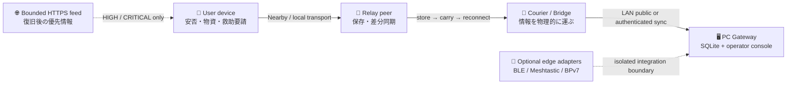

<div align="center">


### 災害時の「届かない」を、端末と人の移動でつなぐ。
### Keep critical information moving when networks cannot.

[](#development-status--開発状況)
[](#quick-start--クイックスタート)
[](#technology--技術構成)
[](#how-relay-works--relayの仕組み)
[](#privacy-security-and-trust--プライバシーセキュリティ信頼)

[日本語](#日本語) · [English](#english) · [Repository guide](docs/REPOSITORY_GUIDE.md) · [Operation model](docs/OPERATION_MODEL.md) · [Architecture](docs/architecture.md)

</div>

> [!CAUTION]
> **Relay is under active development and is not an emergency-service replacement.** Current source code contains substantial implementation and automated verification infrastructure, while physical-device, radio, deployment, and real-disaster validation remain separate work.
>
> **Relay は開発途中であり、消防・警察・自治体などの緊急連絡手段を置き換えるものではありません。** コード上の実装と自動検証基盤があっても、実機・電波・設置・災害運用の検証は別途必要です。

---

## How Relay works / Relayの仕組み



Relay uses **Store–Carry–Forward**. A device stores information locally, carries it while the user moves, and forwards it during a later encounter with another Relay device or fixed gateway.

Relay は **Store–Carry–Forward（保存・運搬・再転送）** 方式です。常時接続を前提にせず、端末同士が短時間しか出会えない環境でも、情報を少しずつ前へ進めます。

```text
CREATE  ──►  STORE  ──►  CARRY  ──►  FORWARD  ──►  STORE AGAIN
 作成          保存          運ぶ          再転送             次の拠点へ
```

---

# 日本語

## 30秒でわかる Relay

Relay は、災害や大規模通信障害でインターネットが不安定・利用不能になった状況を想定した、**ローカル優先の情報中継プロジェクト**です。

- Android端末同士で不足している情報だけを交換
- 安否、避難状況、物資不足、救助要請を端末内へ保存
- 受信端末やCourierが移動し、次に出会った端末へ再転送
- 固定地点ではAndroid BridgeからPC Gatewayへ同期
- 復旧後は設定されたHTTPSフィードから重要度の高い情報を制限付きで補完
- 電話番号、メールアドレス、永続的ハードウェアIDを必須にしない
- 中核のオフライン配送にAIを必要としない

### 目指していること

Relayが目指すのは「必ず即時に届く通信」ではありません。**通信機会が断続的でも、重要情報が止まらず前へ進める仕組み**を作ることです。

### Relayではないもの

- リアルタイムチャット
- 配送や最終到達を保証するサービス
- 受信内容を自動的に公式情報・本人確認済み情報へ変える仕組み
- 緊急通報、行政防災無線、公式警報の代替
- 現時点で完成済みの一般公開製品

## 主な機能

| 分野 | 現在のコードにあるもの |
|---|---|
| 安否・避難状況 | 無事、負傷、避難中、避難所到着などを定型フォームで保存 |
| 物資不足 | 水、食料、薬、毛布、電源、衛生用品などを登録 |
| 救助リレー | 救助要請の作成、暗号化された配送データ、Courier表示・提出経路 |
| Nearby中継 | Android Peerの発見・接続・差分同期を行うStore–Carry–Forward経路 |
| ローカル保存 | Room / SQLCipher関連基盤、重複排除、TTL、hop上限、Peer別ACK |
| PC Gateway | Ktor / SQLite / LANビーコン / public ingress / 管理コンソール |
| 復旧後同期 | HTTPS限定、応答サイズ・件数・時間制限付きの優先フィード |
| Apple基盤 | Kotlin Multiplatform、Compose Multiplatform、Swift Package / GATT契約 |
| 外部境界 | Windows BLE Bridge、Meshtastic adapter、BPv7 export boundary |
| 防御的処理 | 不正JSON、未知version、過大payload、期限切れ、path escapeなどの拒否 |

## Development status / 開発状況

この表は**製品完成宣言ではなく、現在のソースを読むためのスナップショット**です。

| コンポーネント | コード | 自動検証基盤 | 物理・運用検証 |
|---|---:|---:|---:|
| Android UI / Room / ドメイン | ✅ | ✅ Unit / host / UI契約 | 🚧 端末差・再起動・長時間運用 |
| Nearby Store–Carry–Forward | ✅ | ✅ Fake多段・契約試験 | 🚧 複数実機RF・省電力 |
| Foreground Service / 自動開始 | ✅ | ✅ コード・単体試験 | 🚧 メーカー別バックグラウンド挙動 |
| PC Gateway / 管理画面 | ✅ | ✅ build・recovery・HTTP fixture | 🚧 Phone→PC実機E2E |
| 救助要請 / Courier経路 | ✅ | ✅ 共有モデル・暗号・画面試験を整備中 | 🚧 避難所を含む運用試験 |
| HTTPS優先フィード | ✅ | ✅ URL・容量・version・scheduler試験 | 🚧 実際の配信元との運用設計 |
| Apple / BLE基盤 | 🧪 | ✅ framework・仮想GATT契約 | 🚧 IPA・CoreBluetooth実機 |
| Meshtastic / BPv7境界 | 🧪 Adapter / export | ✅ Python contract tests | 🚧 実機無線・外部網接続 |
| 配布保護 | 🧪 scripts / metadata | ✅ SBOM・scan・TUF chain checks | 🚧 本番鍵・署名運用・リリース手順 |

> [!IMPORTANT]
> 2026年7月16日の記録では、Android実機接続数が0台だったため、Phone↔PCとNearby複数端末試験は未実施でした。その後コードやCIは更新されているため、古い検証記録を最新コードの実機PASSとして扱わないでください。詳細は [`docs/DEVICE_VALIDATION_REPORT.md`](docs/DEVICE_VALIDATION_REPORT.md) を参照してください。

## 保存・受領表示の意味

Relayは「どこかに保存された」と「内容が正しい」を分けます。

| 状態 | 意味 | 証明しないこと |
|---|---|---|
| `PEER_RECEIVED` | 別のRelay端末が保存した | 本人確認、内容の真正性、最終到達 |
| `GATEWAY_RECEIVED_UNVERIFIED` | 匿名LAN経路でPC Gatewayが保存した | 公式Gateway、内容検証、最終配信 |
| `GATEWAY_RECEIVED` | 認証済みBridge経路でPC Gatewayが保存した | REPORT本文の真正性、発信者本人、最終配信 |

REPORTの一部には共有基盤のcanonical ECDSA P-256署名・検証経路があります。一方、通常のRelayMessage配送やGateway Receiptを含む**システム全体の本番信頼モデルは完成していません**。Debug用NoOp signer/verifierはreleaseのmain source setから分離されています。

## Quick start / クイックスタート

### Android

必要環境:

- JDK 17
- Android Studio
- Android SDK 36 / Build Tools 36.0.0
- 初回依存取得時のインターネット接続

Windows:

```powershell
.\gradlew.bat :app:testDebugUnitTest :shared:jvmTest :relay-protocol:test :pc-gateway:test
.\gradlew.bat :app:assembleDebug :pc-gateway:build
```

macOS / Linux:

```bash
./gradlew :app:testDebugUnitTest :shared:jvmTest :relay-protocol:test :pc-gateway:test
./gradlew :app:assembleDebug :pc-gateway:build
```

Debug APK:

```text
app/build/outputs/apk/debug/app-debug.apk
```

> [!NOTE]
> APKのビルド成功は、Nearby電波、権限、Foreground Service、画面消灯、再接続が実機で成功することを意味しません。

### PC Gateway

Windows:

```powershell
.\Start-PC-Gateway.cmd
```

macOS / Linux:

```bash
chmod +x scripts/run-pc-gateway.sh
./scripts/run-pc-gateway.sh
```

起動後の既定:

- Operator console: `http://127.0.0.1:8080/`
- Health: `http://127.0.0.1:8080/api/health`
- Public ingress: `POST /api/public/sync/messages`
- LAN discovery: UDP `42888`

固定地点への導入前に [`docs/PC_GATEWAY_SETUP.md`](docs/PC_GATEWAY_SETUP.md) と [`docs/PC_GATEWAY_SECURITY.md`](docs/PC_GATEWAY_SECURITY.md) を確認してください。

## Privacy, security and trust / プライバシー・セキュリティ・信頼

- 電話番号・メールアドレス・永続的ハードウェアIDを必須にしない
- 端末IDはアプリ領域に保存するランダムID
- GPSは場所欄が空で権限がある場合のワンショット補完。常時追跡ではない
- 受信データは信頼せず、JSON解析前にサイズを制限
- HTTPS優先フィードはHTTPS・port 443・件数・容量・timeout・versionを制限
- 外部アダプターはRelay coreへ直接混ぜず、プロセス／export境界へ隔離
- CIにはSBOM、OSV、Grype、MobSF、Jazzer、accessibility、decoder regressionなどのジョブが定義されている
- 配布スクリプトはcosign bundle、SPDX SBOM、TUF metadata chainを扱うが、本番署名には信頼されたオフライン鍵運用が必要
- PC GatewayのLAN HTTPはTLSなし。信頼できないWi-Fiへ公開しない
- Keystore、PFX、API key、実機ログ、SQLite DB、生成APKはコミットしない

## リポジトリ構成

```text
Relay/
├─ app/                         Android app: Compose / Room / Nearby / services
├─ shared/                      KMP models, crypto, QR and shared logic
├─ relay-protocol/              Shared Gateway DTO and wire contracts
├─ composeApp/                  Compose Multiplatform UI / iOS framework
├─ pc-gateway/                  JVM Gateway: Ktor / SQLite / operator console
├─ pc-ble-bridge/               Windows BLE peripheral boundary
├─ gateway-meshtastic-adapter/  Isolated Meshtastic integration
├─ gateway-bp7-export/          BPv7 export boundary
├─ apple/                       Swift package and GATT contracts
├─ test-lab/                    Mobly, fuzz, fault-injection and host contracts
├─ tools/ble-sim/               Deterministic virtual GATT harness
├─ maestro/                     UI flows
├─ distribution/                Release inputs and metadata
├─ scripts/                     Build, startup, backup, scan and verification
├─ docs/                        Canonical design, operation and runbooks
└─ artifacts/                   Local/generated evidence; mostly untracked
```

## まず読む資料

1. [`docs/REPOSITORY_GUIDE.md`](docs/REPOSITORY_GUIDE.md) — 変更場所を探す
2. [`docs/OPERATION_MODEL.md`](docs/OPERATION_MODEL.md) — 利用者と固定中継地点の運用
3. [`docs/architecture.md`](docs/architecture.md) — Androidと同期プロトコル
4. [`docs/DEVICE_TEST_PLAN.md`](docs/DEVICE_TEST_PLAN.md) — 実機試験計画
5. [`docs/DEVICE_VALIDATION_REPORT.md`](docs/DEVICE_VALIDATION_REPORT.md) — 日付付き検証記録
6. [`docs/PC_GATEWAY_SETUP.md`](docs/PC_GATEWAY_SETUP.md) — Gateway導入
7. [`docs/APPLE_TARGETS.md`](docs/APPLE_TARGETS.md) — Apple基盤

---

# English

## Relay in 30 seconds

Relay is a **local-first disaster information relay** designed for situations where internet connectivity is unavailable, intermittent, or overloaded.

- Android devices exchange only missing information over local transports
- Safety, evacuation, supply, and rescue records are stored on-device
- A person or fixed bridge can physically carry data to the next contact point
- A PC Gateway stores LAN submissions in SQLite and exposes an operator console
- An optional bounded HTTPS feed supplements HIGH / CRITICAL information after connectivity returns
- Phone numbers, email addresses, and persistent hardware identifiers are not mandatory
- Core offline delivery does not require AI

Relay is not real-time chat, does not guarantee delivery, does not automatically make received content official, and must not replace emergency services.

## Current capabilities

| Area | Present in the repository |
|---|---|
| Structured reports | Safety, evacuation, supply needs, and rescue workflows |
| Store–Carry–Forward | Deduplication, lifetime policy, hop limits, manifests, requests, and peer ACK state |
| Android runtime | Compose UI, Room, Nearby integration, foreground services, and gateway sync |
| Fixed gateway | Ktor, SQLite, LAN beacon, public/authenticated routes, operator console |
| Recovery feed | HTTPS-only bounded priority feed with a periodic attempt scheduler |
| Multiplatform | Shared Kotlin code, Compose Multiplatform, Swift package and GATT contracts |
| Edge boundaries | Windows BLE bridge, Meshtastic adapter, and BPv7 export boundary |
| Quality infrastructure | Host tests, UI contracts, virtual BLE, fuzz regression, scans, SBOM, and TUF metadata checks |

## Development status

The status table in the Japanese section is intentionally split into implementation, automated verification, and physical/operational verification. Do not interpret source presence or a host test as proof of radio behavior on real devices.

The dated device report from July 16, 2026 recorded no attached Android devices, so Phone-to-PC and multi-device Nearby tests were not run in that session. The repository has changed since then; rerun the relevant runbooks before making current device-readiness claims.

## Trust semantics

Relay separates successful storage from content authenticity. Peer and Gateway receipts describe a storage event, not identity verification or final delivery. Some REPORT paths use canonical ECDSA P-256 signing and verification, but the complete production trust model for all Relay messages and receipts remains unfinished. Debug NoOp signing is isolated from release main sources.

## Build

```bash
./gradlew :app:testDebugUnitTest :shared:jvmTest :relay-protocol:test :pc-gateway:test
./gradlew :app:assembleDebug :pc-gateway:build
```

For physical-device validation, follow the dated runbooks under `docs/` rather than treating a successful build as an RF test.

## Technology / 技術構成

- Kotlin / JVM 17
- Kotlin Multiplatform / Compose Multiplatform
- Jetpack Compose / Material 3
- Coroutines / Flow / StateFlow
- Room / SQLCipher integration
- kotlinx.serialization
- Google Nearby Connections
- Ktor / Netty / SQLite JDBC
- Swift Package / CoreBluetooth contracts
- Python host-contract and adapter tests
- GitHub Actions quality and security jobs

## Contributing / コントリビューション

Read the operation model and repository guide before making structural changes. Keep external transports behind explicit boundaries, keep trust wording conservative, add the smallest deterministic test first, and document anything that still requires physical hardware.

大きな変更の前に運用モデルとリポジトリ案内を確認してください。外部通信は明示的な境界に隔離し、信頼表示を過大にせず、まず再現可能な最小テストを追加し、実機依存部分を文書に残してください。

## License / ライセンス

No license has been selected. Do not assume permission to redistribute the code until a license is added.

ライセンスは未選定です。ライセンスが追加されるまでは、再配布の許可があるものとみなさないでください。

## Safety note / 安全上の注意

Use official alerts and emergency services whenever they are available. Relay is an experimental resilience project, not a certified life-safety system.

公式情報や緊急連絡手段が利用できる場合は、必ずそちらを優先してください。Relayは実験的な耐障害プロジェクトであり、認証済みの人命安全システムではありません。
